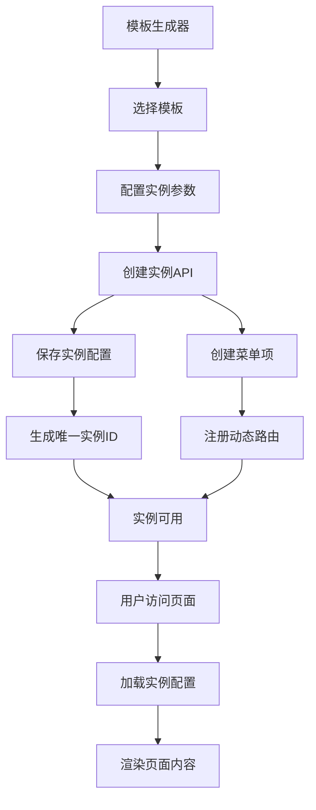

# 模板实例化系统 API 设计文档

## 1. 模板定义管理 API

### 1.1 获取模板列表
```http
GET /admin-api/system/template/list
```

**响应示例:**
```json
{
  "code": 0,
  "data": [
    {
      "id": 1,
      "templateId": "draggable-category",
      "templateName": "拖拽分类管理",
      "templateType": "drag-drop-classification",
      "componentPath": "examples/DragDropClassificationExample",
      "routePattern": "/examples/drag-drop-classification/:configId",
      "supportsMultiInstance": true,
      "description": "支持拖拽排序的分类管理模板",
      "tags": ["分类管理", "拖拽排序", "树形结构", "多实例"],
      "status": 0
    }
  ]
}
```

### 1.2 获取模板详情
```http
GET /admin-api/system/template/get?templateId=draggable-category
```

### 1.3 获取模板配置结构
```http
GET /admin-api/system/template/config-schema?templateId=draggable-category
```

## 2. 模板实例管理 API

### 2.1 创建模板实例
```http
POST /admin-api/system/template-instance/create
```

**请求参数:**
```json
{
  "templateId": "draggable-category",
  "instanceName": "设备分类管理",
  "businessType": "device-category",
  "configData": {
    "pageTitle": "设备分类管理",
    "categoryTitle": "设备分类",
    "itemUnit": "台设备",
    "enableDragSort": true,
    "enableSearch": true,
    "treeType": "device_category",
    "permissions": ["create", "update", "delete"]
  },
  "menuConfig": {
    "parentId": 1,
    "menuPath": ["system", "device"],
    "icon": "ep:cpu",
    "sort": 100
  }
}
```

**响应示例:**
```json
{
  "code": 0,
  "data": {
    "instanceId": "device_category_20250115_001",
    "menuId": 1001,
    "routePath": "/examples/drag-drop-classification/device_category_20250115_001",
    "message": "实例创建成功"
  }
}
```

### 2.2 获取实例列表
```http
GET /admin-api/system/template-instance/list?templateId=draggable-category
```

### 2.3 更新实例配置
```http
PUT /admin-api/system/template-instance/update
```

### 2.4 删除实例
```http
DELETE /admin-api/system/template-instance/delete?instanceId=device_category_20250115_001
```

### 2.5 获取实例配置
```http
GET /admin-api/system/template-instance/config?instanceId=device_category_20250115_001
```

## 3. 增强的菜单管理 API

### 3.1 创建实例化菜单
```http
POST /admin-api/system/menu/create-instance
```

**请求参数:**
```json
{
  "templateId": "draggable-category",
  "instanceId": "device_category_20250115_001",
  "name": "设备分类管理",
  "parentId": 1,
  "path": "/examples/drag-drop-classification/:configId",
  "component": "examples/DragDropClassificationExample",
  "permission": "system:device:category",
  "icon": "ep:cpu",
  "dynamicParams": {
    "paramName": "configId",
    "titleTemplate": "设备分类管理 - ${configId}",
    "multiInstance": true
  }
}
```

### 3.2 获取实例化菜单列表
```http
GET /admin-api/system/menu/instance-list?templateId=draggable-category
```

## 4. 实例数据管理 API

### 4.1 获取实例数据
```http
GET /admin-api/system/template-instance/data?instanceId=device_category_20250115_001&type=tree
```

### 4.2 保存实例数据
```http
POST /admin-api/system/template-instance/data/save
```

**请求参数:**
```json
{
  "instanceId": "device_category_20250115_001",
  "dataType": "tree",
  "data": {
    "nodes": [...],
    "relationships": [...]
  }
}
```

## 5. 实例统计分析 API

### 5.1 获取实例使用统计
```http
GET /admin-api/system/template-instance/stats?instanceId=device_category_20250115_001
```

### 5.2 获取模板使用概览
```http
GET /admin-api/system/template/usage-overview?templateId=draggable-category
```

## 6. 批量操作 API

### 6.1 批量创建实例
```http
POST /admin-api/system/template-instance/batch-create
```

### 6.2 批量更新实例配置
```http
PUT /admin-api/system/template-instance/batch-update
```

### 6.3 实例导入导出
```http
POST /admin-api/system/template-instance/export
POST /admin-api/system/template-instance/import
```

## 数据流转示意

