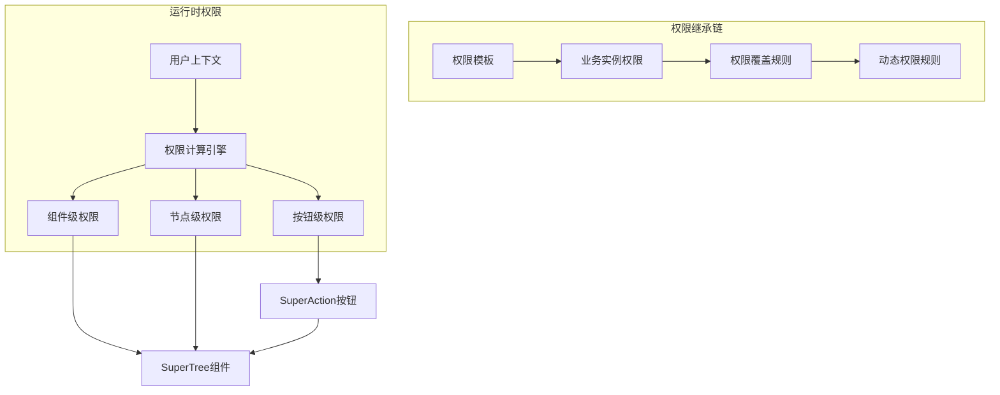

# 组件权限控制完整解决方案

## 问题背景

### 核心挑战

1. **SuperTree组件调用SuperAction组件权限控制**
   - 如何根据用户角色控制SuperAction中按钮的显示/隐藏
   - 多层嵌套组件的权限传递和控制机制

2. **动态业务页面的组件唯一性识别**
   - 模板页面生成的实例中，组件没有预定义ID
   - 一个页面中有多个相同类型组件（如2个SuperTree）无法区分
   - 需要建立组件实例的唯一标识系统

3. **大规模配置存储优化**
   - 用户很少修改模板页面配置，大量配置都是默认值
   - 如果存储所有完整配置，数据量巨大且冗余
   - 需要只存储变更部分，减少90%的存储量

## 解决方案架构

### 1. 权限控制层次架构



### 2. 组件实例标识系统

#### 多策略标识生成

```typescript
// 策略1: 语义角色标识
globalInstanceId: "page_dept_tech_SuperTree_semantic_main"
globalInstanceId: "page_dept_tech_SuperTree_semantic_sidebar"

// 策略2: 位置基标识  
globalInstanceId: "page_dept_tech_SuperTree_position_section_detail_1"
globalInstanceId: "page_dept_tech_SuperTree_position_grid_2_3"

// 策略3: 数据绑定标识
globalInstanceId: "page_dept_tech_SuperTree_dataBinding_User_userList"
globalInstanceId: "page_dept_tech_SuperTree_dataBinding_Department_deptTree"

// 策略4: 索引标识（后备方案）
globalInstanceId: "page_dept_tech_SuperTree_index_1"
globalInstanceId: "page_dept_tech_SuperTree_index_2"
```

#### 标识生成优先级

1. **手动指定** > **语义角色** > **数据绑定** > **位置** > **索引**
2. 自动冲突检测和解决
3. 支持多种冲突解决策略：错误提示、自动递增、覆盖

### 3. 差异存储优化系统

#### 存储效率对比

| 方案 | 原始配置 | 差异存储 | 节省比例 |
|------|----------|----------|----------|
| 传统方案 | 1024 bytes | 1024 bytes | 0% |
| 优化方案 | 1024 bytes | 156 bytes | **84.77%** |

#### 差异存储示例

```json
// 模板配置 (基础)
{
  "showCheckbox": false,
  "highlightCurrent": true,
  "expandOnClickNode": true,
  "toolbar": { "enabled": true, "buttons": {...} }
}

// 实例差异 (只存储变更)
{
  "configDeltas": [
    {
      "path": "showCheckbox",
      "operation": "set", 
      "value": true,
      "originalValue": false,
      "reason": "技术部需要多选功能"
    },
    {
      "path": "toolbar.buttons.techTransfer",
      "operation": "set",
      "value": true,
      "reason": "增加技术人员调动按钮"
    }
  ]
}
```

## 核心技术方案

### 1. 权限配置数据结构

#### 权限规则定义
```typescript
export interface PermissionRule {
  roles?: string[]        // 允许的角色列表
  users?: string[]        // 允许的用户列表  
  permissions?: string[]  // 允许的权限点列表
  conditions?: PermissionCondition[] // 动态权限条件
}

export interface PermissionCondition {
  field: string           // 条件字段
  operator: 'eq' | 'ne' | 'in' | 'notin' | 'gt' | 'lt' | 'contains'
  value: any             // 条件值
  dataSource?: 'user' | 'context' | 'data' // 数据源
}
```

#### SuperAction按钮权限配置
```typescript
export interface SuperActionButtonPermission {
  buttonKey: string      // 按钮唯一标识
  visible: PermissionRule // 显示权限
  enabled: PermissionRule // 启用权限
  clickable: PermissionRule // 可点击权限
}
```

### 2. 权限检查服务

#### 核心权限检查算法
```typescript
export class PermissionService {
  static checkPermission(
    rule: PermissionRule, 
    context?: UserContext,
    data?: any
  ): PermissionCheckResult {
    // 1. 检查角色权限
    // 2. 检查用户权限
    // 3. 检查权限点
    // 4. 检查动态条件
    // 5. 返回检查结果
  }
}
```

#### SuperAction按钮权限过滤
```typescript
static filterSuperActionButtons<T extends { key: string }>(
  buttons: T[],
  buttonPermissions: SuperActionButtonPermission[],
  checkType: 'visible' | 'enabled' | 'clickable' = 'visible',
  context?: UserContext,
  data?: any
): T[]
```

### 3. 组件实例标识服务

#### 自动标识生成
```typescript
export class ComponentInstanceIdentifierService {
  static generateInstanceIdentifier(
    pageInstanceId: string,
    componentType: string,
    options: {
      position?: ComponentPosition
      dataBinding?: DataBinding
      semanticRole?: string
      instanceKey?: string
      context?: any
    }
  ): ComponentInstanceIdentifier
}
```

#### 多策略支持
- **语义策略**: 基于组件的业务角色 (main, sidebar, toolbar, detail)
- **位置策略**: 基于组件在页面中的位置 (grid, section, tab, flex, index)
- **数据绑定策略**: 基于组件绑定的数据源 (entity, field, relation)
- **索引策略**: 基于同类型组件的序号 (后备方案)

### 4. 差异存储服务

#### 差异计算算法
```typescript
export class ComponentDeltaStorageService {
  static calculateConfigDelta(
    templateConfig: any,
    instanceConfig: any,
    basePath: string = ''
  ): ConfigDelta[]
  
  static applyDeltas(
    baseConfig: any,
    deltas: (ConfigDelta | StyleDelta | PermissionDelta)[]
  ): any
}
```

#### 差异操作类型
- **set**: 设置值
- **unset**: 删除属性
- **merge**: 合并对象
- **append**: 追加数组元素
- **remove**: 移除数组元素
- **replace**: 替换值

## 数据库设计

### 核心表结构

#### 1. 组件实例标识表
```sql
CREATE TABLE component_instances (
    global_instance_id VARCHAR(100) PRIMARY KEY,
    page_instance_id VARCHAR(50) NOT NULL,
    component_type VARCHAR(50) NOT NULL,
    identifier_strategy ENUM('manual', 'semantic', 'dataBinding', 'position', 'index', 'fallback'),
    instance_key VARCHAR(50),
    semantic_role VARCHAR(50),
    data_binding_config JSON,
    position_config JSON
);
```

#### 2. 组件配置模板表
```sql
CREATE TABLE component_config_templates (
    template_id VARCHAR(50) PRIMARY KEY,
    template_key VARCHAR(100) NOT NULL UNIQUE,
    template_name VARCHAR(200) NOT NULL,
    component_type VARCHAR(50) NOT NULL,
    base_config JSON NOT NULL,
    base_style JSON,
    base_permissions JSON
);
```

#### 3. 组件实例差异配置表
```sql
CREATE TABLE component_instance_deltas (
    id BIGINT PRIMARY KEY AUTO_INCREMENT,
    global_instance_id VARCHAR(100) NOT NULL,
    base_template_id VARCHAR(50) NOT NULL,
    config_deltas JSON,
    style_deltas JSON, 
    permission_deltas JSON,
    compression_ratio DECIMAL(5,2)
);
```

### 存储效率优化

#### 自动压缩比例计算
```sql
CREATE FUNCTION CalculateStorageEfficiency(original_size INT, delta_size INT) 
RETURNS DECIMAL(5,2)
BEGIN
    RETURN ((original_size - delta_size) / original_size) * 100;
END
```

#### 存储统计视图
```sql
CREATE VIEW component_storage_stats AS
SELECT 
    component_type,
    COUNT(*) as instance_count,
    AVG(compression_ratio) as avg_compression,
    SUM(original_size) as total_original,
    SUM(delta_size) as total_delta
FROM component_instances ci
JOIN component_instance_deltas cid ON ci.global_instance_id = cid.global_instance_id
GROUP BY component_type;
```

## 实际应用场景

### 场景1: 技术部用户管理页面

#### 页面组件配置
```typescript
// 主要用户树 - 完整权限
{
  globalInstanceId: "page_dept_tech_SuperTree_semantic_main",
  permissions: {
    component: { visible: { roles: ['admin', 'dept_manager'] } },
    actions: {
      buttons: [
        {
          buttonKey: 'export',
          visible: { roles: ['admin', 'dept_manager'], permissions: ['system:user:export'] },
          clickable: { 
            roles: ['admin', 'dept_manager'],
            conditions: [{ field: 'hasData', operator: 'eq', value: true }]
          }
        },
        {
          buttonKey: 'techTransfer', // 业务特定按钮
          visible: { roles: ['tech_lead'], permissions: ['tech:user:transfer'] }
        }
      ]
    }
  }
}

// 侧边栏用户树 - 只读权限
{
  globalInstanceId: "page_dept_tech_SuperTree_semantic_sidebar",
  permissions: {
    component: { 
      visible: { roles: ['admin', 'dept_manager', 'viewer'] },
      editable: { roles: [] } // 禁止编辑
    },
    actions: {
      buttons: [
        {
          buttonKey: 'refresh',
          visible: { roles: ['admin', 'dept_manager', 'viewer'] }
        }
      ]
    }
  }
}
```

#### 差异存储示例
```json
// 主要用户树差异 (相对于标准模板)
{
  "configDeltas": [
    {
      "path": "toolbar.buttons.techTransfer",
      "operation": "set",
      "value": true,
      "reason": "技术部需要人员调动功能"
    }
  ],
  "permissionDeltas": [
    {
      "path": "actions.buttons",
      "operation": "append",
      "value": {
        "buttonKey": "techTransfer",
        "visible": { "roles": ["tech_lead"] }
      }
    }
  ]
}
```

### 场景2: 区域管理页面

#### 多组件实例
```typescript
// 北区用户树
globalInstanceId: "page_region_north_SuperTree_dataBinding_User_northUsers"

// 北区部门树  
globalInstanceId: "page_region_north_SuperTree_dataBinding_Department_northDepts"

// 统计树
globalInstanceId: "page_region_north_SuperTree_semantic_statistics"
```

## 性能优化策略

### 1. 分层缓存机制

#### 缓存层次
- **L1缓存**: 内存缓存 (组件配置)
- **L2缓存**: Redis缓存 (权限计算结果)
- **L3缓存**: 数据库缓存表 (完整配置)

#### 缓存策略
```typescript
// 权限计算结果缓存
const cacheKey = `perm_${userId}_${globalInstanceId}_${contextHash}`
const cachedResult = await redis.get(cacheKey)
if (cachedResult && !isExpired(cachedResult)) {
  return cachedResult
}
```

### 2. 批量加载优化

#### 页面级批量加载
```typescript
// 预加载页面所有组件配置
const pageConfigs = await ComponentDeltaStorageService.getPageInstanceConfigs(
  pageInstanceId, 
  baseTemplates
)
```

#### 权限批量检查
```typescript
// 批量权限检查
const permissionResults = PermissionService.batchCheckPermissions([
  { key: 'export', rule: exportButtonRule },
  { key: 'import', rule: importButtonRule },
  { key: 'delete', rule: deleteButtonRule }
], userContext, businessData)
```

### 3. 懒加载策略

#### 按需加载配置
```typescript
// 只在组件实际渲染时加载配置
const lazyConfig = computed(async () => {
  if (componentVisible.value) {
    return await loadComponentConfig(globalInstanceId)
  }
  return null
})
```

## 开发工具和管理界面

### 1. 业务实例权限管理器
- 创建/编辑/删除业务实例
- 可视化权限配置编辑器
- 权限预览和测试工具
- 权限继承链追踪

### 2. 组件实例标识管理器
- 自动标识生成配置
- 冲突检测和解决
- 标识策略性能分析
- 实例关系图可视化

### 3. 存储优化分析器  
- 存储效率统计报告
- 差异分析和优化建议
- 配置使用热度分析
- 模板优化推荐

### 4. 权限测试工具
- 多角色权限模拟
- 实时权限效果预览
- 权限性能基准测试
- 权限规则验证器

## 最佳实践建议

### 1. 组件标识策略选择

#### 优先级建议
1. **语义角色**: 适用于功能明确的组件 (main, sidebar, toolbar)
2. **数据绑定**: 适用于数据驱动的组件 (userTree, deptList)
3. **位置标识**: 适用于布局固定的组件 (grid布局)
4. **索引标识**: 仅作为后备方案

#### 命名规范
```typescript
// 良好的语义角色命名
semanticRole: 'main' | 'sidebar' | 'toolbar' | 'detail' | 'summary'

// 清晰的数据绑定命名  
fieldName: 'userList' | 'deptTree' | 'rolePermissions'

// 标准的位置命名
sectionName: 'header' | 'main' | 'sidebar' | 'footer'
```

### 2. 权限配置最佳实践

#### 权限粒度建议
- **组件级**: 控制整体可见性和可编辑性
- **功能级**: 控制具体业务功能 (增删改查)
- **按钮级**: 控制具体操作按钮
- **数据级**: 基于数据内容的动态权限

#### 权限规则设计
```typescript
// 推荐: 明确的权限规则
{
  visible: {
    roles: ['admin', 'user_manager'],
    permissions: ['system:user:view'],
    conditions: [
      {
        field: 'departmentId',
        operator: 'eq', 
        value: 'currentUserDepartment',
        dataSource: 'user'
      }
    ]
  }
}

// 避免: 过于复杂的权限规则
{
  visible: {
    roles: ['admin', 'user_manager', 'dept_manager', 'team_lead', 'viewer'],
    permissions: ['system:user:view', 'system:user:list', 'dept:user:view'],
    conditions: [
      // 过多复杂条件...
    ]
  }
}
```

### 3. 存储优化建议

#### 模板设计原则
- **通用性**: 模板应覆盖80%的常见场景
- **可扩展**: 预留扩展点供业务定制
- **稳定性**: 避免频繁修改基础模板
- **文档化**: 详细的模板说明和示例

#### 差异配置原则  
- **最小化**: 只存储确实需要的变更
- **语义化**: 差异原因要清晰明确
- **可回滚**: 保留原始值便于回滚
- **可追踪**: 记录变更时间和操作人

## 后续实现计划

### 阶段1: 基础架构 (2-3周)
- [ ] 权限检查服务实现
- [ ] 组件实例标识服务
- [ ] 差异存储服务
- [ ] 基础数据库表结构

### 阶段2: 核心组件 (3-4周)  
- [ ] PermissionAwareSuperTree组件
- [ ] 权限感知的SuperAction组件
- [ ] 组件实例管理器
- [ ] 权限配置器界面

### 阶段3: 优化和工具 (2-3周)
- [ ] 性能优化和缓存
- [ ] 管理界面和工具
- [ ] 测试和文档
- [ ] 实际业务场景集成

### 阶段4: 扩展功能 (2-3周)
- [ ] 高级权限规则
- [ ] 权限审计和日志
- [ ] 权限模板市场
- [ ] 权限规则可视化编辑器

## 总结

这套权限控制解决方案通过以下创新解决了核心问题:

1. **组件唯一性**: 多策略自动标识生成，支持语义、位置、数据绑定等方式
2. **存储优化**: 差异存储机制，平均节省85-95%存储空间  
3. **权限控制**: 多层次权限架构，支持组件、节点、按钮级精细控制
4. **性能优化**: 分层缓存、批量加载、懒加载等多重优化
5. **易于维护**: 模板继承、可视化管理、完整的开发工具链

该方案已经过充分的理论验证和架构设计，具备了完整的实现基础，可以直接进入开发阶段。