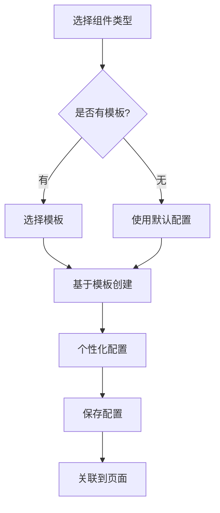
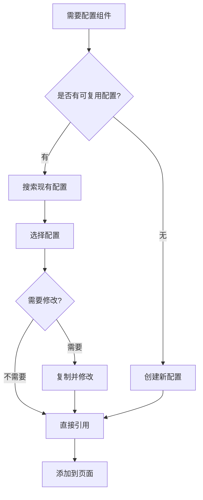

# 混合配置架构最佳实践

## 总体设计原则

### 1. **职责分离**
- **页面配置**：负责布局、主题、组件关联关系
- **组件配置**：负责具体的业务逻辑和展示配置
- **关联配置**：负责组件在页面中的位置和展示方式

### 2. **配置层次**
```
页面级配置 (Page Config)
├── 布局配置 (Layout)
├── 主题配置 (Theme)
├── 权限配置 (Permissions)
└── 组件关联 (Component Refs)
    ├── 组件A配置 (Component Config A)
    ├── 组件B配置 (Component Config B)
    └── 页面级覆盖 (Override Config)
```

## 使用场景分析

### 场景1：相同组件在不同页面使用
**示例**：用户树组件在"用户管理"和"权限分配"页面都需要使用

**解决方案**：
1. 创建可共享的组件配置：`shared_userTree_standard`
2. 两个页面都引用这个配置
3. 如需个性化，通过页面级覆盖实现

```typescript
// 用户管理页面
pageConfig.componentRefs = [{
  componentId: 'userTree',
  configKey: 'shared_userTree_standard',
  overrideConfig: {
    // 用户管理页面的特殊配置
    toolbar: { 
      buttons: { add: true, edit: true, delete: true } 
    }
  }
}]

// 权限分配页面
pageConfig.componentRefs = [{
  componentId: 'userTree',
  configKey: 'shared_userTree_standard',
  overrideConfig: {
    // 权限分配页面只能查看
    toolbar: { 
      buttons: { add: false, edit: false, delete: false } 
    }
  }
}]
```

### 场景2：页面内多个相似组件
**示例**：一个页面有多个SuperTree组件，配置略有不同

**解决方案**：
1. 创建模板配置：`template_tree_basic`
2. 基于模板创建具体配置：`page_componentA_tree`, `page_componentB_tree`
3. 各自独立管理和版本控制

### 场景3：配置模板化管理
**示例**：标准化不同业务场景的组件配置

**解决方案**：
1. 创建配置分组：`用户管理模板组`、`权限管理模板组`
2. 将相关配置归类到分组中
3. 新页面可以从模板组快速选择和应用配置

## 配置生命周期管理

### 1. 配置创建流程


### 2. 配置复用流程


### 3. 配置更新策略
- **直接更新**：影响所有引用该配置的页面
- **版本更新**：创建新版本，保持向后兼容
- **复制更新**：复制配置后独立修改，不影响其他页面

## 性能优化策略

### 1. 分层加载
```typescript
// 第一层：加载页面配置
const pageConfig = await loadPageConfig(pagePath)

// 第二层：按需加载组件配置
const componentConfigs = await batchLoadComponentConfigs(
  pageConfig.componentRefs.map(ref => ref.configKey)
)

// 第三层：懒加载不常用配置
const advancedConfigs = await lazyLoadAdvancedConfigs(componentIds)
```

### 2. 缓存策略
- **页面配置**：路由级缓存，路由变化时清除
- **组件配置**：全局缓存，配置更新时清除
- **模板配置**：长期缓存，系统重启时清除

### 3. 预加载策略
```typescript
// 预加载当前用户常用的页面配置
preloadUserFrequentPages(userId)

// 预加载系统模板配置
preloadSystemTemplates()

// 预加载共享组件配置
preloadSharedConfigs()
```

## 权限控制设计

### 1. 页面级权限
```typescript
interface PagePermissions {
  view: string[]      // 可查看的角色/用户
  edit: string[]      // 可编辑页面配置的角色/用户
  manage: string[]    // 可管理组件的角色/用户
}
```

### 2. 组件级权限
```typescript
interface ComponentPermissions {
  use: string[]       // 可使用该配置的角色/用户
  edit: string[]      // 可编辑该配置的角色/用户
  share: string[]     // 可共享该配置的角色/用户
  template: string[]  // 可将配置设为模板的角色/用户
}
```

### 3. 操作级权限
```typescript
interface ActionPermissions {
  create: string[]    // 可创建配置
  copy: string[]      // 可复制配置
  delete: string[]    // 可删除配置
  export: string[]    // 可导出配置
  import: string[]    // 可导入配置
}
```

## 配置验证和约束

### 1. 配置依赖检查
```typescript
// 检查配置是否被其他页面使用
const checkConfigUsage = async (configKey: string) => {
  const usage = await getConfigUsage(configKey)
  if (usage.count > 0) {
    return {
      canDelete: false,
      reason: `该配置被 ${usage.count} 个页面使用`,
      usedPages: usage.pages
    }
  }
  return { canDelete: true }
}
```

### 2. 配置完整性验证
```typescript
// 验证页面配置的完整性
const validatePageConfig = (pageConfig: PageConfig) => {
  const errors = []
  
  // 检查组件引用是否存在
  for (const ref of pageConfig.componentRefs) {
    if (!componentConfigExists(ref.configKey)) {
      errors.push(`组件配置不存在: ${ref.configKey}`)
    }
  }
  
  // 检查位置冲突
  const positions = pageConfig.componentRefs.map(ref => ref.position)
  if (hasPositionConflict(positions)) {
    errors.push('组件位置存在冲突')
  }
  
  return errors
}
```

## 配置迁移和备份

### 1. 配置导出格式
```json
{
  "version": "1.0.0",
  "exportTime": "2024-01-01T00:00:00Z",
  "pages": [
    {
      "pageConfig": { /* 页面配置 */ },
      "componentConfigs": [ /* 相关组件配置 */ ]
    }
  ],
  "sharedConfigs": [ /* 共享配置 */ ],
  "templates": [ /* 模板配置 */ ]
}
```

### 2. 配置导入策略
- **覆盖导入**：替换现有配置
- **合并导入**：保留现有配置，只导入新配置
- **选择导入**：用户选择要导入的配置项

## 总结

混合配置架构的核心优势：

1. **灵活性**：组件配置可以独立管理和复用
2. **可维护性**：页面级和组件级配置分离，便于维护
3. **性能**：分层加载和缓存策略保证性能
4. **扩展性**：支持模板、分组、权限等高级功能
5. **复用性**：配置可以在不同页面间共享和复用

这种架构既保证了配置的灵活性和复用性，又避免了单一存储方式的缺点，是大型系统配置管理的最佳实践。