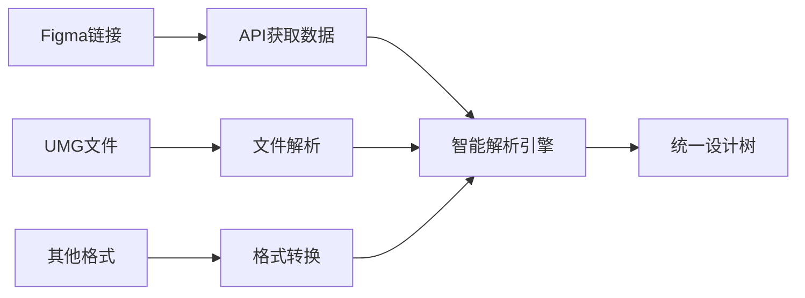
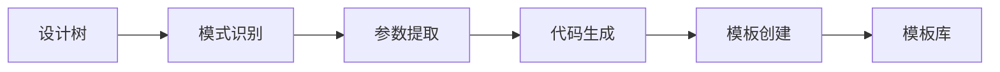
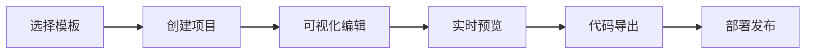

# UI转换平台设计文档

## 📋 项目概述

### 核心理念
构建一个**一站式UI转换平台**，实现多种设计格式之间的智能转换，特别是Element UI与UMG控件之间的双向转换，形成自增长的模板生态系统。

### 核心价值
- **消除技术壁垒**：让Web开发者能够直接参与UMG界面开发
- **提升开发效率**：设计一次，多端使用
- **建立生态系统**：持续生成高质量的可复用模板
- **降低学习成本**：统一的设计语言和开发流程

## 🎯 产品定位

### 目标用户
1. **游戏开发者** - 需要快速创建UMG界面
2. **Web开发者** - 希望复用现有技能开发游戏UI
3. **UI/UX设计师** - 需要设计稿快速转换为可用代码
4. **产品经理** - 需要快速原型验证和迭代

### 解决的核心问题
1. **鸡生蛋问题**：缺乏优质Element UI模板来验证UMG转换效果
2. **技能壁垒**：Web开发者难以直接参与UMG开发
3. **重复工作**：相似界面在不同平台重复开发
4. **设计一致性**：多端界面风格难以统一

## 🏗 系统架构

### 整体架构图
```
┌─────────────────────────────────────────────────────────────┐
│                    前端用户界面                               │
├─────────────────────────────────────────────────────────────┤
│  可视化设计器  │  模板库  │  项目管理  │  实时预览  │  导出系统  │
├─────────────────────────────────────────────────────────────┤
│                    核心转换引擎                               │
├─────────────────────────────────────────────────────────────┤
│  多源导入器  │  智能解析  │  统一格式  │  多目标输出  │  AI优化   │
├─────────────────────────────────────────────────────────────┤
│                    基础服务层                                 │
├─────────────────────────────────────────────────────────────┤
│  文件存储  │  用户管理  │  版本控制  │  协作系统  │  部署服务    │
└─────────────────────────────────────────────────────────────┘
```

### 核心模块

#### 1. 多源导入系统
**支持格式：**
- Figma设计文件（通过API）
- UMG资产文件
- Sketch文件
- Adobe XD文件
- PSD文件
- HTML/CSS代码

**功能特性：**
- 智能组件识别
- 样式自动提取
- 布局关系解析
- 资产自动下载

#### 2. 统一设计树格式
```typescript
interface DesignNode {
  id: string
  name: string
  type: ComponentType
  styles: StyleProperties
  layout: LayoutProperties
  properties: ComponentProperties
  children: DesignNode[]
  metadata: {
    source: 'figma' | 'umg' | 'sketch' | 'custom'
    originalId?: string
    importedAt: Date
  }
}
```

#### 3. 智能转换引擎
**转换目标：**
- Vue组件（Element UI风格）
- Vue组件（UMG控件风格）
- UMG资产文件
- React组件
- Flutter Widget

**AI辅助功能：**
- 组件类型智能识别
- 布局模式自动优化
- 响应式适配建议
- 可访问性检查

#### 4. 可视化设计器
**核心功能：**
- 拖拽式界面设计
- 实时属性编辑
- 多层级组件管理
- 样式可视化调整

**设计器界面布局：**
```
┌──────────┬─────────────────────┬──────────┐
│          │                     │          │
│ 组件库   │    设计画布         │ 属性面板 │
│          │                     │          │
│ - 基础   │  ┌─────────────┐    │ - 位置   │
│ - 布局   │  │             │    │ - 尺寸   │
│ - 高级   │  │   设计区域  │    │ - 样式   │
│ - 自定义 │  │             │    │ - 事件   │
│          │  └─────────────┘    │          │
└──────────┴─────────────────────┴──────────┘
```

## 🔄 完整工作流程

### 1. 设计导入阶段


### 2. 模板生成阶段


### 3. 项目开发阶段


## 🎨 模板生态系统

### 模板分类体系
```
模板库
├── 基础组件模板
│   ├── 表单模板
│   ├── 表格模板
│   ├── 导航模板
│   └── 卡片模板
├── 业务场景模板
│   ├── 管理后台
│   ├── 电商系统
│   ├── 数据看板
│   └── 客户管理
├── 行业特定模板
│   ├── 金融系统
│   ├── 医疗系统
│   ├── 教育平台
│   └── 游戏界面
└── 设计风格模板
    ├── 现代风格
    ├── 极简风格
    ├── 暗黑主题
    └── 企业风格
```

### 模板生成策略
1. **从优质设计导入** - 分析成功的UI设计
2. **AI智能优化** - 自动改进和标准化
3. **社区贡献** - 用户分享和协作
4. **商业合作** - 与设计团队合作

### 自增长循环
```
优质设计导入 → AI解析优化 → 生成Element模板 → 
模板库扩充 → 更多开发者使用 → 产生新需求 → 
创造更多设计 → 优质设计导入（循环）
```

## 💻 技术实现方案

### 前端技术栈
```yaml
框架: Vue 3 + TypeScript
构建: Vite + Tailwind CSS
状态管理: Pinia
编辑器: Monaco Editor
拖拽: Vue Draggable
图表: ECharts
```

### 后端技术栈
```yaml
运行时: Node.js + Express
数据库: PostgreSQL + Redis
文件存储: MinIO/AWS S3
队列: Bull Queue
实时通信: Socket.io
```

### 核心算法

#### 1. 智能组件识别算法
```typescript
class ComponentRecognizer {
  recognizeComponent(node: DesignNode): ComponentType {
    // 特征提取
    const features = this.extractFeatures(node)
    
    // 规则匹配
    const ruleResult = this.applyRules(features)
    
    // AI模型预测
    const aiResult = this.aiPredict(features)
    
    // 结果融合
    return this.fuseResults(ruleResult, aiResult)
  }
}
```

#### 2. 样式标准化算法
```typescript
class StyleNormalizer {
  normalizeStyles(styles: RawStyles): NormalizedStyles {
    // 颜色标准化
    const colors = this.normalizeColors(styles.colors)
    
    // 尺寸标准化
    const sizes = this.normalizeSizes(styles.sizes)
    
    // 字体标准化
    const fonts = this.normalizeFonts(styles.fonts)
    
    return { colors, sizes, fonts }
  }
}
```

## 🌟 核心功能特性

### 1. 一站式体验
- **无需插件** - 完全基于Web的解决方案
- **实时预览** - 设计即预览，所见即所得
- **多格式支持** - 支持主流设计工具
- **智能转换** - AI辅助的智能识别和转换

### 2. 协作功能
- **实时协作** - 多人同时编辑
- **版本管理** - 完整的版本历史
- **评论系统** - 设计评审和反馈
- **权限控制** - 细粒度的访问控制

### 3. 部署集成
- **一键部署** - 自动构建和部署
- **多平台支持** - Vercel、Netlify、自有服务器
- **CDN加速** - 全球内容分发
- **自定义域名** - 品牌化部署

## 📊 商业模式

### 免费版功能
- 基础模板使用
- 简单项目创建
- 标准格式导出
- 社区模板访问

### 专业版功能
- 高级模板库
- 批量转换功能
- 私有部署选项
- 优先技术支持

### 企业版功能
- 私有模板库
- 企业级安全
- 定制开发服务
- 专属客户成功

## 🎯 发展路线图

### 第一阶段（MVP）- 3个月
- [x] 基础UMG控件库创建
- [ ] 简单的Figma导入功能
- [ ] 基础的Element UI转换
- [ ] 核心模板生成器

### 第二阶段（Beta）- 6个月
- [ ] 完整的可视化设计器
- [ ] 多格式导入支持
- [ ] AI智能优化功能
- [ ] 社区模板分享

### 第三阶段（正式版）- 12个月
- [ ] 企业级功能完善
- [ ] 高级协作功能
- [ ] 商业化模板市场
- [ ] 移动端适配

## 🔍 竞争优势

### 技术优势
1. **独创的双向转换** - Element UI ↔ UMG
2. **AI驱动的智能识别** - 自动组件分类和优化
3. **统一的设计语言** - 跨平台一致性
4. **自增长的模板生态** - 持续丰富的资源库

### 市场优势
1. **解决真实痛点** - 填补市场空白
2. **降低技术门槛** - 让更多人参与UMG开发
3. **提升开发效率** - 显著减少重复工作
4. **建立生态护城河** - 网络效应和数据积累

## 📈 成功指标

### 技术指标
- 转换准确率 > 95%
- 模板生成速度 < 30秒
- 系统响应时间 < 2秒
- 代码质量评分 > 90分

### 业务指标
- 月活跃用户数
- 模板使用次数
- 用户留存率
- 付费转化率

### 生态指标
- 模板库规模
- 社区贡献数量
- 合作伙伴数量
- 开源项目集成数

## 🚀 总结

这个UI转换平台将彻底改变Web开发者参与游戏UI开发的方式，通过智能转换和模板生态系统，实现真正的"设计一次，到处运行"。平台的自增长特性将确保模板库持续丰富，为整个开发社区创造价值。

**核心价值主张：**
- 🎯 **消除壁垒** - Web技能直接应用于游戏开发
- ⚡ **提升效率** - 自动化转换减少重复工作  
- 🌱 **生态增长** - 社区驱动的模板库扩展
- 🔄 **双向转换** - Element UI与UMG无缝对接

这个平台不仅仅是一个工具，更是一个连接Web开发和游戏开发的桥梁，将推动整个UI开发生态的发展。 