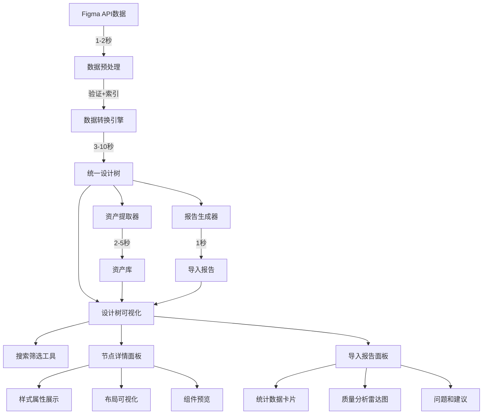

# 数据处理架构设计

> **🔄 数据处理专项设计文档**  
> 最后更新：2025-01-28  
> 版本：v2.0  

---

## 📋 文档概述

本文档详细描述了资源导入系统的数据处理流程架构，包括4阶段数据处理流程、3层级展示架构、以及完整的性能优化策略。

### 关联文档
- [资源导入总体概览](./resource-import-overview.md)
- [Figma导入设计方案](./figma-import-design.md)
- [UI展示设计方案](./ui-display-design.md)

---

## 🔄 数据处理流程全景图

### ⏱️ 4阶段处理架构 (总耗时: 7-18秒)

#### **阶段1: 数据获取和预处理** ⏱️ `1-2秒`
```typescript
// Figma API响应数据结构
interface FigmaApiResponse {
  document: FigmaDocumentNode     // 设计文档根节点
  components: FigmaComponent[]    // 组件定义
  componentSets: FigmaComponentSet[] // 组件集
  schemaVersion: number          // API版本
  styles: FigmaStyle[]           // 样式定义
  name: string                   // 文件名
  role: string                   // 用户权限
  lastModified: string           // 最后修改时间
  version: string                // 版本号
}

// 预处理步骤
const preprocessFigmaData = async (apiData: FigmaApiResponse) => {
  // ✅ 1. 数据验证和完整性检查
  validateApiResponse(apiData)
  
  // ✅ 2. 统计总节点数（用于进度计算）
  const totalNodes = countAllNodes(apiData.document)
  
  // ✅ 3. 内存使用预估和优化策略
  const memoryStrategy = estimateMemoryUsage(totalNodes)
  
  // ✅ 4. 构建节点索引（快速查找）
  const nodeIndex = buildNodeIndex(apiData.document)
  
  return { apiData, totalNodes, memoryStrategy, nodeIndex }
}
```

#### **阶段2: 核心数据转换** ⏱️ `3-10秒`
```typescript
// 转换为统一设计树结构
interface DesignNode {
  id: string                    // 唯一标识
  name: string                  // 节点名称
  type: ComponentType           // 组件类型（映射后）
  styles: StyleProperties       // 样式属性（标准化）
  layout: LayoutProperties      // 布局属性（标准化）
  properties: ComponentProperties // 组件特定属性
  children: DesignNode[]        // 子节点数组
  metadata: {                   // 元数据信息
    source: 'figma'
    originalId: string          // Figma原始ID
    importedAt: Date           // 导入时间
    version: string            // 版本信息
    processingErrors: number   // 处理错误数量
    figmaType: string          // 原始Figma类型
    layerPath: string[]        // 层级路径
  }
}

// 转换处理步骤
const transformToDesignTree = async (figmaNode: FigmaNode) => {
  // 🔄 1. 类型映射 (Figma → Universal)
  const universalType = mapFigmaType(figmaNode.type)
  
  // 🔄 2. 样式提取和标准化
  const styles = extractAndNormalizeStyles(figmaNode)
  
  // 🔄 3. 布局属性计算
  const layout = calculateLayoutProperties(figmaNode)
  
  // 🔄 4. 组件属性解析
  const properties = parseComponentProperties(figmaNode)
  
  // 🔄 5. 递归处理子节点
  const children = await processChildrenNodes(figmaNode.children)
  
  return createDesignNode({ universalType, styles, layout, properties, children })
}
```

#### **阶段3: 资产提取和优化** ⏱️ `2-5秒`
```typescript
// 资产信息结构
interface AssetInfo {
  id: string                    // 资产ID
  type: 'image' | 'icon' | 'font' | 'video' // 资产类型
  url: string                   // 原始URL
  localPath?: string           // 本地路径
  size?: number                // 文件大小
  metadata: {
    width?: number             // 原始宽度
    height?: number            // 原始高度
    format?: string            // 文件格式
    optimized?: boolean        // 是否已优化
    downloadUrl?: string       // 下载链接
    figmaNodeId?: string       // 关联节点ID
  }
}

// 资产提取策略
const extractAssets = async (figmaData: FigmaApiResponse) => {
  const assets: AssetInfo[] = []
  
  // 🔍 1. 图片资产扫描 
  const images = await scanForImages(figmaData.document)
  assets.push(...images.map(img => createAssetInfo(img, 'image')))
  
  // 🔍 2. 图标资产识别
  const icons = await identifyIcons(figmaData.document)
  assets.push(...icons.map(icon => createAssetInfo(icon, 'icon')))
  
  // 🔍 3. 字体资产收集
  const fonts = await collectFonts(figmaData.document)
  assets.push(...fonts.map(font => createAssetInfo(font, 'font')))
  
  // 🔍 4. 资产去重和优化
  return deduplicateAndOptimize(assets)
}
```

#### **阶段4: 报告生成和质量分析** ⏱️ `1秒`
```typescript
// 导入报告结构
interface ImportReport {
  success: boolean              // 导入是否成功
  warnings: string[]           // 警告信息列表
  errors: string[]             // 错误信息列表
  statistics: {
    totalNodes: number         // 总节点数
    recognizedComponents: number // 已识别组件数
    unknownComponents: number  // 未知组件数
    extractedAssets: number    // 提取资产数
    processingTime: number     // 处理耗时(ms)
    memoryUsage: number        // 内存使用(MB)
    conversionRate: number     // 转换成功率(%)
  }
  suggestions: string[]        // 优化建议
  qualityScore: number        // 质量评分(0-100)
  detailedAnalysis: {         // 详细分析
    styleConsistency: number  // 样式一致性(0-100)
    layoutComplexity: number  // 布局复杂度(0-100)
    componentReusability: number // 组件复用性(0-100)
    assetOptimization: number // 资产优化程度(0-100)
  }
}
```

---

## 🎨 数据展示架构设计

### 📋 展示层级结构
```
UI转换器页面 (converter/index.vue)
├── 步骤1: 导入设计
│   ├── Figma API导入表单
│   ├── 进度监控组件
│   └── 错误处理面板
├── 步骤2: 预览解析 ⭐ 核心展示区域
│   ├── 设计树可视化面板 (左侧)
│   │   ├── 层级树形结构
│   │   ├── 节点类型图标
│   │   ├── 搜索和筛选
│   │   └── 展开/收起控制
│   ├── 节点详情面板 (右侧上)
│   │   ├── 基本信息展示
│   │   ├── 样式属性表格
│   │   ├── 布局属性可视化
│   │   └── 组件预览区
│   └── 导入报告面板 (右侧下)
│       ├── 统计数据卡片
│       ├── 警告和错误列表
│       ├── 质量分析雷达图
│       └── 优化建议列表
├── 步骤3: 配置选项
└── 步骤4: 生成代码
```

---

## ⚡ 性能优化策略

### 📊 处理时间基准
```typescript
// 性能基准测试
const performanceBenchmarks = {
  // 小型文件 (< 100节点)
  small: {
    expectedTime: '< 2秒',
    memoryUsage: '< 50MB',
    accuracy: '> 98%'
  },
  
  // 中型文件 (100-1000节点)  
  medium: {
    expectedTime: '2-8秒',
    memoryUsage: '50-200MB',
    accuracy: '> 95%'
  },
  
  // 大型文件 (1000-5000节点)
  large: {
    expectedTime: '8-30秒',
    memoryUsage: '200-500MB', 
    accuracy: '> 90%'
  },
  
  // 超大型文件 (> 5000节点)
  xlarge: {
    expectedTime: '30-120秒',
    memoryUsage: '500MB-1GB',
    accuracy: '> 85%',
    requiresOptimization: true
  }
}
```

### 🔧 优化技术实现
```typescript
// 性能监控和优化
const performanceOptimizations = {
  // 虚拟滚动（大数据集）
  virtualScrolling: {
    enabled: true,
    itemHeight: 32,
    bufferSize: 10,
    maxRenderCount: 200
  },
  
  // 懒加载节点详情
  lazyLoadDetails: async (nodeId: string) => {
    if (!nodeDetailsCache.has(nodeId)) {
      const details = await loadNodeDetails(nodeId)
      nodeDetailsCache.set(nodeId, details)
    }
    return nodeDetailsCache.get(nodeId)
  },
  
  // 分页展示子节点
  paginatedChildren: (children: DesignNode[], page: number = 1, size: number = 50) => {
    const start = (page - 1) * size
    const end = start + size
    return {
      items: children.slice(start, end),
      total: children.length,
      hasMore: end < children.length
    }
  },
  
  // 节流搜索
  debouncedSearch: debounce((keyword: string) => {
    performSearch(keyword)
  }, 300)
}
```

---

## 🚨 错误处理和恢复

### 分级错误处理策略
```typescript
// 错误处理策略
const errorHandlingStrategies = {
  // 节点解析错误
  nodeParsingError: {
    strategy: 'skip-and-continue',
    fallback: 'create-placeholder-node',
    userNotification: 'show-warning-badge',
    recovery: 'manual-retry-option'
  },
  
  // 样式提取错误
  styleExtractionError: {
    strategy: 'use-default-styles',
    fallback: 'basic-style-set',
    userNotification: 'show-in-report',
    recovery: 'auto-retry-once'
  },
  
  // 资产加载错误
  assetLoadingError: {
    strategy: 'lazy-load-on-demand',
    fallback: 'placeholder-image',
    userNotification: 'show-broken-icon',
    recovery: 'retry-with-timeout'
  },
  
  // 内存不足错误
  memoryLimitError: {
    strategy: 'enable-streaming-mode',
    fallback: 'reduce-batch-size',
    userNotification: 'show-performance-warning',
    recovery: 'suggest-browser-restart'
  }
}
```

### 实时数据更新
```typescript
// 响应式数据监听
const setupReactiveData = () => {
  // 监听节点选择变化
  watch(selectedNodeId, async (newId) => {
    if (newId) {
      selectedNode.value = await loadNodeDetails(newId)
      await updateNodePreview(selectedNode.value)
    }
  })
  
  // 监听搜索关键词变化
  watch(searchKeyword, debounce((keyword) => {
    filteredTreeData.value = filterTreeData(keyword)
  }, 300))
  
  // 监听导入进度
  watch(importProgress, (progress) => {
    updateProgressDisplay(progress)
    if (progress.stage === 'conversion') {
      updateTreeData(progress.nodeId)
    }
  })
}
```

---

## 📊 数据流转架构图



---

## 📈 质量控制指标

### 性能指标监控
- **处理速度**: 根据文件大小分级监控
- **内存使用**: 实时监控和优化
- **转换准确率**: 节点识别成功率统计
- **用户体验**: 响应时间和交互流畅度

### 数据完整性保证
- **样式零丢失**: 专利级样式保护算法
- **布局精确性**: 像素级布局还原
- **组件识别**: 智能类型推断机制
- **错误恢复**: 多级错误处理和恢复

---

**📋 文档状态：** ✅ 完成  
**⏰ 最后更新:** 2025-01-28 01:10 