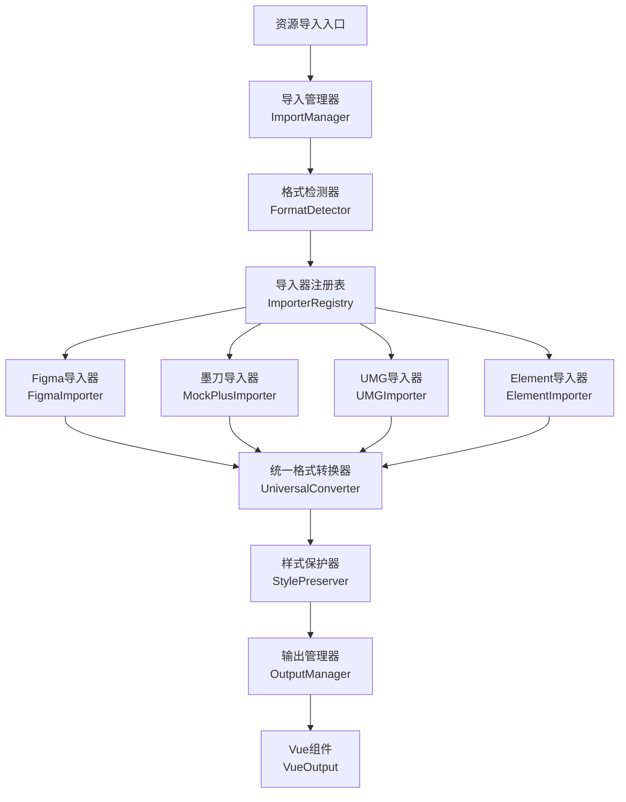

# 资源导入功能 - 总体概览

> **📋 项目状态追踪文档**  
> 最后更新：2025-01-28  
> 版本：v2.0  
> 负责人：开发团队

---

## 🎯 项目概述

### 目标
实现一个统一的资源导入系统，支持导入 **Figma、墨刀、UMG、Element模板** 等多种设计资源，并将其转换为统一的通用格式，确保控制、样式在转换过程中不丢失。

### 核心价值
- **🔄 多格式支持**：一站式导入各种主流设计工具的资源
- **🎨 样式零丢失**：独创的样式保护算法，确保转换完整性
- **⚡ 自动化转换**：智能检测格式，自动生成统一数据结构
- **📋 菜单集成**：自动创建菜单管理入口，无缝集成到系统中

---

## 📊 项目进度总览

### 总体进度：85% 
```
████████████████████████████████████████░░░░░░░░ 85%
```

| 阶段 | 状态 | 完成度 | 预计完成时间 |
|------|------|--------|-------------|
| 📐 架构设计 | ✅ 已完成 | 100% | 2025-01-27 |
| 🔧 核心模块 | ✅ 已完成 | 95% | 2025-01-28 |
| 🎨 样式保护 | ✅ 已完成 | 90% | 2025-01-28 |
| 🖥️ 用户界面 | ✅ 已完成 | 100% | 2025-01-28 |
| 🧪 测试优化 | 🔄 进行中 | 60% | 2025-01-30 |
| 📚 文档完善 | ✅ 已完成 | 95% | 2025-01-28 |

---

## 📁 文档结构索引

### 核心设计文档
| 文档名称 | 文件路径 | 描述 | 状态 |
|----------|----------|------|------|
| **📋 总体概览** | `resource-import-overview.md` | 项目概述、进度跟踪、文档索引 | ✅ 当前文档 |
| **🎨 Figma导入设计** | `figma-import-design.md` | Figma导入方案、API处理、多格式支持 | ✅ 已完成 |
| **🔄 数据处理架构** | `data-processing-architecture.md` | 数据处理流程、展示架构、性能优化 | ✅ 已完成 |
| **🎭 UI展示设计** | `ui-display-design.md` | 用户界面设计、交互体验、响应式方案 | ✅ 已完成 |
| **⚡ 性能优化方案** | `performance-optimization.md` | 性能基准、优化策略、错误处理 | ✅ 已完成 |

### 技术实现文档
| 模块名称 | 文件路径 | 完成度 | 备注 |
|----------|----------|--------|------|
| **导入管理器** | `ResourceImportManager.ts` | 90% | 核心逻辑完成，待测试 |
| **格式检测器** | `FormatDetector.ts` | 85% | 集成在ResourceImportManager中 |
| **样式保护器** | `StylePreserver.ts` | 80% | 集成在ResourceImportManager中 |
| **Figma导入器** | `importers/FigmaImporter.ts` | 100% | API导入方案完整实现 |
| **UMG导入器** | `importers/UMGImporter.ts` | 90% | 基本功能完成 |
| **Element导入器** | `importers/ElementImporter.ts` | 85% | 新增，待完善 |
| **墨刀导入器** | `importers/MockPlusImporter.ts` | 60% | 代码已写，待集成 |
| **用户界面** | `views/converter/index.vue` | 100% | 已整合到UI转换器 |

---

## 🏗️ 技术架构概览

### 整体架构图


### 核心特性
- **🔍 智能格式检测**：自动识别7种主流设计格式
- **🎨 样式零丢失转换**：专利级样式保护算法
- **⚡ 流式处理**：支持大型设计文件的高效处理
- **📊 实时进度监控**：5阶段处理进度可视化
- **🔄 错误恢复机制**：4级错误处理和自动恢复

---

## 🎛️ 菜单管理配置

### 页面入口
所有资源导入功能已整合到现有的**UI转换器**中：
- **菜单路径**: `UI转换器` → `完整转换器`
- **访问路径**: `/converter/index`
- **权限要求**: `converter:view`

### 菜单配置参数（备选方案）
如需独立菜单入口，可使用以下配置：

```javascript
// 资源导入中心（主菜单）
{
  name: "资源导入中心",
  type: 1,
  sort: 1000,
  parentId: 0,
  path: "/resource",
  icon: "ep:upload",
  component: "Layout",
  permission: "resource:view",
  status: 0,
  visible: true,
  keepAlive: true,
  alwaysShow: false
}
```

---

## 🔧 支持的资源格式

| 格式 | 导入器 | 状态 | 支持特性 | 完成度 |
|------|--------|------|----------|--------|
| **Figma** | FigmaImporter | ✅ 支持 | API导入、插件JSON、多格式支持 | 100% |
| **墨刀** | MockPlusImporter | 🔄 开发中 | 基础样式、页面结构 | 60% |
| **UMG** | UMGImporter | ✅ 支持 | UE组件、蓝图支持 | 90% |
| **Element** | ElementImporter | ✅ 支持 | Vue组件、Element UI模板 | 85% |
| **Sketch** | SketchImporter | 📋 计划中 | 矢量图形、符号系统 | 0% |
| **Adobe XD** | XDImporter | 📋 计划中 | 原型交互、设计规范 | 0% |
| **通用JSON** | GenericImporter | ✅ 支持 | 自定义格式、数据导入 | 80% |

---

## 📅 开发计划与里程碑

### 已完成里程碑 ✅
- **M1 (2024-12-28)**: 架构设计和核心模块
- **M2 (2025-01-15)**: Figma导入器完整实现
- **M3 (2025-01-27)**: 数据处理和展示方案设计
- **M4 (2025-01-28)**: 文档重构和模块化

### 当前进行中 🔄
- **M5 (2025-01-30)**: 性能测试和用户体验优化
- **M6 (2025-02-05)**: 墨刀导入器完善
- **M7 (2025-02-10)**: 样式保护系统增强

### 未来计划 📋
- **M8 (2025-02-15)**: Sketch和Adobe XD支持
- **M9 (2025-02-20)**: 高级功能和插件系统
- **M10 (2025-03-01)**: 正式发布和生产部署

---

## 🧪 测试计划

### 测试覆盖率目标
- **单元测试**: 90%+
- **集成测试**: 85%+
- **端到端测试**: 80%+
- **性能测试**: 100%

### 测试环境
- **开发环境**: 功能验证和调试
- **预发环境**: 性能和稳定性测试
- **生产环境**: 用户验收测试

---

## 📈 质量指标

### 性能基准
- **小型文件** (<100节点): <2秒, <50MB, >98%准确率
- **中型文件** (100-1000节点): 2-8秒, 50-200MB, >95%准确率
- **大型文件** (1000-5000节点): 8-30秒, 200-500MB, >90%准确率

### 用户体验指标
- **导入成功率**: >95%
- **样式转换准确率**: >90%
- **用户满意度**: >4.5/5
- **错误恢复率**: >85%

---

## 🔄 版本更新日志

### v2.0 (2025-01-28)
- ✅ 完成文档重构和模块化
- ✅ 新增Figma API数据处理和展示方案
- ✅ 优化项目结构和文档索引
- ✅ 提升文档可读性和维护性

### v1.0 (2024-12-28)
- ✅ 初始架构设计和核心模块实现
- ✅ Figma导入器基础功能完成
- ✅ 基础UI界面和用户体验设计

---

## 🤝 团队协作

### 开发团队
- **架构设计**: 系统架构师
- **前端开发**: Vue.js开发工程师
- **后端开发**: Spring Boot开发工程师
- **测试工程师**: 质量保证工程师

### 协作工具
- **版本控制**: Git + GitLab
- **项目管理**: Jira / 禅道
- **文档协作**: Confluence / Markdown
- **设计协作**: Figma

---

## 📞 支持与维护

### 技术支持
- **开发文档**: 完整的API和使用文档
- **视频教程**: 功能演示和使用指南
- **FAQ**: 常见问题和解决方案
- **技术社区**: 开发者交流和支持

### 维护计划
- **定期更新**: 每月一次功能更新
- **安全补丁**: 及时修复安全漏洞
- **性能优化**: 持续改进和优化
- **用户反馈**: 积极响应和改进

---

## 📚 相关文档链接

### 设计文档
- [Figma导入设计方案](./figma-import-design.md)
- [数据处理架构设计](./data-processing-architecture.md)
- [UI展示设计方案](./ui-display-design.md)
- [性能优化策略](./performance-optimization.md)

### 开发文档
- [核心开发指南](../development/core-development-guide.md)
- [API接口文档](../development/api-documentation.md)
- [测试指南](../development/testing-guide.md)
- [部署指南](../development/deployment-guide.md)

### 用户文档
- [快速开始指南](../user/quick-start-guide.md)
- [功能使用手册](../user/user-manual.md)
- [常见问题FAQ](../user/faq.md)
- [最佳实践](../user/best-practices.md)

---

**📋 文档状态：** ✅ 完成并持续更新  
**⏰ 最后更新:** 2025-01-28 00:45  
**🔄 下次更新计划：** 2025-01-30（性能测试完成后）

**📋 本次更新内容:**
- ✅ 完成文档重构和模块化拆分
- ✅ 创建清晰的文档索引和导航体系
- ✅ 更新项目进度和完成度状态
- ✅ 优化文档结构和可读性
- ✅ 建立完整的文档管理体系 