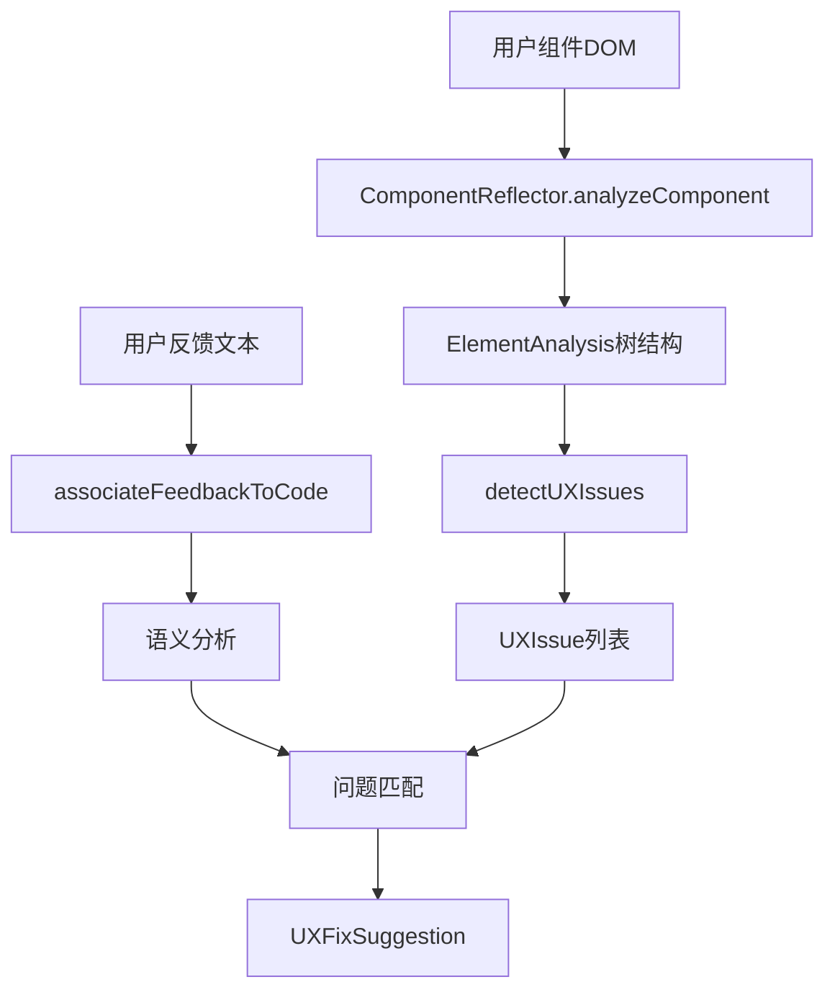

# 🔍 Vue组件反射机制 - 精准问题检测与关联系统

## 📋 目录
- [系统概述](#系统概述)
- [核心架构](#核心架构)
- [技术实现](#技术实现)
- [使用指南](#使用指南)
- [问题检测类型](#问题检测类型)
- [反馈关联算法](#反馈关联算法)
- [扩展指南](#扩展指南)

## 🎯 系统概述

Vue组件反射机制是一个革命性的UX问题检测系统，通过运行时分析DOM结构、CSS样式和Vue组件实例，自动识别UX问题并将用户反馈精准关联到具体的代码位置。

### 核心价值

#### 🚀 自动化优势
- **零人工介入**：系统自动检测布局问题
- **精准定位**：直接指向问题代码和CSS选择器
- **智能关联**：用户反馈自动匹配到具体问题
- **修复建议**：生成可执行的代码修改方案

#### 🎯 解决的核心问题
1. **人工检查低效**：传统的手动代码review耗时耗力
2. **问题定位困难**：用户反馈难以映射到具体代码位置
3. **修复方案不统一**：不同开发者的修复方式不一致
4. **质量标准缺失**：缺乏自动化的UX质量检测

## 🏗️ 核心架构

### 系统层次结构

```
组件反射机制
├── 🔍 ComponentReflector (核心反射器)
│   ├── 元素分析器 (ElementAnalysis)
│   ├── 问题检测器 (UXIssue Detection)
│   ├── 语义匹配器 (Semantic Matcher)
│   └── 修复生成器 (Fix Generator)
├── 📊 分析结果类型
│   ├── ElementAnalysis (元素分析结果)
│   ├── UXIssue (UX问题定义)
│   └── UXFixSuggestion (修复建议)
├── 🎮 Vue组合函数
│   └── useComponentReflection
└── 🖥️ 演示组件
    └── ComponentReflectionDemo.vue
```

### 数据流向



## 🔧 技术实现

### 1. 元素分析 (ElementAnalysis)

```typescript
interface ElementAnalysis {
  element: Element
  tagName: string
  classes: string[]
  styles: CSSStyleDeclaration
  boundingRect: DOMRect
  children: ElementAnalysis[]
  
  // 语义分析
  semanticRole: 'label' | 'control' | 'container' | 'decorator'
  interactionType: 'clickable' | 'input' | 'display' | 'navigation'
  
  // 布局分析
  layoutPattern: LayoutPattern
  positionRelative: { left, top, right, bottom }
}
```

#### 分析流程
1. **DOM遍历**：递归分析所有子元素
2. **样式解析**：获取计算后的CSS样式
3. **语义识别**：根据标签和类名确定元素作用
4. **布局模式检测**：识别flex、grid等布局模式

### 2. 问题检测引擎

#### 布局模式枚举
```typescript
enum LayoutPattern {
  SPACE_BETWEEN = 'space-between',     // justify-content: space-between
  INLINE_COMPACT = 'inline-compact',   // 内联紧凑布局
  VERTICAL_STACK = 'vertical-stack',   // 垂直堆叠
  GRID_LAYOUT = 'grid-layout',        // 网格布局
  FLEX_WRAP = 'flex-wrap'             // 弹性包装
}
```

#### 问题检测类型
```typescript
enum UXIssueType {
  COGNITIVE_LOAD = 'cognitive-load',           // 认知负担过重
  VISUAL_SEPARATION = 'visual-separation',     // 视觉分离问题
  ALIGNMENT_INCONSISTENCY = 'alignment-inconsistency',  // 对齐不一致
  SPACING_INEFFICIENT = 'spacing-inefficient', // 空间利用低效
  INTERACTION_AMBIGUOUS = 'interaction-ambiguous'  // 交互歧义
}
```

### 3. Space-Between 问题检测算法

```typescript
private detectSpaceBetweenIssues(analysis: ElementAnalysis): UXIssue[] {
  // 1. 查找所有使用 justify-content: space-between 的元素
  const spaceBetweenElements = this.findElementsByStyle(
    analysis, 'justify-content', 'space-between'
  )
  
  // 2. 分析是否为"标签-控件"模式
  for (const element of spaceBetweenElements) {
    const labelControlPairs = this.identifyLabelControlPairs(element)
    
    if (labelControlPairs.length > 0) {
      // 3. 生成问题报告和修复建议
      return this.generateSpaceBetweenIssue(element, labelControlPairs)
    }
  }
}
```

### 4. 语义匹配算法

```typescript
private matchFeedbackToIssues(feedback: string, issues: UXIssue[]): {
  exactMatches: UXIssue[]
  semanticMatches: UXIssue[]
} {
  const keywords = {
    spaceBetween: ['space-between', '距离过远', '空隙太大', '分离'],
    alignment: ['对齐', '整齐', '一致', '垂直'],
    compactness: ['紧凑', '紧挨着', '旁边', '直接放在'],
    cognitive: ['一目了然', '扫描', '认知', '视觉负担']
  }
  
  // 精确匹配 + 语义评分
  return this.performSemanticMatching(feedback, issues, keywords)
}
```

## 📖 使用指南

### 1. 基础用法

```vue
<template>
  <div ref="componentRef" class="my-component">
    <!-- 你的组件内容 -->
  </div>
</template>

<script setup>
import { useComponentReflection } from '@/components/FeedbackToRules/ComponentReflector'

const componentRef = ref()
const { issues, analysis, analyzeCurrentComponent, associateFeedback } = 
  useComponentReflection(componentRef)

// 分析组件
onMounted(() => {
  analyzeCurrentComponent()
})

// 关联用户反馈
const handleUserFeedback = (feedback: string) => {
  const result = associateFeedback(feedback)
  console.log('关联结果:', result)
}
</script>
```

### 2. 手动反射分析

```typescript
import { componentReflector } from '@/components/FeedbackToRules/ComponentReflector'

// 分析特定DOM元素
const analysis = componentReflector.analyzeComponent(domElement)

// 检测UX问题
const issues = componentReflector.detectUXIssues(analysis)

// 关联用户反馈
const result = componentReflector.associateFeedbackToCode(
  "开关应该直接放在选项后面",
  domElement
)
```

### 3. 自定义问题检测器

```typescript
class CustomIssueDetector {
  detect(analysis: ElementAnalysis): UXIssue[] {
    // 实现你的自定义检测逻辑
    return []
  }
}

// 扩展ComponentReflector
ComponentReflector.addDetector(new CustomIssueDetector())
```

## 🚨 问题检测类型详解

### 1. 视觉分离问题 (VISUAL_SEPARATION)

#### 检测条件
- 使用 `justify-content: space-between`
- 存在标签-控件对
- 标签与控件距离过远

#### 典型场景
```css
/* ❌ 问题布局 */
.config-item {
  display: flex;
  justify-content: space-between;  /* 导致过大空隙 */
}
```

#### 修复建议
```css
/* ✅ 修复后 */
.config-item {
  display: flex;
  align-items: center;
}

.config-item .label {
  width: 80px;          /* 固定宽度确保对齐 */
  margin-right: 8px;    /* 紧凑间距 */
  flex-shrink: 0;
}
```

### 2. 对齐不一致问题 (ALIGNMENT_INCONSISTENCY)

#### 检测条件
- 同级元素的对齐方式不统一
- 标签宽度不一致导致控件错位

#### 修复策略
- 统一标签宽度
- 使用CSS Grid实现精确对齐
- 建立对齐基准线

### 3. 认知负担问题 (COGNITIVE_LOAD)

#### 检测条件
- 视觉扫描距离过大
- 标签与控件的关联性不明确
- 需要额外的认知映射

#### 优化方向
- 减少视觉跳跃
- 增强元素关联性
- 简化交互逻辑

## 🔗 反馈关联算法

### 1. 关键词映射表

```typescript
const KEYWORD_MAPPING = {
  // Space-between相关
  spaceBetween: [
    'space-between', 'justify-content', 
    '距离过远', '空隙太大', '分离', '散开'
  ],
  
  // 对齐相关
  alignment: [
    '对齐', '整齐', '一致', '垂直', '水平',
    'align', 'alignment', 'justify'
  ],
  
  // 紧凑性相关
  compactness: [
    '紧凑', '紧挨着', '旁边', '直接放在',
    '贴近', '接近', 'compact', 'close'
  ],
  
  // 认知相关
  cognitive: [
    '一目了然', '扫描', '认知', '视觉负担',
    '理解', '直观', 'intuitive', 'clear'
  ]
}
```

### 2. 匹配评分机制

```typescript
interface MatchScore {
  exact: number      // 精确匹配分数
  semantic: number   // 语义匹配分数
  context: number    // 上下文匹配分数
  total: number      // 总分
}

const calculateMatchScore = (feedback: string, issue: UXIssue): MatchScore => {
  let score = { exact: 0, semantic: 0, context: 0, total: 0 }
  
  // 1. 精确匹配：关键词直接出现
  if (containsExactKeywords(feedback, issue.type)) {
    score.exact = 10
  }
  
  // 2. 语义匹配：相关概念匹配
  score.semantic = calculateSemanticSimilarity(feedback, issue.description)
  
  // 3. 上下文匹配：场景相似度
  score.context = calculateContextSimilarity(feedback, issue.context)
  
  score.total = score.exact + score.semantic + score.context
  return score
}
```

### 3. 关联精度优化

#### 提升精度的策略
1. **多维度匹配**：关键词 + 语义 + 上下文
2. **权重调整**：根据问题类型动态调整匹配权重
3. **否定词处理**：识别"不要"、"避免"等否定表达
4. **同义词扩展**：建立同义词库提高召回率

## 🚀 扩展指南

### 1. 添加新的问题检测器

```typescript
// 1. 定义新的问题类型
enum UXIssueType {
  COLOR_CONTRAST = 'color-contrast',  // 色彩对比度问题
  FONT_READABILITY = 'font-readability'  // 字体可读性问题
}

// 2. 实现检测逻辑
class ColorContrastDetector {
  detect(analysis: ElementAnalysis): UXIssue[] {
    // 检测颜色对比度是否符合WCAG标准
    return []
  }
}

// 3. 注册检测器
ComponentReflector.addDetector('color-contrast', new ColorContrastDetector())
```

### 2. 自定义修复建议生成器

```typescript
interface FixGenerator {
  generate(issue: UXIssue): UXFixSuggestion[]
}

class AccessibilityFixGenerator implements FixGenerator {
  generate(issue: UXIssue): UXFixSuggestion[] {
    // 生成无障碍相关的修复建议
    return []
  }
}
```

### 3. 集成到CI/CD流程

```yaml
# .github/workflows/ux-quality-check.yml
name: UX Quality Check
on: [push, pull_request]
jobs:
  ux-check:
    runs-on: ubuntu-latest
    steps:
      - uses: actions/checkout@v2
      - name: Run UX Analysis
        run: |
          npm run ux:analyze
          npm run ux:report
```

## 📊 性能考虑

### 1. 缓存策略
- **分析结果缓存**：避免重复分析相同元素
- **问题检测缓存**：缓存检测结果提高响应速度
- **LRU缓存清理**：防止内存泄露

### 2. 延迟加载
```typescript
// 组件首次渲染后延迟分析
onMounted(() => {
  nextTick(() => {
    setTimeout(() => {
      analyzeCurrentComponent()
    }, 100)
  })
})
```

### 3. 性能监控
```typescript
const performanceMonitor = {
  start: Date.now(),
  
  logAnalysisTime(elementCount: number, duration: number) {
    console.log(`分析${elementCount}个元素耗时: ${duration}ms`)
  }
}
```

## 🎯 最佳实践

### 1. 问题优先级设定
- **Critical**: 严重影响用户体验
- **Important**: 明显的UX问题  
- **Moderate**: 中等程度的改进点
- **Minor**: 细微的优化机会

### 2. 修复建议的可操作性
- 提供具体的CSS代码
- 包含before/after对比
- 说明修复的预期效果
- 考虑响应式适配

### 3. 团队协作集成
- 将检测结果集成到代码review流程
- 建立UX问题跟踪看板
- 定期生成UX质量报告
- 培训团队使用反射工具

## 📝 总结

Vue组件反射机制通过**自动化检测** + **精准关联** + **智能修复**的三位一体架构，将UX问题的发现和解决过程从"人工经验驱动"升级为"数据驱动 + 算法辅助"。

这个系统不仅解决了传统UX问题检测的效率问题，更重要的是建立了从**用户反馈**到**代码修复**的完整闭环，让UX优化变得可量化、可追踪、可持续改进。

### 🎉 核心优势总结
1. **🎯 精准定位**：直接指向问题代码位置
2. **🚀 自动化程度高**：零人工干预的问题检测
3. **🔗 反馈关联**：用户反馈自动映射到具体问题
4. **💡 智能修复**：生成可执行的修复方案
5. **📈 可扩展性强**：支持自定义检测器和修复器
6. **⚡ 性能优化**：缓存机制确保高效运行

这个反射机制为实现"设计系统自动优化"奠定了坚实的技术基础！ 