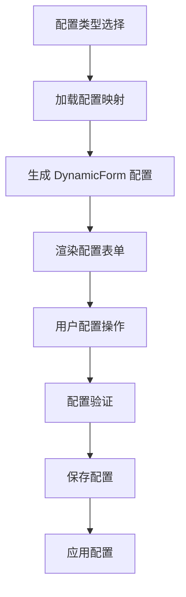

# 基于 DynamicForm 的配置页面自动生成方案

## 🎯 方案概述

基于现有的 DynamicForm 组件和样式配置工具，实现配置页面的自动生成，避免重复开发配置UI组件，提高开发效率和用户体验一致性。

## 🏗️ 架构设计

### 1. **核心组件**

```
DynamicConfigurator (配置页面生成器)
├── DynamicForm (动态表单引擎)
├── ControlStyleConfigurator (样式配置工具)
└── ConfigValidator (配置验证器)
```

### 2. **技术栈复用**

- **DynamicForm**: 提供动态表单生成能力
- **样式配置工具**: 提供统一的样式管理
- **配置验证器**: 提供配置验证能力
- **模板系统**: 提供预定义配置模板

## 🔧 实现方案

### 1. **DynamicConfigurator 组件**

```typescript
// 配置映射定义
const configMappings = {
  standard: {
    title: '标准配置',
    description: '调整组件的基础功能和显示设置',
    fields: [
      {
        key: 'dataSource.type',
        label: '数据源类型',
        type: 'select',
        control: 'select',
        defaultValue: 'static',
        options: [
          { label: '静态数据', value: 'static' },
          { label: 'API接口', value: 'api' },
          { label: '模拟数据', value: 'mock' }
        ],
        required: true,
        group: 'dataSource'
      }
      // ... 更多字段定义
    ],
    groups: [
      {
        key: 'dataSource',
        label: '数据源配置',
        icon: 'DataBoard',
        collapsible: true,
        collapsed: false
      }
      // ... 更多分组定义
    ]
  },
  advanced: {
    // 高级配置定义
  },
  style: {
    // 样式配置定义
  }
}
```

### 2. **配置页面自动生成流程**



### 3. **样式配置工具集成**

```typescript
// 样式配置字段定义
const styleFields = [
  {
    key: 'appearance.theme',
    label: '主题样式',
    type: 'select',
    control: 'select',
    options: [
      { label: '默认主题', value: 'default' },
      { label: '深色主题', value: 'dark' },
      { label: '自定义主题', value: 'custom' }
    ],
    group: 'appearance'
  },
  {
    key: 'layout.columns',
    label: '列数设置',
    type: 'number',
    control: 'number',
    min: 1,
    max: 6,
    defaultValue: 2,
    group: 'layout'
  }
  // ... 更多样式配置字段
]
```

## 🎨 用户体验设计

### 1. **渐进式配置**

- **标准配置**: 基础功能设置，适合普通用户
- **高级配置**: 深度定制功能，适合高级用户
- **样式配置**: 外观和布局设置，适合设计师

### 2. **智能默认值**

```typescript
// 根据组件类型自动设置默认配置
const getDefaultConfig = (componentType: string) => {
  const defaults = {
    'SuperTree': {
      dataSource: { type: 'api' },
      display: { layout: 'tree' },
      operations: { create: true, update: true, delete: true }
    },
    'SuperList': {
      dataSource: { type: 'api' },
      display: { layout: 'list' },
      interactions: { pagination: true, search: true }
    }
  }
  return defaults[componentType] || {}
}
```

### 3. **实时预览**

- 配置变更时实时更新预览
- 支持配置回滚和重置
- 提供配置对比功能

## 🔄 与现有架构的集成

### 1. **SuperConfiguratorNew 集成**

```vue
<template>
  <div class="super-configurator-new">
    <!-- 模板选择器 -->
    <TemplateSelector v-if="currentMode === 'template'" />
    
    <!-- 动态配置器 -->
    <DynamicConfigurator
      v-if="currentMode === 'standard'"
      config-type="standard"
      :component-id="componentId"
      @config-change="handleConfigChange"
    />
    
    <DynamicConfigurator
      v-if="currentMode === 'advanced'"
      config-type="advanced"
      :component-id="componentId"
      @config-change="handleConfigChange"
    />
    
    <DynamicConfigurator
      v-if="currentMode === 'style'"
      config-type="style"
      :component-id="componentId"
      @config-change="handleConfigChange"
    />
  </div>
</template>
```

### 2. **配置验证集成**

```typescript
// 使用现有的配置验证器
import { defaultConfigValidator } from '@/components/SuperConfigurator/utils/ConfigValidator'

const validateConfig = (config: any) => {
  const result = defaultConfigValidator.validateDetailed(config)
  return result
}
```

## 📋 开发计划

### 阶段一：基础功能 ✅
- [x] DynamicConfigurator 组件开发
- [x] 标准配置映射定义
- [x] 高级配置映射定义
- [x] 配置验证集成

### 阶段二：样式配置 🔄
- [ ] 样式配置字段定义
- [ ] 样式配置工具集成
- [ ] 样式预览功能
- [ ] 样式模板系统

### 阶段三：高级功能 📋
- [ ] 配置模板管理
- [ ] 配置导入导出
- [ ] 智能配置推荐
- [ ] 配置版本管理

### 阶段四：优化完善 📋
- [ ] 性能优化
- [ ] 用户体验优化
- [ ] 文档完善
- [ ] 测试覆盖

## 🎯 优势分析

### 1. **技术栈统一**
- 复用 DynamicForm 的成熟能力
- 统一的表单验证和交互模式
- 一致的样式和布局系统

### 2. **开发效率提升**
- 新增配置项只需定义配置结构
- 无需为每个配置器编写专门的UI组件
- 支持更复杂的配置项类型和验证规则

### 3. **用户体验一致性**
- 所有配置页面使用相同的交互模式
- 统一的样式和布局
- 更好的响应式支持

### 4. **可维护性增强**
- 配置逻辑与UI逻辑分离
- 配置结构清晰，易于理解和修改
- 支持配置的热更新和动态加载

## 🔧 使用示例

### 1. **基础使用**

```vue
<template>
  <DynamicConfigurator
    config-type="standard"
    :component-id="'my-component'"
    :initial-config="defaultConfig"
    @config-change="handleConfigChange"
    @config-save="handleConfigSave"
  />
</template>

<script setup>
import { DynamicConfigurator } from '@/components/SuperConfigurator'

const defaultConfig = {
  dataSource: { type: 'api' },
  display: { layout: 'list' },
  operations: { create: true, update: true, delete: true }
}

const handleConfigChange = (config) => {
  console.log('配置变更:', config)
}

const handleConfigSave = (config) => {
  console.log('配置保存:', config)
}
</script>
```

### 2. **高级配置**

```vue
<template>
  <DynamicConfigurator
    config-type="advanced"
    :component-id="'my-component'"
    :show-preview="true"
    @config-change="handleAdvancedConfigChange"
  />
</template>
```

### 3. **样式配置**

```vue
<template>
  <DynamicConfigurator
    config-type="style"
    :component-id="'my-component'"
    @config-change="handleStyleConfigChange"
  />
</template>
```

## 🚀 总结

基于 DynamicForm 的配置页面自动生成方案具有以下优势：

1. **技术栈统一**: 复用现有组件，避免重复开发
2. **开发效率高**: 配置驱动，减少UI开发工作
3. **用户体验好**: 统一的交互模式和样式
4. **可维护性强**: 配置与UI分离，易于维护和扩展
5. **扩展性好**: 支持自定义配置项和验证规则

这个方案完美地解决了"配置爆炸"问题，同时提供了更好的开发体验和用户体验。 