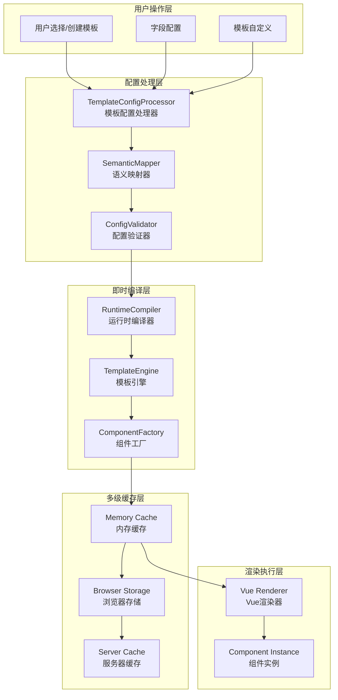

# 运行时编译架构讨论记录

## 📋 **讨论背景**

### **用户关键问题**
> 预编译配置如何实现，会不会因为模板页面增加需要重新编译？因为将来还要实现用户自定义模板（修改模板页面生成新模板）

### **核心挑战**
1. **动态模板需求**: 用户可以自定义模板，传统预编译无法满足
2. **性能要求**: 需要保证模板渲染的高性能
3. **扩展性**: 新增模板不应要求重新编译整个应用
4. **用户体验**: 自定义模板应该即时生效

## 🔍 **问题分析**

### **传统预编译的局限性**
```typescript
// ❌ 传统预编译的问题
const traditionalPrecompilation = {
  problems: [
    '每次新增模板需要重新编译整个应用',
    '用户自定义模板无法预编译',
    '部署复杂度高',
    '无法支持运行时模板生成'
  ],
  limitations: [
    '静态编译时间固定',
    '无法动态扩展',
    '用户自定义受限',
    '发布流程复杂'
  ]
}
```

### **运行时编译的优势**
```typescript
// ✅ 运行时编译+缓存的优势  
const runtimeCompilation = {
  advantages: [
    '支持动态模板创建',
    '用户自定义模板即时生效',
    '无需重新部署',
    '编译结果可缓存复用'
  ],
  benefits: [
    '灵活性极高',
    '用户体验佳',
    '扩展性强',
    '维护成本低'
  ]
}
```

## 🏗️ **提出的解决方案：即时编译+多级缓存**

### **整体架构**



### **核心组件设计**

#### **1. 运行时编译器 (RuntimeTemplateCompiler)**
```typescript
/**
 * 运行时编译器 - 不生成代码，而是生成渲染指令
 */
class RuntimeTemplateCompiler {
  private compilationCache = new Map<string, CompiledTemplate>()
  private templateEngine = new TemplateEngine()
  
  /**
   * 即时编译模板配置
   * @param templateConfig 模板配置（可能是预设的或用户自定义的）
   * @param userFields 用户定义的字段
   * @returns 编译后的渲染指令
   */
  async compile(
    templateConfig: TemplateConfig,
    userFields: UserFieldDefinition[]
  ): Promise<CompiledTemplate>
  
  // 编译阶段：
  // 1. 语义映射（5-20ms）
  // 2. 组件配置生成（10-50ms）
  // 3. 渲染指令生成（5-15ms）
  // 4. 优化和验证（5-10ms）
}
```

#### **2. 多级缓存系统 (MultiLevelCache)**
```typescript
class MultiLevelCache {
  // Level 1: 内存缓存 (最快 ~0.1ms)
  private memoryCache = new Map<string, CachedItem>()
  
  // Level 2: 浏览器存储 (快 ~1-5ms)
  private browserStorage = new BrowserStorageAdapter()
  
  // Level 3: 服务器缓存 (慢 ~50-200ms，但比重新编译快)
  private serverCache = new ServerCacheAdapter()
  
  async get(cacheKey: string): Promise<CompiledTemplate | null>
  async set(cacheKey: string, compiledTemplate: CompiledTemplate): Promise<void>
}
```

#### **3. 用户自定义模板管理 (UserTemplateManager)**
```typescript
class UserTemplateManager {
  /**
   * 用户创建自定义模板
   */
  async createCustomTemplate(
    baseTemplateId: string,
    customizations: TemplateCustomization,
    templateName: string
  ): Promise<string>
  
  /**
   * 即时编译用户模板
   */
  async compileUserTemplate(
    templateId: string,
    userFields: UserFieldDefinition[]
  ): Promise<CompiledTemplate>
}
```

### **关键技术特点**

#### **配置解析而非代码编译**
```typescript
/**
 * 编译结果 - 渲染指令而不是编译后的代码
 */
interface CompiledTemplate {
  id: string
  templateId: string
  userFieldsHash: string
  compiledAt: number
  
  // 核心：渲染指令
  renderInstructions: RenderInstruction[]
  
  // 元数据
  metadata: {
    compilationTime: number
    cacheKey: string
    version: string
  }
}

/**
 * 渲染指令 - 描述如何渲染，而不是编译后的代码
 */
interface RenderInstruction {
  type: 'component' | 'layout' | 'template'
  component: string
  props: Record<string, any>
  events: Record<string, Function>
  children?: RenderInstruction[]
  
  // 动态渲染函数
  render: () => VNode
}
```

#### **智能缓存策略**
```typescript
// 缓存过期策略
const cacheStrategy = {
  // 用户自定义模板：较短过期时间（1小时）
  userTemplate: '1 hour',
  
  // 预设模板：较长过期时间（1天）
  presetTemplate: '1 day',
  
  // 热门模板：预热缓存
  popularTemplate: 'precompiled'
}
```

### **性能表现预期**

```typescript
const performanceBenchmark = {
  // 冷启动（首次编译）
  coldStart: {
    simpleTemplate: '50-100ms',     // 简单模板
    complexTemplate: '100-300ms',   // 复杂模板
    userCustomTemplate: '150-400ms' // 用户自定义模板
  },
  
  // 热启动（缓存命中）
  hotStart: {
    memoryCache: '0.1-0.5ms',      // 内存缓存
    browserStorage: '1-5ms',        // 浏览器存储
    serverCache: '50-150ms'         // 服务器缓存
  },
  
  // 用户感知性能
  userExperience: {
    firstPaint: '<100ms',           // 骨架屏
    meaningfulPaint: '<300ms',      // 主要内容
    fullyInteractive: '<500ms'      // 完全可交互
  }
}
```

## 🎯 **方案优势**

### **技术优势**
1. **✅ 动态模板支持**: 用户自定义模板即时生效，无需重新部署
2. **✅ 智能缓存**: 多级缓存确保高性能，避免重复编译
3. **✅ 渐进式渲染**: 分阶段渲染，保证用户体验
4. **✅ 配置解析**: 不生成代码，而是生成渲染指令，更灵活

### **业务优势**
1. **快速迭代**: 新模板即时生效
2. **用户自主**: 用户可自定义模板
3. **降低维护**: 无需频繁发布
4. **扩展性强**: 模板数量不影响性能

## 📝 **实施计划**

### **分阶段实施**
1. **第一阶段**: 实现基础的运行时编译器和内存缓存
2. **第二阶段**: 添加浏览器存储缓存和用户自定义模板支持
3. **第三阶段**: 实现服务器缓存和性能优化
4. **第四阶段**: 添加预编译和渐进式渲染

### **风险评估**
```typescript
const riskAssessment = {
  技术风险: {
    运行时编译复杂度: 'Medium',
    缓存一致性管理: 'Medium',
    性能调优难度: 'High'
  },
  
  业务风险: {
    用户学习成本: 'Low',
    系统稳定性: 'Medium',
    维护复杂度: 'Medium'
  }
}
```

## 🚫 **最终决策：暂不采用**

### **决策原因**
> 为保证顺利落地，不建议引入太多未知因素。暂时不增加即时编译的功能

### **决策合理性**
1. **降低复杂度**: 避免引入过多未知技术风险
2. **保证交付**: 优先完成核心功能
3. **渐进演进**: 可在后续版本中考虑引入
4. **稳定优先**: 确保系统稳定性

## 🔄 **替代方案**

### **当前阶段采用的方案**
1. **静态模板**: 预定义常用模板
2. **配置驱动**: 通过配置实现模板变化
3. **标准接口**: 保证模板接口一致性
4. **后续扩展**: 为未来即时编译预留接口

### **未来演进路径**
```typescript
const evolutionPath = {
  v1: '静态模板 + 配置驱动',
  v2: '增量编译 + 简单缓存',
  v3: '运行时编译 + 多级缓存',
  v4: '智能预编译 + 用户自定义'
}
```

## 📚 **参考资料**

- [SmartRenderer设计决策](./SMARTRENDERER_DESIGN_DECISION.md)
- [模板驱动设计](./TEMPLATE_DRIVEN_DESIGN.md)
- [DynamicConfigurator集成](./DYNAMICFORM_CONFIGURATOR_INTEGRATION.md)

## 📋 **后续行动**

1. **✅ 记录讨论**: 完成此文档
2. **🔄 进行SmartRenderer详细设计**: 基于当前决策进行设计
3. **📋 保留扩展接口**: 为未来即时编译预留可能性
4. **📋 关注技术发展**: 持续评估即时编译的可行性

---

**文档状态**: 已完成  
**创建时间**: 2024-01-20  
**最后更新**: 2024-01-20  
**相关决策**: 暂不采用即时编译，优先完成SmartRenderer核心功能