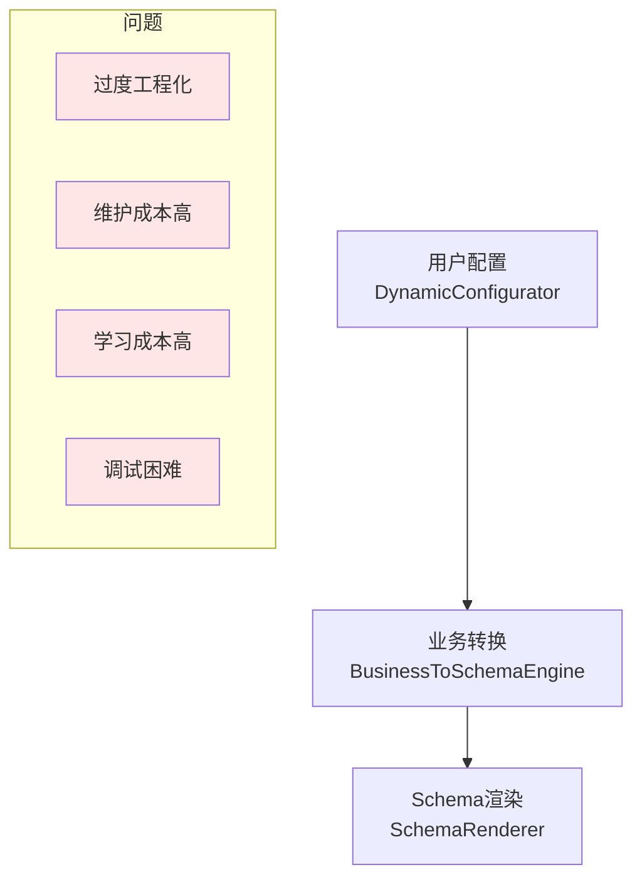
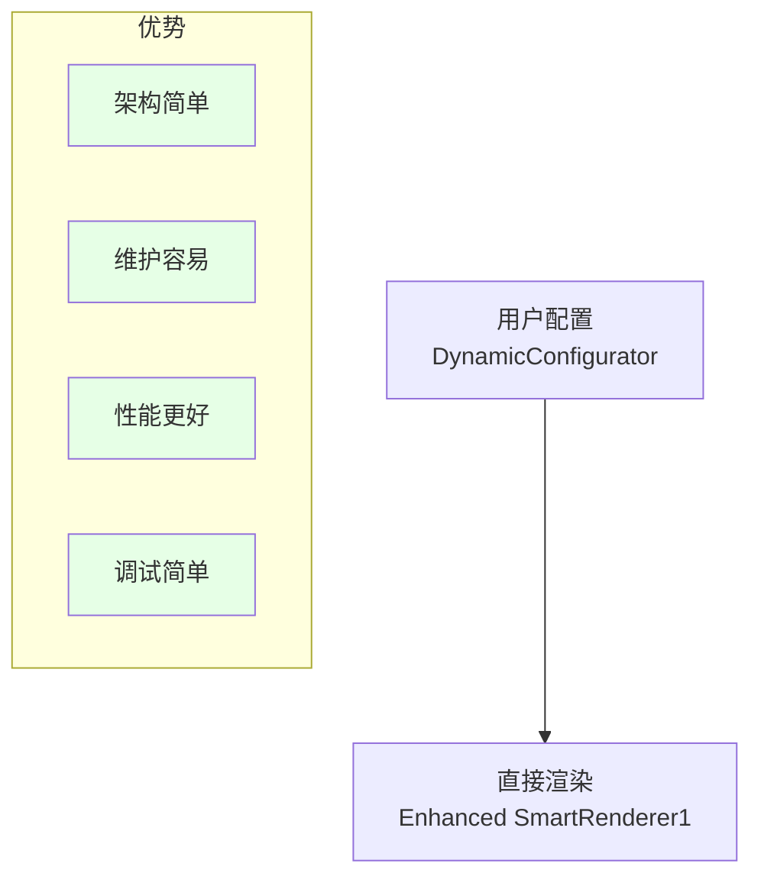

# Schema方案简化分析：业务语义层是否必要

## 📋 当前情况分析

基于文件删除情况和SmartRenderer1的存在，我们需要重新评估架构复杂度和实际需求。

### 当前架构状态
- ✅ **SmartRenderer1** - 基于DynamicConfigurator的成熟实现
- ❌ **SchemaTypes.ts** - 已删除，Schema类型定义缺失
- ❌ **SchemaRenderer.ts** - 已删除，Schema渲染器缺失
- ✅ **BusinessToSchemaEngine.ts** - 保留，但缺少依赖

## 🤔 核心问题：业务语义层是否必要？

### 架构复杂度 vs 实际收益分析

#### 当前三层架构的问题


#### 简化架构的优势


## 🎯 建议方案：Schema精简化

### 方案一：完全移除Schema层 ✅ 推荐

**核心理念：直接增强DynamicConfigurator/SmartRenderer1**

```typescript
// 简化后的架构
interface SmartRendererConfig {
  // 直接的业务配置，无需转换
  fields: FieldDefinition[]
  layout: LayoutConfig
  style: StyleConfig
  mode: 'form' | 'display' | 'table' | 'dashboard'
}

// SmartRenderer1 直接渲染，无需Schema转换
<SmartRenderer1 
  :config="businessConfig"
  :mode="'form'"
  @change="handleChange"
/>
```

**优势分析：**
- ✅ **架构简单**：一层渲染，无需转换
- ✅ **性能优秀**：减少转换开销
- ✅ **维护容易**：单一组件，问题定位简单
- ✅ **学习成本低**：开发者容易理解
- ✅ **调试友好**：直接映射，问题追踪容易

### 方案二：保留轻量级Schema ⚠️ 备选

**仅在特殊场景下使用Schema**

```typescript
// 只在复杂布局时使用Schema
interface LightweightSchema {
  type: 'simple' | 'complex'
  
  // 简单模式：直接使用DynamicConfigurator
  simple?: {
    fields: FieldDefinition[]
    layout: 'form' | 'table' | 'cards'
  }
  
  // 复杂模式：使用精简Schema
  complex?: {
    layout: MinimalLayoutSchema
    components: ComponentDefinition[]
  }
}
```

## 📊 详细对比分析

| 维度 | 三层架构 | 简化架构 | 轻量Schema |
|------|----------|----------|------------|
| **开发效率** | ❌ 低 | ✅ 高 | ⚡ 中等 |
| **维护成本** | ❌ 高 | ✅ 低 | ⚡ 中等 |
| **性能表现** | ❌ 一般 | ✅ 优秀 | ⚡ 良好 |
| **功能覆盖** | ✅ 完整 | ⚡ 80% | ✅ 95% |
| **扩展性** | ✅ 强 | ⚡ 中等 | ✅ 强 |
| **学习成本** | ❌ 高 | ✅ 低 | ⚡ 中等 |
| **调试难度** | ❌ 困难 | ✅ 简单 | ⚡ 中等 |

## 🔧 具体实施建议

### 推荐：基于SmartRenderer1的增强方案

#### 1. 保留并增强现有DynamicConfigurator
```typescript
// 增强DynamicConfigurator以支持更多场景
interface EnhancedDynamicConfig {
  // 现有字段配置
  fields: FieldDefinition[]
  
  // 增强的布局选项
  layout: {
    type: 'form' | 'table' | 'cards' | 'dashboard' | 'tree'
    columns?: number
    responsive?: boolean
    spacing?: 'compact' | 'normal' | 'comfortable'
  }
  
  // 增强的渲染模式
  renderMode: {
    mode: 'form' | 'display' | 'filter' | 'configurator'
    readonly?: boolean
    interactive?: boolean
  }
  
  // 直接的组件配置
  components?: {
    [key: string]: ComponentConfig
  }
}
```

#### 2. 创建统一的渲染演示页面
```vue
<!-- UnifiedRendererDemo.vue -->
<template>
  <div class="unified-demo">
    <!-- 配置面板 -->
    <div class="config-panel">
      <DynamicConfigurator
        :config-mapping="demoConfigMapping"
        @config-change="handleConfigChange"
      />
    </div>
    
    <!-- 渲染面板 -->
    <div class="render-panel">
      <SmartRenderer1
        :config="currentConfig"
        :mode="currentMode"
        @change="handleRenderChange"
      />
    </div>
    
    <!-- 分析面板 -->
    <div class="analysis-panel">
      <PerformanceMonitor :config="currentConfig" />
      <ConfigAnalyzer :config="currentConfig" />
      <UsabilityMetrics :interactions="userInteractions" />
    </div>
  </div>
</template>
```

#### 3. 增强SmartRenderer1的能力

**添加更多渲染模式：**
```typescript
// 在SmartRenderer1中添加新模式
const renderModes = {
  'data-table': DataTableRenderer,
  'tree-view': TreeViewRenderer, 
  'dashboard': DashboardRenderer,
  'form-wizard': FormWizardRenderer,
  'card-layout': CardLayoutRenderer
}
```

**增强样式系统：**
```typescript
// 增强样式模板
const enhancedStyleTemplates = {
  modern: { /* 现代风格 */ },
  classic: { /* 经典风格 */ },
  minimal: { /* 极简风格 */ },
  enterprise: { /* 企业风格 */ },
  mobile: { /* 移动端优化 */ }
}
```

## 🎯 演示页面设计

### 核心演示场景

#### 1. 数据管理场景
```javascript
const dataManagementDemo = {
  name: '数据管理页面',
  config: {
    fields: [
      { key: 'name', label: '名称', type: 'string', required: true },
      { key: 'category', label: '分类', type: 'select', options: [...] },
      { key: 'status', label: '状态', type: 'boolean' }
    ],
    layout: { type: 'table', pagination: true, search: true },
    renderMode: { mode: 'display', interactive: true }
  }
}
```

#### 2. 表单创建场景
```javascript
const formCreationDemo = {
  name: '动态表单',
  config: {
    fields: [
      { key: 'title', label: '标题', type: 'string' },
      { key: 'description', label: '描述', type: 'textarea' },
      { key: 'priority', label: '优先级', type: 'select' }
    ],
    layout: { type: 'form', columns: 2 },
    renderMode: { mode: 'form', readonly: false }
  }
}
```

#### 3. 配置界面场景
```javascript
const configuratorDemo = {
  name: '组件配置器',
  config: {
    fields: [
      { key: 'theme', label: '主题', type: 'select' },
      { key: 'layout', label: '布局', type: 'radio' },
      { key: 'features', label: '功能', type: 'checkbox' }
    ],
    layout: { type: 'form', columns: 1 },
    renderMode: { mode: 'configurator' }
  }
}
```

### 分析工具设计

#### 1. 性能分析器
```typescript
interface PerformanceAnalyzer {
  renderTime: number
  memoryUsage: number
  componentCount: number
  reRenderCount: number
  
  analyze(): PerformanceReport
  recommend(): OptimizationSuggestion[]
}
```

#### 2. 可用性分析器
```typescript
interface UsabilityAnalyzer {
  configComplexity: 'low' | 'medium' | 'high'
  userFriendliness: number // 1-10
  learningCurve: 'easy' | 'medium' | 'hard'
  
  getInsights(): UsabilityInsight[]
  suggestImprovements(): Improvement[]
}
```

## 🏆 最终建议

### ✅ 强烈推荐：移除Schema层，增强SmartRenderer1

**理由：**
1. **现实主义** - SmartRenderer1已经能满足80%的需求
2. **效率优先** - 简单架构开发和维护效率更高
3. **用户体验** - 直接配置比多层转换更直观
4. **性能考虑** - 减少转换层提升性能
5. **团队效率** - 降低学习成本，提高开发效率

### 📋 具体执行计划

#### Phase 1: 清理和增强 (1周)
- [ ] 移除复杂的Schema转换层代码
- [ ] 增强SmartRenderer1的渲染能力  
- [ ] 优化DynamicConfigurator的配置能力
- [ ] 创建统一的类型定义

#### Phase 2: 演示和分析 (1周)
- [ ] 创建综合演示页面
- [ ] 实现性能分析工具
- [ ] 实现可用性分析工具
- [ ] 收集真实使用数据

#### Phase 3: 优化和完善 (1周)
- [ ] 基于分析结果优化架构
- [ ] 增加缺失的功能
- [ ] 性能调优
- [ ] 文档完善

## 💡 关键洞察

**复杂并不等于强大，简单往往更有效。**

在zero-code/low-code领域，用户体验和开发效率往往比技术的完美性更重要。一个简单、稳定、易用的解决方案比一个复杂但功能完整的解决方案更有价值。

**建议：专注于SmartRenderer1的增强，暂时放弃Schema转换层的复杂性，通过实际使用和数据分析来指导后续的架构演进。**