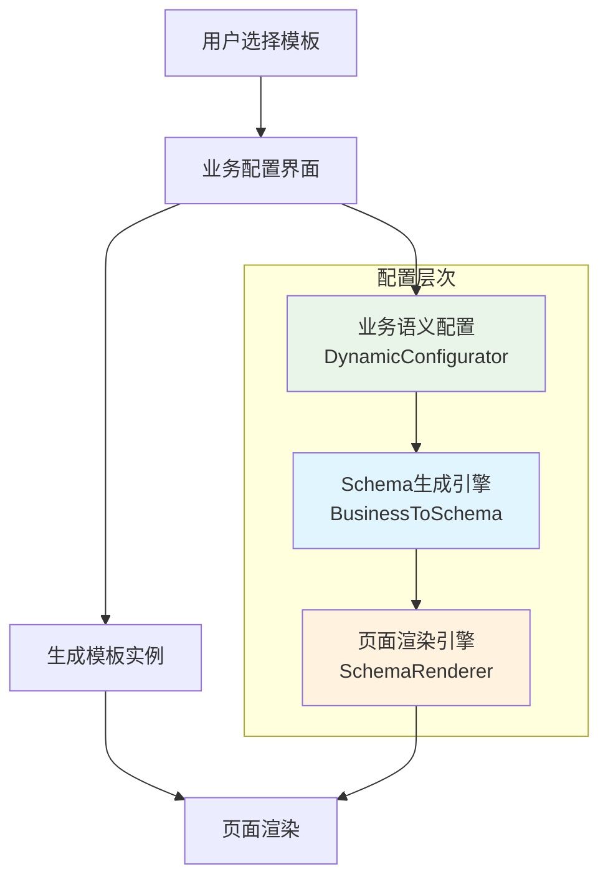
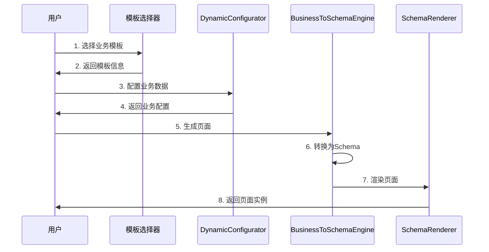

# Schema方案 vs DynamicConfigurator架构分析及统一零代码方案设计

## 📋 背景

目前系统中存在两套并行的架构方案：
1. **DynamicConfigurator** - 基于字段配置的动态表单生成
2. **Schema方案** - 基于JSON Schema的声明式渲染

需要建立一套统一的方案，支持**动态业务扩展**和**零代码业务生成**，符合"用户选择模板→配置数据→生成模板实例"的设计理念。

## 🔍 当前架构差异分析

### 1. DynamicConfigurator架构特点

#### ✅ 优势
```typescript
// 字段驱动的配置生成
interface FieldConfig {
  key: string
  label: string
  type: 'boolean' | 'string' | 'number' | 'select' | 'array' | 'textarea'
  required?: boolean
  defaultValue?: any
  options?: Array<{ label: string; value: any }>
}

// 分组管理
interface GroupConfig {
  key: string
  label: string
  icon?: string
  fields: FieldConfig[]
}

// 简单直观的配置映射
const configMappings = {
  standard: {
    title: '标准配置',
    groups: [/*分组配置*/]
  }
}
```

**DynamicConfigurator的核心优势：**
- 🎯 **业务语义清晰**：直接对应用户理解的业务概念
- 🔧 **配置简单**：通过字段配置即可生成表单
- 👥 **用户友好**：符合用户的表单操作习惯
- 🚀 **开发效率高**：无需编写复杂的Schema

#### ❌ 局限性
- **表达能力有限**：主要适用于表单场景，复杂布局支持不足
- **扩展性约束**：添加新的渲染模式需要修改核心逻辑
- **页面组合能力弱**：难以支持复杂的页面布局和组件组合

### 2. Schema方案架构特点

#### ✅ 优势
```typescript
// 强大的布局描述能力
interface LayoutSchema {
  type: 'container' | 'row' | 'col' | 'grid' | 'flex' | 'card' | 'tabs'
  component?: string
  props?: Record<string, any>
  children?: LayoutSchema[]
  condition?: string
  loop?: {
    source: string
    item: string
    filter?: string
  }
}

// 完整的页面定义
interface PageSchema {
  schemaVersion: string
  metadata: SchemaMetadata
  layout: LayoutSchema
  configSchema: ConfigSchema
  dataSchema?: DataSchema
  eventSchema?: EventSchema
}
```

**Schema方案的核心优势：**
- 🎨 **表达能力强**：可以描述任意复杂的页面结构
- 🔄 **扩展性好**：易于添加新的布局类型和组件
- 📱 **响应式友好**：支持复杂的响应式布局
- 🎛️ **配置驱动**：完全基于配置的渲染

#### ❌ 局限性
- **学习成本高**：需要用户理解复杂的Schema结构
- **配置复杂**：简单的表单也需要复杂的Schema定义
- **用户体验挑战**：直接编辑Schema对业务用户不友好

## 🎯 统一零代码方案设计

### 核心设计理念



### 1. 三层架构设计

#### 第一层：业务语义层 (Business Semantic Layer)
**基于DynamicConfigurator的用户配置界面**

```typescript
// 业务模板定义
interface BusinessTemplate {
  id: string
  name: string
  category: 'data-management' | 'dashboard' | 'form' | 'report'
  
  // 业务配置Schema - 用DynamicConfigurator生成
  businessConfigSchema: {
    groups: GroupConfig[]
  }
  
  // 默认业务配置
  defaultBusinessConfig: Record<string, any>
  
  // Schema生成规则
  schemaGenerationRules: SchemaGenerationRule[]
}

// 用户业务配置 (DynamicConfigurator输出)
interface UserBusinessConfig {
  templateId: string
  businessData: Record<string, any>  // 用户通过DynamicConfigurator配置的数据
  customizations: Record<string, any>
}
```

#### 第二层：Schema转换层 (Schema Transformation Layer)
**业务配置到Schema的智能转换**

```typescript
// Schema生成引擎
export class BusinessToSchemaEngine {
  /**
   * 将业务配置转换为PageSchema
   */
  generatePageSchema(
    template: BusinessTemplate,
    userConfig: UserBusinessConfig
  ): PageSchema {
    
    // 1. 解析业务数据
    const businessData = this.parseBusinessData(userConfig.businessData)
    
    // 2. 应用生成规则
    const layoutSchema = this.applyGenerationRules(
      template.schemaGenerationRules,
      businessData
    )
    
    // 3. 生成完整Schema
    return {
      schemaVersion: '1.0',
      metadata: this.generateMetadata(template, userConfig),
      layout: layoutSchema,
      configSchema: this.generateConfigSchema(template),
      dataSchema: this.generateDataSchema(businessData)
    }
  }
  
  /**
   * 应用生成规则
   */
  private applyGenerationRules(
    rules: SchemaGenerationRule[],
    businessData: Record<string, any>
  ): LayoutSchema {
    // 根据业务数据和规则生成布局Schema
  }
}

// Schema生成规则
interface SchemaGenerationRule {
  condition: string  // 何时应用此规则
  action: 'add-component' | 'set-layout' | 'configure-props'
  target: {
    component: string
    position?: string
    props?: Record<string, any>
  }
}
```

#### 第三层：Schema渲染层 (Schema Rendering Layer)
**基于增强SchemaRenderer的页面渲染**

```typescript
// 增强的Schema渲染器
export class EnhancedSchemaRenderer extends SchemaRenderer {
  /**
   * 渲染业务页面
   */
  async renderBusinessPage(
    pageSchema: PageSchema,
    businessContext: BusinessRenderContext
  ): Promise<SchemaRenderResult> {
    
    // 1. 注入业务上下文
    const enhancedContext = this.createBusinessContext(
      pageSchema,
      businessContext
    )
    
    // 2. 执行Schema渲染
    return await super.render(pageSchema, enhancedContext.config, enhancedContext.data)
  }
}
```

### 2. 模板系统设计

#### 数据管理类模板
```typescript
const dataManagementTemplate: BusinessTemplate = {
  id: 'data-management-v1',
  name: '数据管理页面',
  category: 'data-management',
  
  businessConfigSchema: {
    groups: [
      {
        key: 'dataSource',
        label: '数据源配置',
        icon: 'DataBoard',
        fields: [
          {
            key: 'tableName',
            label: '表名称',
            type: 'string',
            required: true,
            placeholder: '请输入数据表名称'
          },
          {
            key: 'displayFields',
            label: '显示字段',
            type: 'array',
            required: true,
            itemType: 'field-selector'
          }
        ]
      },
      {
        key: 'operations',
        label: '操作配置',
        icon: 'Setting',
        fields: [
          {
            key: 'enableCreate',
            label: '允许新增',
            type: 'boolean',
            defaultValue: true
          },
          {
            key: 'enableEdit',
            label: '允许编辑',
            type: 'boolean',
            defaultValue: true
          },
          {
            key: 'enableDelete',
            label: '允许删除',
            type: 'boolean',
            defaultValue: false
          }
        ]
      }
    ]
  },
  
  schemaGenerationRules: [
    {
      condition: 'businessData.layout === "table"',
      action: 'add-component',
      target: {
        component: 'SuperList',
        position: 'main-content',
        props: {
          'data-source': '${businessData.dataSource}',
          'columns': '${businessData.displayFields}',
          'operations': '${businessData.operations}'
        }
      }
    },
    {
      condition: 'businessData.layout === "tree"',
      action: 'add-component',
      target: {
        component: 'SuperTree',
        position: 'main-content',
        props: {
          'data-source': '${businessData.dataSource}',
          'tree-props': '${businessData.treeConfig}'
        }
      }
    }
  ]
}
```

#### 仪表盘类模板
```typescript
const dashboardTemplate: BusinessTemplate = {
  id: 'dashboard-v1',
  name: '仪表盘页面',
  category: 'dashboard',
  
  businessConfigSchema: {
    groups: [
      {
        key: 'layout',
        label: '布局配置',
        fields: [
          {
            key: 'gridColumns',
            label: '列数',
            type: 'number',
            min: 1,
            max: 12,
            defaultValue: 4
          }
        ]
      },
      {
        key: 'widgets',
        label: '组件配置',
        fields: [
          {
            key: 'widgets',
            label: '仪表盘组件',
            type: 'array',
            itemType: 'widget-selector'
          }
        ]
      }
    ]
  },
  
  schemaGenerationRules: [
    {
      condition: 'true',
      action: 'set-layout',
      target: {
        component: 'dashboard-grid',
        props: {
          columns: '${businessData.gridColumns}'
        }
      }
    }
  ]
}
```

### 3. 实现流程

#### 用户操作流程


#### 技术实现流程
```typescript
// 统一的零代码页面生成器
export class ZeroCodePageGenerator {
  
  async generatePage(
    templateId: string,
    userBusinessConfig: UserBusinessConfig
  ): Promise<RenderedPageInstance> {
    
    // 1. 获取业务模板
    const template = await this.getBusinessTemplate(templateId)
    
    // 2. 生成PageSchema
    const pageSchema = this.businessToSchemaEngine.generatePageSchema(
      template,
      userBusinessConfig
    )
    
    // 3. 渲染页面
    const renderResult = await this.schemaRenderer.renderBusinessPage(
      pageSchema,
      {
        businessConfig: userBusinessConfig,
        template: template
      }
    )
    
    // 4. 创建页面实例
    return this.createPageInstance(renderResult, template, userBusinessConfig)
  }
}
```

## 🔧 统一架构优势

### 1. 用户体验优势
- **简单配置**：用户只需通过DynamicConfigurator进行业务配置
- **模板驱动**：提供丰富的业务模板，降低配置复杂度
- **即时预览**：配置变更时实时预览页面效果
- **渐进增强**：从简单配置到复杂定制的平滑过渡

### 2. 技术架构优势
- **职责分离**：业务配置、Schema转换、页面渲染各司其职
- **复用性强**：DynamicConfigurator和SchemaRenderer都得到充分利用
- **扩展性好**：新增业务场景只需定义新的模板和生成规则
- **维护性高**：各层独立，修改某一层不影响其他层

### 3. 开发效率优势
- **零代码实现**：业务用户无需编程即可创建复杂页面
- **模板复用**：常见业务场景可以复用已有模板
- **快速开发**：新的业务场景主要是配置工作
- **标准化**：统一的开发模式和最佳实践

## 📋 实施计划

### Phase 1: 基础架构搭建 (1-2周)
- [ ] 设计BusinessTemplate类型系统
- [ ] 实现BusinessToSchemaEngine核心逻辑
- [ ] 增强SchemaRenderer支持业务上下文
- [ ] 创建ZeroCodePageGenerator协调器

### Phase 2: 模板系统开发 (2-3周)
- [ ] 开发数据管理类模板
- [ ] 开发仪表盘类模板
- [ ] 开发表单类模板
- [ ] 开发报表类模板

### Phase 3: 集成和优化 (1-2周)
- [ ] 与现有DynamicConfigurator集成
- [ ] 性能优化和缓存
- [ ] 错误处理和用户反馈
- [ ] 测试和文档

### Phase 4: 高级功能 (2-3周)
- [ ] 模板市场和分享
- [ ] 自定义模板创建
- [ ] 版本管理和回滚
- [ ] 批量操作和导入导出

## 🎯 预期效果

### 用户价值
- **零代码**：业务用户可以独立创建复杂页面
- **高效率**：从需求到页面上线的时间大幅缩短
- **低门槛**：无需技术背景即可使用
- **高质量**：基于成熟模板，确保页面质量

### 技术价值
- **架构统一**：消除了两套架构的分歧
- **组件复用**：充分利用现有技术投入
- **标准化**：建立了零代码平台的技术标准
- **可扩展**：为未来功能扩展奠定基础

## 📊 结论

通过**三层架构设计**，我们成功地将DynamicConfigurator的用户友好性与Schema方案的强大表达能力结合起来：

1. **业务语义层**使用DynamicConfigurator，确保用户体验
2. **Schema转换层**实现智能转换，桥接两种架构
3. **Schema渲染层**提供强大的页面渲染能力

这种设计既保持了"用户选择模板→配置数据→生成模板实例"的原始理念，又充分利用了现有的技术投入，为构建真正的零代码平台奠定了坚实基础。