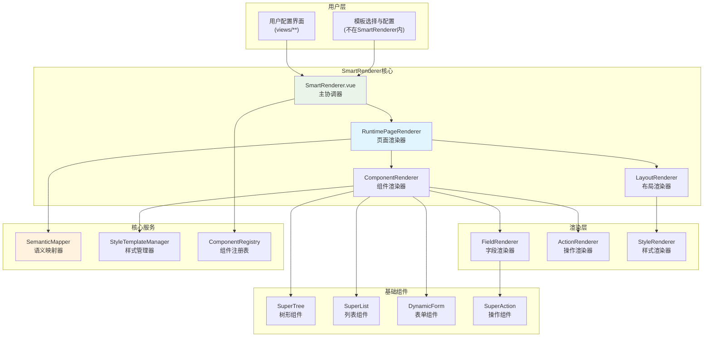

# SmartRenderer详细设计文档

## 📋 **设计概览**

### **设计原则**
基于[完整讨论记录](./SMARTRENDERER_COMPLETE_DISCUSSION_RECORD.md)的关键决策：

1. **✅ 零代码优先**：配置驱动的运行时渲染，而非代码生成
2. **✅ 职责清晰**：专注运行时渲染，不包含管理界面
3. **✅ 分层架构**：继承DynamicConfigurator的成功经验，解决单文件过大问题
4. **✅ 平滑集成**：基于现有SuperTree/SuperList/DynamicForm组件
5. **✅ 接口标准**：显式接口定义，确保一致性

### **核心定位**
```typescript
const smartRendererRole = {
  核心职责: '纯运行时页面渲染引擎',
  输入: 'PageTemplate + TemplateInstanceConfig',
  输出: '动态渲染的Vue页面实例',
  
  NOT包含: [
    '模板管理界面',
    '配置编辑界面', 
    '模板构建逻辑',
    '业务流程管理'
  ]
}
```

## 🏗️ **整体架构设计**

### **架构层次图**



### **模块职责矩阵**
```typescript
const moduleResponsibilities = {
  // 主协调器
  'SmartRenderer.vue': [
    '接收模板和配置',
    '协调各个渲染器',
    '管理渲染上下文',
    '处理错误和加载状态'
  ],
  
  // 页面渲染器
  'RuntimePageRenderer': [
    '解析页面模板结构',
    '管理页面级布局',
    '协调组件间通信',
    '处理页面生命周期'
  ],
  
  // 组件渲染器
  'ComponentRenderer': [
    '渲染具体组件实例',
    '应用组件配置',
    '处理组件事件',
    '管理组件状态'
  ],
  
  // 语义映射器
  'SemanticMapper': [
    '业务语义到控制语义映射',
    '字段类型转换',
    '配置规范化',
    '兼容性处理'
  ]
}
```

## 🔧 **核心接口设计**

### **主要接口定义**

#### **1. SmartRenderer主接口**
```typescript
/**
 * SmartRenderer主组件接口
 */
export interface SmartRendererProps {
  // 页面模板定义
  template: PageTemplate
  
  // 模板实例配置（用户的具体配置）
  instanceConfig: TemplateInstanceConfig
  
  // 渲染模式
  mode?: 'preview' | 'edit' | 'readonly'
  
  // 用户角色（影响权限和显示）
  userRole?: UserRole
  
  // 样式主题
  styleTemplate?: string
  
  // 自定义样式覆盖
  customStyles?: DeepPartial<StyleTemplate>
  
  // 调试模式
  debug?: boolean
}

export interface SmartRendererEmits {
  // 页面渲染完成
  'render-complete': [pageInstance: RenderedPageInstance]
  
  // 配置变更（编辑模式下）
  'config-change': [newConfig: TemplateInstanceConfig]
  
  // 用户操作事件
  'user-action': [action: UserAction, context: ActionContext]
  
  // 错误事件
  'render-error': [error: RenderError]
}
```

#### **2. 页面模板接口**
```typescript
/**
 * 页面模板定义
 */
export interface PageTemplate {
  id: string
  name: string
  description: string
  version: string
  
  // 模板类型
  category: 'data-management' | 'dashboard' | 'monitoring' | 'form' | 'custom'
  
  // 页面布局定义
  layout: PageLayout
  
  // 组件定义
  components: ComponentDefinition[]
  
  // 配置架构（用于生成配置界面）
  configSchema: ConfigSchema
  
  // 样式配置
  styles: PageStyleConfig
  
  // 元数据
  metadata: TemplateMetadata
}

/**
 * 页面布局定义
 */
export interface PageLayout {
  type: 'single' | 'horizontal' | 'vertical' | 'grid' | 'flex' | 'dashboard'
  
  // 布局配置
  config: {
    // Grid布局
    columns?: number
    rows?: number
    gaps?: { x: number, y: number }
    
    // Flex布局
    direction?: 'row' | 'column'
    justify?: 'start' | 'center' | 'end' | 'space-between'
    align?: 'start' | 'center' | 'end' | 'stretch'
    
    // 响应式配置
    responsive?: {
      breakpoints: Record<string, LayoutConfig>
    }
  }
  
  // 布局区域定义
  sections: LayoutSection[]
}

/**
 * 组件定义
 */
export interface ComponentDefinition {
  id: string
  name: string
  type: ComponentType // 'super-tree' | 'super-list' | 'dynamic-form' | 'smart-renderer'
  
  // 在布局中的位置
  position: {
    section: string // 对应LayoutSection的id
    order: number
  }
  
  // 组件配置架构
  configSchema: ComponentConfigSchema
  
  // 默认配置
  defaultConfig: ComponentConfig
  
  // 组件间通信配置
  communication?: {
    emits: EventDefinition[]
    listens: EventDefinition[]
  }
}
```

#### **3. 模板实例配置接口**
```typescript
/**
 * 模板实例配置（用户的具体配置数据）
 */
export interface TemplateInstanceConfig {
  id: string
  templateId: string
  name: string
  description?: string
  
  // 用户定义的字段（核心）
  userDefinedFields: UserFieldDefinition[]
  
  // 组件具体配置
  componentConfigs: Record<string, ComponentInstanceConfig>
  
  // 页面级配置覆盖
  pageConfig?: {
    title?: string
    layout?: Partial<PageLayout>
    styles?: Partial<PageStyleConfig>
  }
  
  // 元数据
  metadata: {
    createdAt: number
    updatedAt: number
    author: string
    tags: string[]
  }
}

/**
 * 用户字段定义
 */
export interface UserFieldDefinition {
  id: string
  name: string
  label: string
  type: string // 用户理解的业务类型：'text', 'number', 'date', 'select', 'file'
  
  // 字段配置
  config: {
    required?: boolean
    placeholder?: string
    defaultValue?: any
    options?: Array<{ label: string, value: any }> // for select
    validation?: ValidationRule[]
  }
  
  // 显示配置
  display: {
    order: number
    visible: boolean
    width?: string
    help?: string
  }
}
```

### **运行时渲染接口**

#### **4. 页面渲染器接口**
```typescript
/**
 * 运行时页面渲染器
 */
export interface RuntimePageRenderer {
  /**
   * 渲染页面实例
   */
  renderPageInstance(
    template: PageTemplate,
    instanceConfig: TemplateInstanceConfig,
    context: RenderContext
  ): Promise<RenderedPageInstance>
  
  /**
   * 更新页面配置
   */
  updatePageConfig(
    pageInstance: RenderedPageInstance,
    newConfig: Partial<TemplateInstanceConfig>
  ): Promise<void>
  
  /**
   * 销毁页面实例
   */
  destroyPageInstance(pageInstance: RenderedPageInstance): void
}

/**
 * 渲染上下文
 */
export interface RenderContext {
  mode: 'preview' | 'edit' | 'readonly'
  userRole: UserRole
  styleTemplate: string
  
  // 全局状态
  globalState: Record<string, any>
  
  // 事件总线
  eventBus: EventBus
  
  // API客户端
  apiClient: APIClient
  
  // 国际化
  i18n: I18nInstance
}

/**
 * 渲染结果
 */
export interface RenderedPageInstance {
  id: string
  templateId: string
  configId: string
  
  // Vue节点
  vnode: VNode
  
  // 组件实例映射
  componentInstances: Map<string, ComponentPublicInstance>
  
  // 渲染状态
  renderState: {
    status: 'loading' | 'success' | 'error'
    loadTime: number
    errorMessage?: string
  }
  
  // 页面API
  api: {
    refresh(): Promise<void>
    updateConfig(newConfig: Partial<TemplateInstanceConfig>): Promise<void>
    destroy(): void
  }
}
```

## 🎨 **组件渲染器设计**

### **组件渲染器核心**
```typescript
/**
 * 组件渲染器 - 负责渲染具体的组件实例
 */
export class ComponentRenderer {
  constructor(
    private semanticMapper: SemanticMapper,
    private styleManager: StyleTemplateManager,
    private componentRegistry: ComponentRegistry
  ) {}
  
  /**
   * 渲染单个组件
   */
  async renderComponent(
    definition: ComponentDefinition,
    instanceConfig: ComponentInstanceConfig,
    context: RenderContext
  ): Promise<VNode> {
    
    // 1. 语义映射：用户字段 → 语义字段
    const semanticFields = await this.semanticMapper.mapUserFieldsToSemantic(
      instanceConfig.fields,
      definition.type
    )
    
    // 2. 获取组件实现
    const componentImpl = this.componentRegistry.getComponent(definition.type)
    if (!componentImpl) {
      throw new Error(`Component type ${definition.type} not found`)
    }
    
    // 3. 生成组件Props
    const componentProps = await this.generateComponentProps(
      definition,
      semanticFields,
      instanceConfig,
      context
    )
    
    // 4. 应用样式
    const styles = this.styleManager.getComponentStyles(
      definition.type,
      context.styleTemplate,
      instanceConfig.styles
    )
    
    // 5. 创建组件VNode
    return h(componentImpl, {
      ...componentProps,
      class: styles.classes,
      style: styles.inlineStyles,
      
      // 事件处理
      ...this.generateEventHandlers(definition, context)
    })
  }
  
  /**
   * 生成组件Props
   */
  private async generateComponentProps(
    definition: ComponentDefinition,
    semanticFields: SemanticFieldDefinition[],
    instanceConfig: ComponentInstanceConfig,
    context: RenderContext
  ): Promise<Record<string, any>> {
    
    const props: Record<string, any> = {}
    
    // 基础配置
    props.config = {
      ...definition.defaultConfig,
      ...instanceConfig.config
    }
    
    // 字段配置
    props.fields = semanticFields
    
    // 数据配置
    if (instanceConfig.dataSource) {
      props.dataSource = instanceConfig.dataSource
    }
    
    // 权限配置
    props.permissions = await this.resolvePermissions(
      definition,
      context.userRole
    )
    
    return props
  }
  
  /**
   * 生成事件处理器
   */
  private generateEventHandlers(
    definition: ComponentDefinition,
    context: RenderContext
  ): Record<string, Function> {
    
    const handlers: Record<string, Function> = {}
    
    // 标准事件
    handlers.onChange = (data: any) => {
      context.eventBus.emit('component-change', {
        componentId: definition.id,
        data
      })
    }
    
    handlers.onAction = (action: UserAction) => {
      context.eventBus.emit('user-action', action)
    }
    
    handlers.onError = (error: Error) => {
      context.eventBus.emit('component-error', {
        componentId: definition.id,
        error
      })
    }
    
    return handlers
  }
}
```

### **语义映射器设计**
```typescript
/**
 * 语义映射器 - 独立的映射层
 */
export class SemanticMapper {
  private mappingRules: Map<string, MappingRule> = new Map()
  
  /**
   * 映射用户字段到语义字段
   */
  async mapUserFieldsToSemantic(
    userFields: UserFieldDefinition[],
    componentType: ComponentType
  ): Promise<SemanticFieldDefinition[]> {
    
    return Promise.all(
      userFields.map(async (userField) => {
        // 业务语义映射
        const businessSemantic = this.mapToBusiness(userField)
        
        // 控制语义映射
        const controlSemantic = this.mapToControl(
          businessSemantic,
          componentType
        )
        
        // Element Plus配置映射
        const elementConfig = this.mapToElementConfig(
          controlSemantic,
          userField.config
        )
        
        return {
          id: userField.id,
          name: userField.name,
          label: userField.label,
          businessType: businessSemantic,
          controlType: controlSemantic,
          elementConfig,
          validation: userField.config.validation || []
        }
      })
    )
  }
  
  /**
   * 业务语义映射
   */
  private mapToBusiness(userField: UserFieldDefinition): BusinessSemanticType {
    const typeMapping: Record<string, BusinessSemanticType> = {
      'text': 'text',
      'number': 'number', 
      'date': 'date',
      'datetime': 'datetime',
      'select': 'select',
      'multiselect': 'multiselect',
      'file': 'file',
      'image': 'image',
      'boolean': 'boolean',
      'email': 'email',
      'phone': 'phone',
      'url': 'url'
    }
    
    return typeMapping[userField.type] || 'text'
  }
  
  /**
   * 控制语义映射（继承DynamicConfigurator的getFinalControlType逻辑）
   */
  private mapToControl(
    businessType: BusinessSemanticType,
    componentType: ComponentType
  ): ControlSemanticType {
    
    // 基础映射表
    const baseMapping: Record<BusinessSemanticType, ControlSemanticType> = {
      'text': 'input',
      'number': 'input-number',
      'date': 'date-picker',
      'datetime': 'datetime-picker',
      'select': 'select',
      'multiselect': 'select',
      'file': 'upload',
      'image': 'upload',
      'boolean': 'switch',
      'email': 'input',
      'phone': 'input',
      'url': 'input'
    }
    
    let controlType = baseMapping[businessType] || 'input'
    
    // 组件特定调整
    if (componentType === 'super-tree') {
      // 树形组件的特殊处理
      if (businessType === 'select') {
        controlType = 'tree-select'
      }
    } else if (componentType === 'super-list') {
      // 列表组件的特殊处理  
      if (businessType === 'text') {
        controlType = 'table-column'
      }
    }
    
    return controlType
  }
  
  /**
   * Element Plus配置映射
   */
  private mapToElementConfig(
    controlType: ControlSemanticType,
    userConfig: UserFieldDefinition['config']
  ): ElementConfigMap[ControlSemanticType] {
    
    const baseConfig = {
      placeholder: userConfig.placeholder,
      required: userConfig.required,
      disabled: false
    }
    
    // 控件特定配置
    switch (controlType) {
      case 'input':
        return {
          ...baseConfig,
          type: 'text',
          clearable: true,
          showWordLimit: false
        }
        
      case 'input-number':
        return {
          ...baseConfig,
          min: undefined,
          max: undefined,
          step: 1,
          precision: undefined
        }
        
      case 'select':
        return {
          ...baseConfig,
          options: userConfig.options || [],
          multiple: controlType === 'multiselect',
          clearable: true,
          filterable: true
        }
        
      case 'date-picker':
        return {
          ...baseConfig,
          type: 'date',
          format: 'YYYY-MM-DD',
          valueFormat: 'YYYY-MM-DD'
        }
        
      default:
        return baseConfig
    }
  }
}
```

## 🎯 **布局渲染器设计**

### **布局渲染核心**
```typescript
/**
 * 布局渲染器 - 负责页面布局渲染
 */
export class LayoutRenderer {
  /**
   * 渲染页面布局
   */
  renderLayout(
    layout: PageLayout,
    componentVNodes: Map<string, VNode>,
    context: RenderContext
  ): VNode {
    
    switch (layout.type) {
      case 'single':
        return this.renderSingleLayout(componentVNodes)
        
      case 'horizontal':
        return this.renderHorizontalLayout(layout, componentVNodes)
        
      case 'vertical':
        return this.renderVerticalLayout(layout, componentVNodes)
        
      case 'grid':
        return this.renderGridLayout(layout, componentVNodes)
        
      case 'flex':
        return this.renderFlexLayout(layout, componentVNodes)
        
      case 'dashboard':
        return this.renderDashboardLayout(layout, componentVNodes)
        
      default:
        throw new Error(`Unsupported layout type: ${layout.type}`)
    }
  }
  
  /**
   * Grid布局渲染
   */
  private renderGridLayout(
    layout: PageLayout,
    componentVNodes: Map<string, VNode>
  ): VNode {
    
    const { columns = 12, gaps = { x: 16, y: 16 } } = layout.config
    
    // 按section分组组件
    const sectionComponents = this.groupComponentsBySection(
      layout.sections,
      componentVNodes
    )
    
    return h('div', {
      class: 'smart-renderer-grid-layout',
      style: {
        display: 'grid',
        gridTemplateColumns: `repeat(${columns}, 1fr)`,
        gap: `${gaps.y}px ${gaps.x}px`,
        padding: '16px'
      }
    }, layout.sections.map(section => {
      const components = sectionComponents.get(section.id) || []
      
      return h('div', {
        class: 'smart-renderer-grid-section',
        style: {
          gridColumn: `span ${section.span || 1}`,
          gridRow: `span ${section.rowSpan || 1}`
        }
      }, components)
    }))
  }
  
  /**
   * Flex布局渲染
   */
  private renderFlexLayout(
    layout: PageLayout,
    componentVNodes: Map<string, VNode>
  ): VNode {
    
    const { 
      direction = 'row', 
      justify = 'start', 
      align = 'start' 
    } = layout.config
    
    const sectionComponents = this.groupComponentsBySection(
      layout.sections,
      componentVNodes
    )
    
    return h('div', {
      class: 'smart-renderer-flex-layout',
      style: {
        display: 'flex',
        flexDirection: direction,
        justifyContent: justify,
        alignItems: align,
        gap: '16px',
        padding: '16px'
      }
    }, layout.sections.map(section => {
      const components = sectionComponents.get(section.id) || []
      
      return h('div', {
        class: 'smart-renderer-flex-section',
        style: {
          flex: section.flex || '1'
        }
      }, components)
    }))
  }
  
  /**
   * 仪表盘布局渲染（类似Grafana）
   */
  private renderDashboardLayout(
    layout: PageLayout,
    componentVNodes: Map<string, VNode>
  ): VNode {
    
    // 仪表盘使用grid-stack或类似的拖拽布局
    return h('div', {
      class: 'smart-renderer-dashboard-layout'
    }, [
      // 工具栏
      h('div', { class: 'dashboard-toolbar' }, [
        h('el-button', { size: 'small' }, '添加面板'),
        h('el-button', { size: 'small' }, '编辑布局'),
        h('el-button', { size: 'small' }, '保存布局')
      ]),
      
      // 面板区域
      h('div', { 
        class: 'dashboard-panels',
        style: { 
          display: 'grid',
          gridTemplateColumns: 'repeat(12, 1fr)',
          gap: '8px',
          padding: '8px'
        }
      }, layout.sections.map(section => {
        const components = componentVNodes.get(section.id)
        
        return h('div', {
          class: 'dashboard-panel',
          style: {
            gridColumn: `span ${section.span || 6}`,
            gridRow: `span ${section.rowSpan || 4}`,
            border: '1px solid #e4e7ed',
            borderRadius: '4px',
            padding: '12px',
            backgroundColor: '#fff'
          }
        }, [
          // 面板标题
          h('div', { class: 'panel-header' }, section.title),
          
          // 面板内容
          h('div', { class: 'panel-content' }, components)
        ])
      }))
    ])
  }
  
  /**
   * 按section分组组件
   */
  private groupComponentsBySection(
    sections: LayoutSection[],
    componentVNodes: Map<string, VNode>
  ): Map<string, VNode[]> {
    
    const grouped = new Map<string, VNode[]>()
    
    sections.forEach(section => {
      grouped.set(section.id, [])
    })
    
    componentVNodes.forEach((vnode, componentId) => {
      // 从componentId中提取section信息，或通过其他方式关联
      // 这里需要根据实际的组件定位逻辑来实现
      const sectionId = this.getSectionIdForComponent(componentId, sections)
      if (sectionId && grouped.has(sectionId)) {
        grouped.get(sectionId)!.push(vnode)
      }
    })
    
    return grouped
  }
  
  private getSectionIdForComponent(
    componentId: string, 
    sections: LayoutSection[]
  ): string | undefined {
    // 实现组件到section的映射逻辑
    // 可以通过组件定义中的position.section来确定
    return sections[0]?.id // 简化实现
  }
}
```

## 🎨 **样式系统设计**

### **样式模板管理器增强**
```typescript
/**
 * 样式模板管理器 - 增强版
 */
export class StyleTemplateManager {
  private templates: Map<string, StyleTemplate> = new Map()
  private cache: Map<string, ComputedStyles> = new Map()
  
  constructor() {
    this.initializeDefaultTemplates()
  }
  
  /**
   * 获取组件样式
   */
  getComponentStyles(
    componentType: ComponentType,
    templateName: string = 'modern',
    customStyles?: Partial<ComponentStyles>
  ): ComputedStyles {
    
    const cacheKey = `${componentType}-${templateName}-${JSON.stringify(customStyles)}`
    
    if (this.cache.has(cacheKey)) {
      return this.cache.get(cacheKey)!
    }
    
    const template = this.templates.get(templateName)
    if (!template) {
      throw new Error(`Style template ${templateName} not found`)
    }
    
    // 获取组件基础样式
    const baseStyles = template.components[componentType] || {}
    
    // 合并自定义样式
    const mergedStyles = this.mergeStyles(baseStyles, customStyles || {})
    
    // 计算最终样式
    const computedStyles = this.computeStyles(mergedStyles)
    
    // 缓存结果
    this.cache.set(cacheKey, computedStyles)
    
    return computedStyles
  }
  
  /**
   * 获取页面级样式
   */
  getPageStyles(
    templateName: string = 'modern',
    customStyles?: Partial<PageStyleConfig>
  ): ComputedStyles {
    
    const template = this.templates.get(templateName)
    if (!template) {
      throw new Error(`Style template ${templateName} not found`)
    }
    
    const baseStyles = template.page
    const mergedStyles = this.mergeStyles(baseStyles, customStyles || {})
    
    return this.computeStyles(mergedStyles)
  }
  
  /**
   * 响应式样式计算
   */
  private computeStyles(styles: ComponentStyles): ComputedStyles {
    return {
      classes: this.generateCSSClasses(styles),
      inlineStyles: this.generateInlineStyles(styles),
      cssVariables: this.generateCSSVariables(styles)
    }
  }
  
  /**
   * 生成CSS类名
   */
  private generateCSSClasses(styles: ComponentStyles): string[] {
    const classes: string[] = []
    
    // 基础类名
    if (styles.base?.className) {
      classes.push(styles.base.className)
    }
    
    // 尺寸类名
    if (styles.size) {
      classes.push(`size-${styles.size}`)
    }
    
    // 变体类名
    if (styles.variant) {
      classes.push(`variant-${styles.variant}`)
    }
    
    // 状态类名
    if (styles.state) {
      Object.entries(styles.state).forEach(([state, enabled]) => {
        if (enabled) {
          classes.push(`state-${state}`)
        }
      })
    }
    
    return classes
  }
  
  /**
   * 生成内联样式
   */
  private generateInlineStyles(styles: ComponentStyles): Record<string, string> {
    const inlineStyles: Record<string, string> = {}
    
    // 颜色样式
    if (styles.colors) {
      Object.entries(styles.colors).forEach(([key, value]) => {
        if (key === 'primary') {
          inlineStyles['--el-color-primary'] = value
        } else if (key === 'background') {
          inlineStyles.backgroundColor = value
        }
        // ... 更多颜色映射
      })
    }
    
    // 间距样式
    if (styles.spacing) {
      const { padding, margin } = styles.spacing
      if (padding) inlineStyles.padding = padding
      if (margin) inlineStyles.margin = margin
    }
    
    // 边框样式
    if (styles.border) {
      const { width, style, color, radius } = styles.border
      if (width) inlineStyles.borderWidth = width
      if (style) inlineStyles.borderStyle = style
      if (color) inlineStyles.borderColor = color
      if (radius) inlineStyles.borderRadius = radius
    }
    
    return inlineStyles
  }
  
  /**
   * 初始化默认模板
   */
  private initializeDefaultTemplates(): void {
    // Modern主题
    this.templates.set('modern', {
      name: 'Modern',
      page: {
        colors: {
          background: '#f5f7fa',
          surface: '#ffffff',
          border: '#e4e7ed'
        },
        spacing: {
          padding: '24px',
          gap: '16px'
        }
      },
      components: {
        'super-tree': {
          colors: {
            primary: '#409eff',
            background: '#ffffff'
          },
          border: {
            radius: '6px',
            color: '#e4e7ed'
          }
        },
        'super-list': {
          colors: {
            primary: '#409eff',
            background: '#ffffff'
          },
          spacing: {
            padding: '16px'
          }
        },
        'dynamic-form': {
          colors: {
            primary: '#409eff'
          },
          spacing: {
            gap: '16px'
          }
        }
      }
    })
    
    // Classic主题
    this.templates.set('classic', {
      name: 'Classic',
      page: {
        colors: {
          background: '#f0f2f5',
          surface: '#ffffff',
          border: '#d9d9d9'
        }
      },
      components: {
        'super-tree': {
          colors: {
            primary: '#1890ff'
          }
        }
        // ... 其他组件样式
      }
    })
  }
}
```

## 🔌 **组件注册系统**

### **组件注册表设计**
```typescript
/**
 * 组件注册表 - 管理所有可用组件
 */
export class ComponentRegistry {
  private components: Map<ComponentType, ComponentRegistration> = new Map()
  private adapters: Map<ComponentType, ComponentAdapter> = new Map()
  
  /**
   * 注册组件
   */
  registerComponent(
    type: ComponentType,
    component: ComponentImplementation,
    metadata: ComponentMetadata
  ): void {
    
    const registration: ComponentRegistration = {
      type,
      component,
      metadata,
      adapter: this.createAdapter(type, component, metadata)
    }
    
    this.components.set(type, registration)
    console.log(`✅ Component registered: ${type}`)
  }
  
  /**
   * 获取组件
   */
  getComponent(type: ComponentType): ComponentImplementation | null {
    const registration = this.components.get(type)
    return registration?.component || null
  }
  
  /**
   * 获取组件适配器
   */
  getAdapter(type: ComponentType): ComponentAdapter | null {
    const registration = this.components.get(type)
    return registration?.adapter || null
  }
  
  /**
   * 列出所有注册的组件
   */
  listComponents(): ComponentInfo[] {
    return Array.from(this.components.values()).map(reg => ({
      type: reg.type,
      name: reg.metadata.name,
      description: reg.metadata.description,
      version: reg.metadata.version,
      configSchema: reg.metadata.configSchema
    }))
  }
  
  /**
   * 创建组件适配器
   */
  private createAdapter(
    type: ComponentType,
    component: ComponentImplementation,
    metadata: ComponentMetadata
  ): ComponentAdapter {
    
    return {
      // 标准化Props接口
      normalizeProps: (instanceConfig: ComponentInstanceConfig): Record<string, any> => {
        return this.normalizePropsForType(type, instanceConfig)
      },
      
      // 标准化事件接口  
      normalizeEvents: (handlers: Record<string, Function>): Record<string, Function> => {
        return this.normalizeEventsForType(type, handlers)
      },
      
      // 验证配置
      validateConfig: (config: ComponentInstanceConfig): ValidationResult => {
        return this.validateConfigForType(type, config, metadata.configSchema)
      }
    }
  }
  
  /**
   * 按类型标准化Props
   */
  private normalizePropsForType(
    type: ComponentType,
    instanceConfig: ComponentInstanceConfig
  ): Record<string, any> {
    
    switch (type) {
      case 'super-tree':
        return {
          config: instanceConfig.config,
          data: instanceConfig.data,
          showConfigButton: instanceConfig.showConfigButton !== false
        }
        
      case 'super-list':
        return {
          config: instanceConfig.config,
          data: instanceConfig.data,
          pagination: instanceConfig.pagination
        }
        
      case 'dynamic-form':
        return {
          fields: instanceConfig.fields,
          modelValue: instanceConfig.modelValue,
          rules: instanceConfig.rules
        }
        
      default:
        return instanceConfig.config || {}
    }
  }
}

/**
 * 初始化默认组件注册
 */
export function initializeDefaultComponents(registry: ComponentRegistry): void {
  // 注册SuperTree
  registry.registerComponent('super-tree', SuperTree, {
    name: 'SuperTree',
    description: '增强的树形组件',
    version: '1.0.0',
    configSchema: {
      type: 'object',
      properties: {
        showCheckbox: { type: 'boolean', default: false },
        expandOnClickNode: { type: 'boolean', default: true },
        // ... 更多配置项
      }
    }
  })
  
  // 注册SuperList  
  registry.registerComponent('super-list', SuperList, {
    name: 'SuperList',
    description: '增强的列表组件',
    version: '1.0.0',
    configSchema: {
      type: 'object',
      properties: {
        pagination: { type: 'boolean', default: true },
        selection: { type: 'boolean', default: false }
      }
    }
  })
  
  // 注册DynamicForm
  registry.registerComponent('dynamic-form', DynamicForm, {
    name: 'DynamicForm', 
    description: '动态表单组件',
    version: '1.0.0',
    configSchema: {
      type: 'object',
      properties: {
        labelPosition: { type: 'string', enum: ['left', 'right', 'top'], default: 'right' },
        size: { type: 'string', enum: ['large', 'default', 'small'], default: 'default' }
      }
    }
  })
}
```

## 📋 **实现优先级和里程碑**

### **Phase 1: 核心引擎完善 (高优先级)**
```typescript
const phase1Tasks = {
  '1.1': {
    title: 'SmartRenderer主组件完善',
    tasks: [
      '完善props接口和emits定义',
      '增强错误处理和加载状态',
      '添加调试模式支持',
      '完善TypeScript类型定义'
    ],
    estimatedTime: '2-3天'
  },
  
  '1.2': {
    title: 'RuntimePageRenderer实现',
    tasks: [
      '页面模板解析逻辑',
      '组件渲染协调',
      '页面生命周期管理',
      '错误边界处理'
    ],
    estimatedTime: '3-4天'
  },
  
  '1.3': {
    title: 'ComponentRenderer完善',
    tasks: [
      '组件Props生成优化',
      '事件处理器增强',
      '样式应用改进',
      '权限控制集成'
    ],
    estimatedTime: '2-3天'
  }
}
```

### **Phase 2: 布局和样式系统 (中优先级)**
```typescript
const phase2Tasks = {
  '2.1': {
    title: 'LayoutRenderer实现',
    tasks: [
      '完整的布局类型支持',
      '响应式布局处理',
      '仪表盘布局特殊处理',
      '布局性能优化'
    ],
    estimatedTime: '4-5天'
  },
  
  '2.2': {
    title: 'StyleTemplateManager增强',
    tasks: [
      '更多预设主题',
      '响应式样式支持',
      'CSS变量系统',
      '样式缓存优化'
    ],
    estimatedTime: '3-4天'
  }
}
```

### **Phase 3: 集成和优化 (低优先级)**
```typescript
const phase3Tasks = {
  '3.1': {
    title: '组件注册系统',
    tasks: [
      'ComponentRegistry完整实现',
      '组件适配器系统',
      '动态组件发现',
      '版本兼容处理'
    ],
    estimatedTime: '3-4天'
  },
  
  '3.2': {
    title: '性能和优化',
    tasks: [
      '渲染性能优化',
      '内存使用优化',
      '懒加载支持',
      '缓存策略改进'
    ],
    estimatedTime: '2-3天'
  }
}
```

## ✅ **验收标准**

### **功能验收**
```typescript
const acceptanceCriteria = {
  核心功能: [
    '✅ 能够基于PageTemplate和TemplateInstanceConfig渲染完整页面',
    '✅ 支持SuperTree、SuperList、DynamicForm组件渲染',
    '✅ 语义映射功能正常工作',
    '✅ 布局系统支持所有预定义布局类型',
    '✅ 样式模板系统正常应用'
  ],
  
  性能要求: [
    '✅ 页面渲染时间 < 500ms（复杂页面）',
    '✅ 内存使用合理，无明显泄漏',
    '✅ 支持100+组件同时渲染',
    '✅ 样式计算缓存有效'
  ],
  
  兼容性要求: [
    '✅ 与现有SuperTree/SuperList/DynamicForm完全兼容',
    '✅ 支持DynamicConfigurator的所有配置项',
    '✅ Element Plus组件正常工作',
    '✅ TypeScript类型完整无错误'
  ],
  
  可维护性要求: [
    '✅ 代码结构清晰，职责分离',
    '✅ 单个文件大小控制在合理范围',
    '✅ 完整的类型定义和文档',
    '✅ 单元测试覆盖率 > 80%'
  ]
}
```

## 📚 **相关文档**

- [完整讨论记录](./SMARTRENDERER_COMPLETE_DISCUSSION_RECORD.md) - 设计演进过程
- [DynamicConfigurator集成](./DYNAMICFORM_CONFIGURATOR_INTEGRATION.md) - 继承的核心功能
- [模板驱动设计](./TEMPLATE_DRIVEN_DESIGN.md) - 设计理念
- [运行时编译讨论](./RUNTIME_COMPILATION_DISCUSSION_RECORD.md) - 技术方案对比

---

**文档状态**: ✅ 详细设计完成  
**设计模式**: 零代码平台 + 配置驱动渲染  
**核心组件**: 4个主要模块 + 6个支持服务  
**预估工期**: 15-20个工作日  
**下一步**: 开始Phase 1核心引擎实现