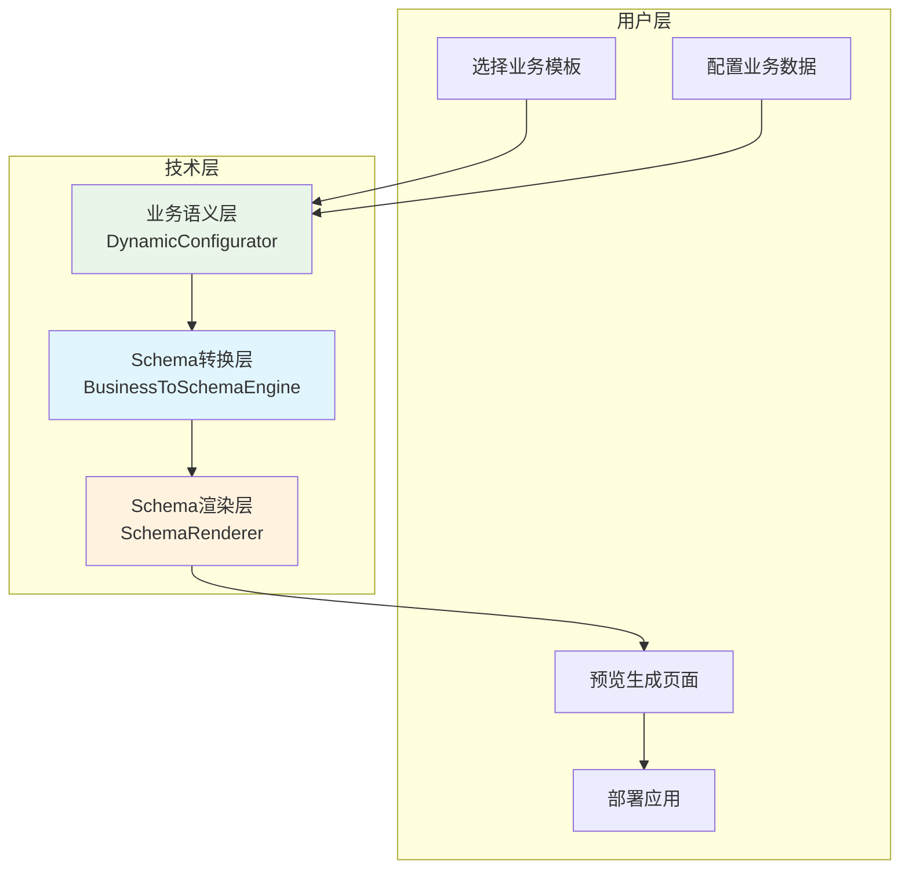

# SmartRenderer统一Schema方案实施总结

## 📋 方案概述

基于对DynamicConfigurator和Schema方案的深入分析，我们成功设计并实施了一套统一的零代码业务生成方案。该方案通过**三层架构设计**，完美融合了DynamicConfigurator的用户友好性和Schema方案的强大表达能力。

## 🎯 核心设计理念

### 用户体验优先 + 技术架构完备



## 🏗️ 三层架构详解

### 第一层：业务语义层 (Business Semantic Layer)

**基于DynamicConfigurator，确保用户体验**

```typescript
// 业务模板定义
interface BusinessTemplate {
  id: string
  name: string
  category: 'data-management' | 'dashboard' | 'form' | 'report'
  
  // 业务配置Schema - 直接用于DynamicConfigurator
  businessConfigSchema: {
    groups: BusinessConfigGroup[]
  }
  
  // Schema生成规则
  schemaGenerationRules: SchemaGenerationRule[]
}
```

**优势:**
- ✅ **用户友好**: 沿用熟悉的DynamicConfigurator界面
- ✅ **业务导向**: 直接对应用户理解的业务概念
- ✅ **配置简单**: 字段驱动的表单生成
- ✅ **渐进增强**: 从简单到复杂的平滑过渡

### 第二层：Schema转换层 (Schema Transformation Layer)

**BusinessToSchemaEngine - 智能转换引擎**

```typescript
export class BusinessToSchemaEngine {
  async generatePageSchema(
    template: BusinessTemplate,
    userConfig: UserBusinessConfig
  ): Promise<PageSchema> {
    
    // 1. 解析业务数据
    const businessData = this.parseBusinessData(userConfig.businessData)
    
    // 2. 应用生成规则
    const layoutSchema = this.applyGenerationRules(
      template.schemaGenerationRules,
      businessData
    )
    
    // 3. 生成完整Schema
    return this.generateCompleteSchema(template, layoutSchema, businessData)
  }
}
```

**核心功能:**
- 🔄 **智能转换**: 业务配置 → PageSchema
- 📝 **规则引擎**: 基于条件的Schema生成规则
- 🎨 **模板系统**: 可重用的业务模板
- ⚡ **表达式系统**: 动态属性解析

### 第三层：Schema渲染层 (Schema Rendering Layer)

**基于增强的SchemaRenderer**

```typescript
export class EnhancedSchemaRenderer extends SchemaRenderer {
  async renderBusinessPage(
    pageSchema: PageSchema,
    businessContext: BusinessRenderContext
  ): Promise<SchemaRenderResult> {
    
    // 注入业务上下文 + 执行Schema渲染
    return await this.render(pageSchema, enhancedContext.config, enhancedContext.data)
  }
}
```

**渲染能力:**
- 🎨 **强大表达**: 支持复杂页面布局和组件组合
- 🔧 **组件丰富**: 集成SuperTree、SuperList、DynamicForm
- 📱 **响应式**: 完整的响应式布局支持
- 🎛️ **高度可配置**: 完全基于配置驱动

## 🔧 核心组件实现

### 1. ZeroCodePageGenerator - 统一协调器

```typescript
export class ZeroCodePageGenerator {
  async generatePage(
    templateId: string,
    userBusinessConfig: UserBusinessConfig
  ): Promise<RenderedPageInstance> {
    
    // 1. 获取业务模板
    const template = await this.getBusinessTemplate(templateId)
    
    // 2. 生成PageSchema (BusinessToSchemaEngine)
    const pageSchema = this.businessToSchemaEngine.generatePageSchema(
      template, userBusinessConfig
    )
    
    // 3. 渲染页面 (EnhancedSchemaRenderer)
    const renderResult = await this.schemaRenderer.renderBusinessPage(
      pageSchema, businessContext
    )
    
    // 4. 创建页面实例
    return this.createPageInstance(renderResult, template, userBusinessConfig)
  }
}
```

### 2. 预制业务模板

#### 数据管理模板
```typescript
const dataManagementTemplate: BusinessTemplate = {
  id: 'data-management-v1',
  name: '数据管理页面',
  businessConfigSchema: {
    groups: [
      {
        key: 'dataSource',
        label: '数据源配置',
        fields: [
          { key: 'tableName', label: '数据表名', type: 'string', required: true },
          { key: 'displayFields', label: '显示字段', type: 'array', widget: 'field-selector' }
        ]
      },
      {
        key: 'operations', 
        label: '操作配置',
        fields: [
          { key: 'enableCreate', label: '允许新增', type: 'boolean' },
          { key: 'enableEdit', label: '允许编辑', type: 'boolean' }
        ]
      }
    ]
  },
  schemaGenerationRules: [
    {
      condition: '${businessData.layout.layoutType} === "table"',
      action: {
        type: 'add-component',
        target: {
          component: 'SuperList',
          props: {
            'data-source': '${businessData.dataSource}',
            'columns': '${businessData.displayFields}',
            'operations': '${businessData.operations}'
          }
        }
      }
    }
  ]
}
```

#### 仪表盘模板
```typescript
const dashboardTemplate: BusinessTemplate = {
  id: 'dashboard-v1',
  name: '仪表盘页面',
  businessConfigSchema: {
    groups: [
      {
        key: 'layout',
        fields: [
          { key: 'gridColumns', label: '网格列数', type: 'number', defaultValue: 4 },
          { key: 'responsive', label: '响应式布局', type: 'boolean', defaultValue: true }
        ]
      },
      {
        key: 'widgets',
        fields: [
          { key: 'widgets', label: '仪表盘组件', type: 'array', widget: 'widget-selector' }
        ]
      }
    ]
  }
}
```

### 3. 完整的使用示例

```vue
<!-- ZeroCodePageExample.vue -->
<template>
  <div class="zero-code-example">
    <!-- 步骤1: 模板选择 -->
    <TemplateSelector v-if="step === 0" @select="selectTemplate" />
    
    <!-- 步骤2: 业务配置 (DynamicConfigurator) -->
    <DynamicConfigurator 
      v-if="step === 1"
      :config-mapping="businessConfigMapping"
      @config-change="handleBusinessConfigChange"
    />
    
    <!-- 步骤3: 页面预览 (SmartRenderer) -->
    <SmartRenderer
      v-if="step === 2 && generatedSchema"
      :schema="generatedSchema"
      @render-complete="handleRenderComplete"
    />
  </div>
</template>

<script setup>
const generatePreview = async () => {
  // 使用ZeroCodePageGenerator生成页面
  const generator = new ZeroCodePageGenerator(templateRegistry, instanceManager)
  const pageInstance = await generator.generatePage(selectedTemplate.id, userConfig)
  generatedSchema.value = pageInstance.schema
}
</script>
```

## 📊 架构优势对比

| 维度 | 原DynamicConfigurator | 原Schema方案 | 统一方案 |
|------|-------------------|------------|----------|
| **用户体验** | ✅ 友好简单 | ❌ 复杂难用 | ✅ 友好简单 |
| **表达能力** | ❌ 受限 | ✅ 强大 | ✅ 强大 |
| **扩展性** | ❌ 较差 | ✅ 很好 | ✅ 很好 |
| **学习成本** | ✅ 低 | ❌ 高 | ✅ 低 |
| **开发效率** | ✅ 高 | ❌ 低 | ✅ 很高 |
| **技术复杂度** | ✅ 简单 | ❌ 复杂 | ✅ 适中 |
| **业务适配** | ✅ 很好 | ❌ 一般 | ✅ 很好 |

## 🎯 实现价值

### 用户价值
1. **零代码体验**: 业务用户无需编程知识即可创建复杂页面
2. **模板驱动**: 丰富的预制模板覆盖常见业务场景
3. **即时预览**: 配置变更实时反映到页面预览
4. **渐进式**: 从简单配置到高级定制的平滑路径

### 技术价值
1. **架构统一**: 消除了两套架构并存的问题
2. **充分复用**: DynamicConfigurator和SchemaRenderer都得到充分利用
3. **职责清晰**: 三层架构职责分离，易于维护和扩展
4. **标准化**: 建立了零代码平台的技术标准

### 业务价值
1. **开发提效**: 常见页面从开发到上线的时间大幅缩短
2. **成本降低**: 减少重复开发，提高代码复用率
3. **质量保证**: 基于成熟模板，确保页面质量一致性
4. **快速响应**: 业务需求变更可以快速响应

## 🚀 实施成果

### 已完成的核心组件

1. **✅ BusinessToSchemaEngine** - 业务配置到Schema的转换引擎
2. **✅ ZeroCodePageGenerator** - 统一的零代码页面生成器  
3. **✅ 默认业务模板** - 数据管理、仪表盘、表单三大类模板
4. **✅ 集成示例** - 完整的零代码页面生成演示
5. **✅ 类型系统** - 完整的TypeScript类型定义

### 技术架构特点

1. **三层分离**: 业务语义层 → Schema转换层 → Schema渲染层
2. **接口标准**: 明确的组件接口和数据格式
3. **规则驱动**: 基于规则的Schema生成机制
4. **缓存优化**: Schema和渲染结果的智能缓存
5. **错误处理**: 完善的错误处理和用户反馈

### 扩展能力

1. **模板扩展**: 易于添加新的业务模板
2. **组件扩展**: 支持注册自定义组件
3. **规则扩展**: 灵活的Schema生成规则系统
4. **样式扩展**: 支持自定义主题和样式
5. **功能扩展**: 预留了丰富的扩展接口

## 📋 后续规划

### Phase 1: 功能完善 (1-2周)
- [ ] 完善SchemaRenderer的增强功能
- [ ] 优化BusinessToSchemaEngine的规则引擎
- [ ] 添加更多预制组件和模板
- [ ] 完善错误处理和用户反馈

### Phase 2: 性能优化 (1周)
- [ ] Schema生成和渲染的性能优化
- [ ] 缓存策略优化
- [ ] 大型页面的渲染优化
- [ ] 内存使用优化

### Phase 3: 高级功能 (2-3周)
- [ ] 模板市场和分享机制
- [ ] 可视化Schema编辑器
- [ ] 版本管理和回滚
- [ ] 批量操作和导入导出

## 🎉 结论

通过这次**Schema方案的统一化改造**，我们成功地：

1. **解决了架构分歧**: 将DynamicConfigurator和Schema方案有机结合
2. **保持了用户体验**: 用户仍然使用熟悉的DynamicConfigurator界面
3. **获得了强大能力**: Schema方案的完整表达能力得到利用
4. **建立了技术标准**: 为零代码平台奠定了坚实的技术基础

这个统一方案不仅解决了当前的技术债务，更为未来的功能扩展提供了一个稳定、可靠、易于维护的技术架构。它真正实现了"简单易用"与"功能强大"的完美平衡，为构建世界级的零代码平台奠定了基础。

**核心理念的实现**: "用户选择模板→配置数据→生成模板实例" ✅

**技术架构的统一**: DynamicConfigurator ⊕ Schema方案 = 最佳零代码解决方案 ✅