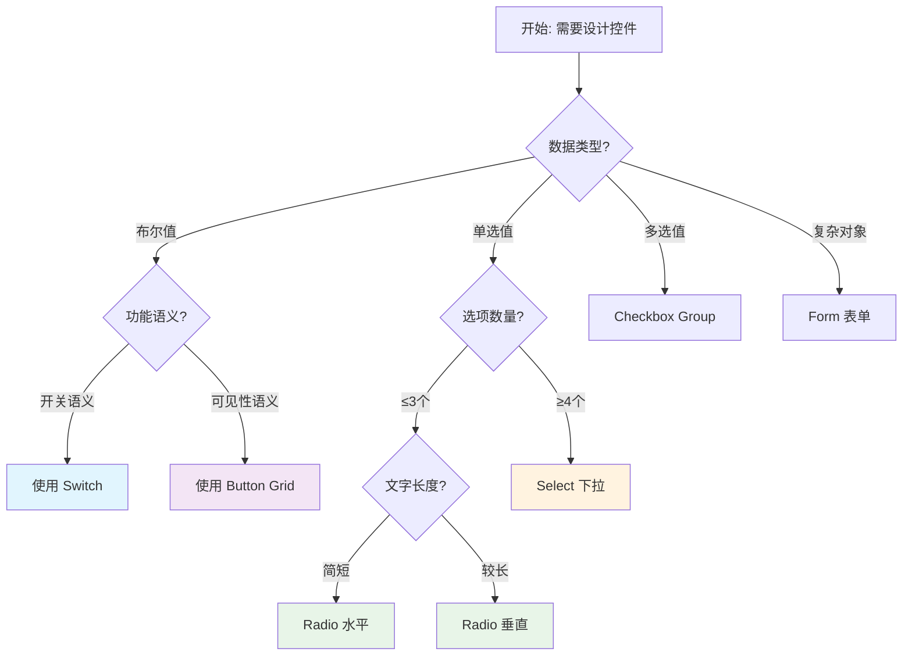

# 🎨 UX设计规范 - 零代码平台交互标准

> **文档目标**: 为零代码平台的所有模板和组件设计建立统一的UX标准  
> **维护原则**: 基于用户反馈持续完善，保持设计的一致性和用户友好性  
> **应用范围**: SuperTree、SuperList、DynamicForm、配置器等所有UI组件

---

## 📋 目录

- [1. 核心设计原则](#1-核心设计原则)
- [2. 控件选择规范](#2-控件选择规范)
- [3. 布局与空间规范](#3-布局与空间规范)
- [4. 交互反馈规范](#4-交互反馈规范)
- [5. 模板设计指南](#5-模板设计指南)
- [6. 设计决策流程](#6-设计决策流程)
- [7. 质量检查清单](#7-质量检查清单)

---

## 1. 核心设计原则

### 1.1 语义驱动原则 🎯
**定义**: 控件选择必须基于功能语义，而非视觉偏好  
**重要性**: ⭐⭐⭐⭐⭐ (最高优先级)

```typescript
// ✅ 正确：基于语义选择控件
if (功能是"启用/禁用") {
  使用 Switch // 明确的开关语义
} else if (功能是"显示/隐藏") {
  使用 ButtonGrid // 可见性控制语义
}

// ❌ 错误：基于数量或美观选择
if (选项数量 > 3) {
  使用 ButtonGrid // 忽略了功能语义
}
```

**应用示例**:
- 启用拖拽 → Switch (开关语义)
- 显示工具栏 → Button Grid (可见性语义)
- 选择主题 → Radio (选择语义)

### 1.2 认知最小化原则 🧠
**定义**: 减少用户的认知负荷，让操作意图清晰明确  
**重要性**: ⭐⭐⭐⭐⭐

**设计要求**:
- 无需文字说明就能理解控件状态
- 避免歧义的视觉表达
- 保持操作的可预测性

### 1.3 空间效率原则 📐
**定义**: 在保证易用性的前提下，最大化空间利用率  
**重要性**: ⭐⭐⭐⭐

**平衡策略**:
- 优先考虑用户理解 > 空间节省
- 适配不同屏幕尺寸
- 避免过度拥挤的布局

---

## 2. 控件选择规范

### 2.1 布尔值控件选择 🔘

#### Switch - 状态切换控件
**适用场景**:
```yaml
语义关键词:
  - enabled/disabled, allow/forbid, enable/disable
  - 启用/禁用, 允许/禁止, 开启/关闭
  
功能特征:
  - 功能性开关 (如: 启用拖拽)
  - 权限控制 (如: 允许编辑)
  - 特性切换 (如: 开启缓存)
  
视觉特点:
  - 明确的开/关状态
  - 无需文字辅助理解
  - 符合用户对开关的认知
```

**设计模板**:
```vue
<!-- ✅ Switch标准模板 -->
<div class="switch-list-item">
  <div class="switch-info">
    <span class="switch-label">{{ 功能名称 }}</span>
    <span class="switch-description">{{ 功能说明 }}</span>
  </div>
  <el-switch v-model="enabled" size="small" />
</div>
```

#### Button Grid - 可见性控件
**适用场景**:
```yaml
语义关键词:
  - show/hide, visible/invisible, display/render
  - 显示/隐藏, 可见/不可见, 按钮/图标
  
功能特征:
  - UI元素显示控制 (如: 显示工具栏)
  - 按钮可见性设置 (如: 显示新增按钮)
  - 界面模块开关 (如: 显示搜索框)
  
视觉特点:
  - 一目了然的状态
  - 高空间效率
  - 支持快速批量切换
```

**设计模板**:
```vue
<!-- ✅ Button Grid标准模板 -->
<div class="button-grid-section">
  <div class="section-label">{{ 分组标题 }}</div>
  <div class="button-grid-container">
    <el-button
      v-for="item in visibilityItems"
      :key="item.key"
      :type="item.visible ? 'primary' : ''"
      :plain="!item.visible"
      size="small"
      @click="toggleVisibility(item)"
    >
      {{ item.label }}
    </el-button>
  </div>
</div>
```

### 2.2 选项控件选择 📻

#### Radio - 单选控件 (智能布局)
**布局决策算法**:
```typescript
function decideRadioLayout(options: Option[], containerWidth: number) {
  const optionCount = options.length
  const hasLongText = options.some(opt => opt.label.length > 6)
  const totalWidth = estimateTextWidth(options)
  
  if (optionCount <= 3 && !hasLongText && totalWidth <= containerWidth) {
    return 'horizontal'  // 水平排列
  } else if (optionCount >= 4) {
    return 'dropdown'    // 下拉选择器
  } else {
    return 'vertical'    // 垂直排列
  }
}
```

**设计模板**:
```vue
<!-- ✅ Radio水平布局 (≤3个简短选项) -->
<el-radio-group v-model="value" class="radio-horizontal">
  <el-radio v-for="option in options" :value="option.value">
    {{ option.label }}
  </el-radio>
</el-radio-group>

<!-- ✅ Radio垂直布局 (长文字说明) -->
<el-radio-group v-model="value" class="radio-vertical">
  <el-radio v-for="option in options" :value="option.value">
    <div class="radio-content">
      <div class="radio-title">{{ option.label }}</div>
      <div class="radio-description">{{ option.description }}</div>
    </div>
  </el-radio>
</el-radio-group>

<!-- ✅ Select下拉 (≥4个选项) -->
<el-select v-model="value" :placeholder="placeholder">
  <el-option v-for="option in options" :value="option.value">
    {{ option.label }}
  </el-option>
</el-select>
```

---

## 3. 布局与空间规范

### 3.1 栅格系统 📏

**标准栅格配置**:
```typescript
const GRID_BREAKPOINTS = {
  xs: { span: 24 },      // 手机: 全宽
  sm: { span: 12 },      // 平板: 半宽
  md: { span: 8 },       // 小屏: 三分之一
  lg: { span: 6 },       // 大屏: 四分之一
  xl: { span: 4 }        // 超大屏: 六分之一
}

const COMPONENT_SPACING = {
  form: { gutter: 20 },
  card: { margin: 16 },
  section: { padding: 24 }
}
```

### 3.2 响应式设计 📱

**设备适配优先级**:
1. **手机优先** (320px - 768px)
2. **平板适配** (768px - 1024px)  
3. **桌面优化** (1024px+)

**自适应策略**:
```scss
// ✅ 移动端优先的响应式设计
.config-panel {
  // 默认移动端样式
  padding: 12px;
  
  @media (min-width: 768px) {
    // 平板及以上
    padding: 20px;
  }
  
  @media (min-width: 1024px) {
    // 桌面及以上
    padding: 24px;
  }
}
```

---

## 4. 交互反馈规范

### 4.1 状态反馈 ⚡

**必需的视觉反馈**:
- **Loading状态**: 操作进行中
- **Success状态**: 操作成功完成
- **Error状态**: 操作失败或错误
- **Disabled状态**: 不可操作状态

**反馈时机**:
```typescript
const FEEDBACK_TIMING = {
  immediate: 0,           // 立即反馈 (按钮点击)
  quick: 200,            // 快速反馈 (表单验证)
  standard: 500,         // 标准反馈 (数据保存)
  slow: 1000            // 延时反馈 (网络请求)
}
```

### 4.2 动画与过渡 🎬

**标准动画时长**:
```scss
$transition-fast: 150ms;      // 快速过渡 (hover, focus)
$transition-base: 300ms;      // 基础过渡 (显示/隐藏)
$transition-slow: 500ms;      // 慢速过渡 (页面切换)

// ✅ 标准过渡效果
.fade-enter-active, .fade-leave-active {
  transition: opacity $transition-base ease;
}
```

---

## 5. 模板设计指南

### 5.1 SuperTree模板标准 🌳

**配置器设计要求**:
```yaml
基础配置:
  - 数据源: Select下拉 (多个选项)
  - 显示模式: Radio水平 (≤3个选项)
  
功能开关:
  - 启用拖拽: Switch (开关语义)
  - 允许编辑: Switch (权限语义)
  
界面控制:
  - 显示复选框: Button Grid (可见性语义)
  - 显示搜索框: Button Grid (UI控制语义)
  
高级配置:
  - 使用表单布局 (复杂配置项)
```

### 5.2 SuperList模板标准 📋

**配置器设计要求**:
```yaml
视图控制:
  - 默认视图: Radio水平 (列表/卡片/网格)
  - 显示分页: Switch (功能开关)
  
操作按钮:
  - 工具栏按钮: Button Grid (可见性控制)
  - 行内按钮: Button Grid (显示控制)
  
搜索配置:
  - 启用搜索: Switch (功能开关)
  - 搜索位置: Radio水平 (顶部/底部)
```

### 5.3 DynamicForm模板标准 📝

**渲染模式选择**:
```typescript
function selectRenderMode(configGroup: ConfigGroup) {
  const { items, semantics } = analyzeGroup(configGroup)
  
  if (semantics.isToggleGroup) {
    return 'switch-list'     // 开关组 → Switch列表
  } else if (semantics.isVisibilityGroup) {
    return 'button-grid'     // 可见性组 → 按钮网格
  } else if (semantics.isSimpleChoice && items.length <= 3) {
    return 'radio-horizontal' // 简单选择 → 水平单选
  } else {
    return 'form'            // 复杂配置 → 标准表单
  }
}
```

---

## 6. 设计决策流程

### 6.1 控件选择决策树 🌲



### 6.2 设计评审检查点 ✅

**阶段1: 语义分析**
- [ ] 控件选择是否基于功能语义？
- [ ] 是否符合用户认知习惯？
- [ ] 是否避免了歧义表达？

**阶段2: 布局验证**
- [ ] 是否适配不同屏幕尺寸？
- [ ] 空间利用是否合理？
- [ ] 是否考虑了内容长度变化？

**阶段3: 交互测试**
- [ ] 操作是否符合预期？
- [ ] 反馈是否及时准确？
- [ ] 是否提供了必要的状态提示？

**阶段4: 一致性检查**
- [ ] 是否与其他组件保持一致？
- [ ] 是否遵循了平台设计规范？
- [ ] 是否易于维护和扩展？

---

## 7. 质量检查清单

### 7.1 可用性测试 👥

**测试场景**:
```yaml
新用户测试:
  - 首次使用是否直观？
  - 是否需要说明文档？
  - 错误操作是否可恢复？

熟练用户测试:
  - 操作效率是否足够高？
  - 是否支持快捷操作？
  - 批量操作是否便捷？

特殊场景测试:
  - 大数据量下的性能表现
  - 网络异常时的降级体验
  - 不同设备的兼容性
```

### 7.2 无障碍访问 ♿

**必需支持**:
- **键盘导航**: Tab键正确顺序
- **屏幕阅读器**: 语义化标签
- **高对比度**: 色彩对比度 ≥ 4.5:1
- **字体缩放**: 支持200%缩放

### 7.3 性能指标 ⚡

**目标值**:
- **首次渲染**: < 100ms
- **交互响应**: < 16ms (60fps)
- **内存占用**: < 10MB (单个模板)
- **包体积**: < 200KB (gzipped)

---

## 8. 版本更新记录

### v1.0.0 (2024-01-XX) - 初始版本
- 🎯 建立语义驱动的控件选择原则
- 🔘 定义Switch、Button Grid、Radio的使用场景
- 📐 制定响应式布局标准
- ✅ 设计决策流程和检查清单

### 未来规划
- [ ] v1.1.0: 添加动画设计规范
- [ ] v1.2.0: 补充主题系统设计标准
- [ ] v1.3.0: 增加国际化设计指南
- [ ] v2.0.0: 引入AI辅助设计建议

---

## 📚 参考资料

- [Material Design Guidelines](https://material.io/design)
- [Human Interface Guidelines](https://developer.apple.com/design/human-interface-guidelines/)
- [Ant Design Values](https://ant.design/docs/spec/values)
- [Element Plus Design](https://element-plus.org/zh-CN/guide/design.html)

---

**📝 贡献指南**: 如有新的设计原则或改进建议，请通过Issue或PR提交  
**🔄 更新频率**: 每月评审一次，重大变更及时更新  
**👥 维护团队**: UX设计组 + 前端开发组 + 产品团队 