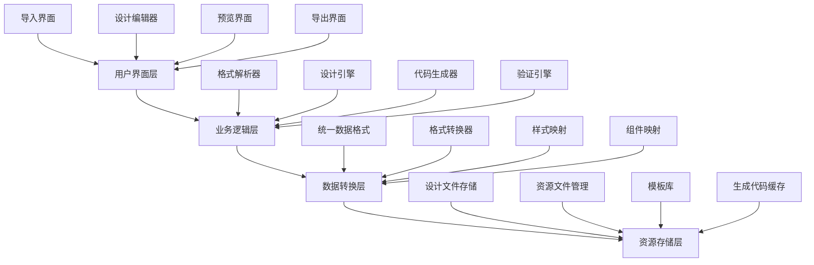

# 🎨 UX Designer UI转换器功能设计文档

> **📋 UX Designer UI Converter Design Document**  
> UI转换器模块的完整设计方案和开发指导意见  
> 最后更新：2024-12-28

### 🎯 设计文档必读
- [🚀 核心开发指南 - 首要开发标准](../development/core-development-guide.md) **⭐ 必读**
- [📋 UI转换器完整操作流程指南](../development/complete-workflow-guide.md) **⭐ 流程参考**
- [📖 文档使用说明 - 快速上手指南](../development/documentation-usage-guide.md) **⭐ 新手必读**

---

## 🎯 模块概述与核心价值

### 💡 设计理念
UI转换器是一个**跨平台设计转换核心引擎**，旨在打破设计工具与开发平台之间的壁垒，实现**"设计一次，处处可用"**的理想状态。

### 🎨 核心价值主张
1. **统一设计语言** - 建立跨平台的设计系统规范
2. **零代码转换** - 设计师无需编程知识即可生成代码
3. **智能化适配** - 自动适配不同平台的UI规范
4. **可视化编辑** - 直观的拖拽式设计体验
5. **实时预览** - 即时查看设计效果和生成代码

### 📊 目标用户群体
- **UX/UI设计师** - 设计稿快速转换为可用代码
- **前端开发者** - 快速搭建页面原型和组件
- **产品经理** - 可视化原型设计和需求验证
- **全栈开发者** - 提高开发效率的工具链

---

## 📋 功能分析与需求梳理

### 🔍 核心功能模块分析

#### 1. 多格式资源导入模块 📥
**功能描述：** 支持多种设计工具和格式的统一导入处理

**详细需求：**
- **Figma集成** - 通过API直接获取设计文件和资源
- **UMG文件支持** - Unreal Engine UI文件的解析和转换
- **文件上传处理** - 支持拖拽上传和格式自动识别
- **预设模板库** - 内置常用UI模板快速开始设计
- **扩展性设计** - 预留接口支持更多设计工具

**业务价值：**
- 降低设计师工具切换成本
- 支持团队多样化的设计工具栈
- 历史设计资产的复用和迁移

#### 2. 统一设计编辑器模块 ✏️
**功能描述：** 基于统一设计规范的可视化编辑环境

**详细需求：**
- **可视化画布** - 所见即所得的设计界面
- **组件树管理** - 层级结构的直观管理
- **实时属性编辑** - 动态修改组件属性和样式
- **智能对齐辅助** - 自动对齐和分布工具
- **响应式设计** - 多设备尺寸的适配预览

**业务价值：**
- 统一的设计标准和规范
- 降低设计学习成本
- 提高设计一致性和质量

#### 3. 智能代码生成模块 🚀
**功能描述：** 多平台代码的智能生成和优化

**详细需求：**
- **Vue组件生成** - 完整的Vue3 + Element Plus组件
- **UMG资源导出** - Unreal Engine可用的UI资源
- **代码优化** - Tree Shaking、压缩等性能优化
- **菜单自动集成** - 自动生成菜单配置和权限设置
- **文档自动生成** - 组件使用文档和注释

**业务价值：**
- 大幅提升开发效率
- 减少手工编码错误
- 标准化的代码结构

#### 4. 预览与验证模块 🔍
**功能描述：** 多维度的设计预览和验证工具

**详细需求：**
- **多设备预览** - 桌面、平板、手机视图
- **交互原型** - 基本的用户交互模拟
- **代码预览** - 实时查看生成的代码结构
- **性能分析** - 组件复杂度和性能指标
- **兼容性检查** - 跨浏览器和平台兼容性验证

**业务价值：**
- 提前发现设计问题
- 验证用户体验效果
- 确保技术可行性

---

## 🏗️ 设计思路与架构规划

### 🎨 设计系统架构

#### 1. 分层架构设计


#### 2. 核心数据流设计
```typescript
// 统一设计节点数据结构
interface DesignNode {
  // 基础信息
  id: string
  name: string
  type: ComponentType
  
  // 样式属性
  styles: {
    layout: LayoutProperties    // 布局相关
    appearance: AppearanceProperties    // 外观相关
    typography: TypographyProperties    // 文字相关
    spacing: SpacingProperties    // 间距相关
  }
  
  // 组件属性
  properties: {
    [key: string]: any    // 组件特有属性
  }
  
  // 层级关系
  children: DesignNode[]
  parent?: DesignNode
  
  // 元数据
  metadata: {
    source: ImportSource    // 来源信息
    platform: TargetPlatform[]    // 目标平台
    version: string    // 版本信息
    timestamp: number    // 时间戳
  }
}
```

#### 3. 插件化扩展架构
```typescript
// 导入器插件接口
interface ImporterPlugin {
  name: string
  version: string
  supportedFormats: string[]
  
  // 核心方法
  validate(source: ImportSource): Promise<boolean>
  parse(source: ImportSource): Promise<DesignNode[]>
  getMetadata(source: ImportSource): Promise<ImportMetadata>
}

// 转换器插件接口
interface ConverterPlugin {
  name: string
  version: string
  targetPlatform: string
  
  // 核心方法
  convert(designTree: DesignNode[], options: ConvertOptions): Promise<ConvertResult>
  optimize(code: GeneratedCode, options: OptimizeOptions): Promise<OptimizedCode>
  validate(code: GeneratedCode): Promise<ValidationResult>
}
```

---

## 📐 详细实现步骤

### Phase 1: 基础架构搭建 🏗️

#### 1.1 核心类型定义 (1-2天)
**目标：** 建立完整的TypeScript类型系统

**实现步骤：**
```typescript
// 1. 创建核心类型文件
// tunnel-management-ui/src/core/converter/types/index.ts

// 2. 定义统一设计节点格式
export interface DesignNode { /* ... */ }

// 3. 定义插件接口规范
export interface ImporterPlugin { /* ... */ }
export interface ConverterPlugin { /* ... */ }

// 4. 定义配置和选项类型
export interface ConvertOptions { /* ... */ }
export interface UIConverterConfig { /* ... */ }
```

**完成标准：**
- [ ] 所有核心类型定义完成
- [ ] TypeScript严格模式通过
- [ ] 类型文档注释完整

#### 1.2 核心转换引擎 (3-5天)
**目标：** 实现统一的转换引擎核心逻辑

**实现步骤：**
```typescript
// tunnel-management-ui/src/core/converter/UniversalConverter.ts

export class UniversalConverter {
  // 插件管理
  private importers: Map<string, ImporterPlugin> = new Map()
  private converters: Map<string, ConverterPlugin> = new Map()
  
  // 核心方法
  async import(source: ImportSource, options?: ImportOptions): Promise<DesignNode[]>
  async convert(designTree: DesignNode[], target: string, options?: ConvertOptions): Promise<ConvertResult>
  async preview(designTree: DesignNode[], options?: PreviewOptions): Promise<PreviewData>
  
  // 插件管理
  registerImporter(importer: ImporterPlugin): void
  registerConverter(converter: ConverterPlugin): void
}
```

**完成标准：**
- [ ] 核心引擎类实现完成
- [ ] 插件注册机制正常工作
- [ ] 基础转换流程可运行

### Phase 2: 用户界面开发 🎨

#### 2.1 主界面布局设计 (2-3天)
**目标：** 实现三栏式的现代化界面布局

**界面结构：**
```vue
<!-- tunnel-management-ui/src/views/ui-converter/index.vue -->
<template>
  <div class="ui-converter-workspace">
    <!-- 顶部工具栏 -->
    <div class="converter-toolbar">
      <el-button-group>
        <el-button @click="showImportDialog">导入</el-button>
        <el-button @click="saveDesign">保存</el-button>
        <el-button @click="showExportDialog">导出</el-button>
        <el-button @click="showPreviewDialog">预览</el-button>
      </el-button-group>
    </div>
    
    <!-- 主工作区 -->
    <div class="converter-main">
      <!-- 左侧组件树 -->
      <div class="converter-sidebar-left">
        <ComponentTreeView 
          :design-tree="designTree"
          :selected-node="selectedNode"
          @node-select="handleNodeSelect"
          @node-update="handleNodeUpdate"
        />
      </div>
      
      <!-- 中央设计画布 -->
      <div class="converter-canvas">
        <DesignCanvas
          :design-tree="designTree"
          :selected-node="selectedNode"
          :viewport-mode="viewportMode"
          @node-select="handleNodeSelect"
          @node-update="handleNodeUpdate"
        />
      </div>
      
      <!-- 右侧属性面板 -->
      <div class="converter-sidebar-right">
        <PropertyPanel
          :selected-node="selectedNode"
          @property-change="handlePropertyChange"
        />
      </div>
    </div>
  </div>
</template>
```

**完成标准：**
- [ ] 响应式布局正常工作
- [ ] 各面板可调整大小
- [ ] 快捷键操作支持

#### 2.2 组件树视图开发 (3-4天)
**目标：** 实现可交互的组件层级树状结构

**核心功能：**
```vue
<!-- tunnel-management-ui/src/components/UIConverter/ComponentTreeView.vue -->
<template>
  <div class="component-tree-view">
    <div class="tree-header">
      <el-input 
        v-model="searchKeyword" 
        placeholder="搜索组件..."
        prefix-icon="el-icon-search"
      />
    </div>
    
    <el-tree
      :data="treeData"
      :props="treeProps"
      :expand-on-click-node="false"
      :default-expand-all="true"
      node-key="id"
      highlight-current
      draggable
      @node-click="handleNodeClick"
      @node-contextmenu="handleContextMenu"
      @node-drop="handleNodeDrop"
    >
      <template #default="{ node, data }">
        <TreeNodeRenderer 
          :node="node"
          :data="data"
          @rename="handleNodeRename"
          @delete="handleNodeDelete"
        />
      </template>
    </el-tree>
  </div>
</template>
```

**完成标准：**
- [ ] 支持拖拽调整层级
- [ ] 右键菜单操作完整
- [ ] 搜索过滤功能正常

### Phase 3: 核心功能实现 ⚡

#### 3.1 Figma导入器开发 (5-7天)
**目标：** 实现完整的Figma API集成和文件解析

**实现架构：**
```typescript
// tunnel-management-ui/src/core/converter/importers/FigmaImporter.ts

export class FigmaImporter implements ImporterPlugin {
  name = 'figma-importer'
  version = '1.0.0'
  supportedFormats = ['figma']
  
  private apiClient: FigmaApiClient
  private styleMapper: FigmaStyleMapper
  private componentMapper: FigmaComponentMapper
  
  async validate(source: FigmaImportSource): Promise<boolean> {
    // 验证Figma文件访问权限
    return await this.apiClient.validateAccess(source.fileKey, source.accessToken)
  }
  
  async parse(source: FigmaImportSource): Promise<DesignNode[]> {
    // 1. 获取Figma文件数据
    const figmaFile = await this.apiClient.getFile(source.fileKey)
    
    // 2. 解析页面和组件
    const pages = await this.parsePages(figmaFile.document.children)
    
    // 3. 转换为统一格式
    return await this.convertToDesignNodes(pages)
  }
  
  private async parsePages(figmaPages: FigmaNode[]): Promise<FigmaPageData[]> {
    // 具体的页面解析逻辑
  }
  
  private async convertToDesignNodes(pages: FigmaPageData[]): Promise<DesignNode[]> {
    // 转换为统一的设计节点格式
  }
}
```

**完成标准：**
- [ ] Figma API集成完成
- [ ] 基础组件类型支持
- [ ] 样式映射正确性验证

#### 3.2 Vue代码生成器开发 (7-10天)
**目标：** 实现高质量的Vue3 + Element Plus代码生成

**生成器架构：**
```typescript
// tunnel-management-ui/src/core/converter/converters/VueConverter.ts

export class VueConverter implements ConverterPlugin {
  name = 'vue-converter'
  version = '1.0.0'
  targetPlatform = 'vue3-element-plus'
  
  private templateGenerator: VueTemplateGenerator
  private scriptGenerator: VueScriptGenerator
  private styleGenerator: VueStyleGenerator
  private routeGenerator: VueRouteGenerator
  
  async convert(designTree: DesignNode[], options: VueConvertOptions): Promise<VueConvertResult> {
    const result: VueConvertResult = {
      files: [],
      routes: [],
      menuConfigs: [],
      documentation: []
    }
    
    // 1. 生成Vue组件文件
    for (const rootNode of designTree) {
      const vueComponent = await this.generateVueComponent(rootNode, options)
      result.files.push(vueComponent)
    }
    
    // 2. 生成路由配置
    result.routes = await this.routeGenerator.generate(designTree, options)
    
    // 3. 生成菜单配置
    result.menuConfigs = await this.generateMenuConfigs(designTree, options)
    
    // 4. 生成文档
    result.documentation = await this.generateDocumentation(designTree, options)
    
    return result
  }
  
  private async generateVueComponent(node: DesignNode, options: VueConvertOptions): Promise<VueComponentFile> {
    return {
      name: `${toPascalCase(node.name)}.vue`,
      template: await this.templateGenerator.generate(node, options),
      script: await this.scriptGenerator.generate(node, options),
      style: await this.styleGenerator.generate(node, options)
    }
  }
}
```

**完成标准：**
- [ ] 生成的Vue组件可直接使用
- [ ] TypeScript类型支持完整
- [ ] 样式生成准确无误
- [ ] 菜单配置自动生成

---

## 🔧 菜单管理集成方案

### 📋 自动化菜单创建

#### 1. 菜单配置参数标准化
```typescript
// tunnel-management-ui/src/core/converter/MenuConfigGenerator.ts

export interface UIConverterMenuConfig {
  // 主菜单配置
  mainMenu: MenuConfig
  // 子菜单配置
  subMenus: MenuConfig[]
  // 权限按钮配置
  permissions: PermissionConfig[]
}

export class MenuConfigGenerator {
  /**
   * 为生成的页面自动创建菜单配置
   */
  async generateMenuConfigs(
    designTree: DesignNode[], 
    options: MenuGenerationOptions
  ): Promise<UIConverterMenuConfig> {
    const configs: UIConverterMenuConfig = {
      mainMenu: {
        name: "UI转换器",
        type: 1,
        sort: 6000,
        parentId: 0,
        path: "ui-converter",
        icon: "ep:magic-stick",
        component: "",
        componentName: "",
        permission: "",
        status: 0,
        visible: true,
        keepAlive: false,
        alwaysShow: true
      },
      subMenus: [],
      permissions: []
    }
    
    // 根据设计树生成子菜单
    let sortIndex = 6010
    for (const node of designTree) {
      const subMenu = this.generateSubMenuConfig(node, sortIndex, options)
      configs.subMenus.push(subMenu)
      
      // 生成权限配置
      const permissions = this.generatePermissionConfigs(subMenu.id, node)
      configs.permissions.push(...permissions)
      
      sortIndex += 10
    }
    
    return configs
  }
  
  /**
   * 自动调用菜单管理API创建菜单
   */
  async createMenusAutomatically(configs: UIConverterMenuConfig): Promise<MenuCreationResult> {
    const result: MenuCreationResult = {
      success: true,
      createdMenus: [],
      errors: []
    }
    
    try {
      // 1. 创建主菜单
      const mainMenuId = await MenuApi.createMenu(configs.mainMenu)
      result.createdMenus.push({ type: 'main', id: mainMenuId, name: configs.mainMenu.name })
      
      // 2. 创建子菜单
      for (const subMenu of configs.subMenus) {
        subMenu.parentId = mainMenuId
        const subMenuId = await MenuApi.createMenu(subMenu)
        result.createdMenus.push({ type: 'sub', id: subMenuId, name: subMenu.name })
        
        // 3. 创建权限按钮
        const menuPermissions = configs.permissions.filter(p => p.parentId === subMenu.id)
        for (const permission of menuPermissions) {
          permission.parentId = subMenuId
          const permissionId = await MenuApi.createMenu(permission)
          result.createdMenus.push({ type: 'permission', id: permissionId, name: permission.name })
        }
      }
      
    } catch (error) {
      result.success = false
      result.errors.push(error.message)
    }
    
    return result
  }
}
```

#### 2. 菜单创建状态跟踪
```typescript
// 菜单创建跟踪表
export interface MenuCreationTracker {
  trackingId: string
  designNodeId: string
  menuConfigs: UIConverterMenuConfig
  creationStatus: 'pending' | 'in-progress' | 'completed' | 'failed'
  createdMenuIds: number[]
  errors: string[]
  createdAt: Date
  completedAt?: Date
}

// 实时状态更新
export class MenuCreationStatusTracker {
  private static trackers = new Map<string, MenuCreationTracker>()
  
  static createTracker(designNodeId: string, configs: UIConverterMenuConfig): string {
    const trackingId = `menu-${Date.now()}-${Math.random().toString(36).slice(2)}`
    
    this.trackers.set(trackingId, {
      trackingId,
      designNodeId,
      menuConfigs: configs,
      creationStatus: 'pending',
      createdMenuIds: [],
      errors: [],
      createdAt: new Date()
    })
    
    return trackingId
  }
  
  static updateStatus(trackingId: string, status: MenuCreationTracker['creationStatus']): void {
    const tracker = this.trackers.get(trackingId)
    if (tracker) {
      tracker.creationStatus = status
      if (status === 'completed' || status === 'failed') {
        tracker.completedAt = new Date()
      }
    }
  }
  
  static getTracker(trackingId: string): MenuCreationTracker | undefined {
    return this.trackers.get(trackingId)
  }
}
```

---

## 📊 开发进度跟踪

### 🎯 模块开发状态

| 模块名称 | 文件路径 | 状态 | 完成度 | 负责人 | 预计完成 | 备注 |
|----------|----------|------|--------|--------|----------|------|
| **核心类型定义** | `types/index.ts` | 📋 待开始 | 0% | - | 2024-12-30 | 基础架构 |
| **统一转换引擎** | `UniversalConverter.ts` | 📋 待开始 | 0% | - | 2025-01-05 | 核心引擎 |
| **主界面布局** | `views/ui-converter/index.vue` | 📋 待开始 | 0% | - | 2025-01-08 | UI框架 |
| **组件树视图** | `components/ComponentTreeView.vue` | 📋 待开始 | 0% | - | 2025-01-12 | 交互组件 |
| **设计画布** | `components/DesignCanvas.vue` | 📋 待开始 | 0% | - | 2025-01-15 | 核心组件 |
| **属性面板** | `components/PropertyPanel.vue` | 📋 待开始 | 0% | - | 2025-01-18 | 编辑组件 |
| **Figma导入器** | `importers/FigmaImporter.ts` | 📋 待开始 | 0% | - | 2025-01-25 | 导入功能 |
| **Vue代码生成器** | `converters/VueConverter.ts` | 📋 待开始 | 0% | - | 2025-02-05 | 导出功能 |
| **菜单配置生成器** | `MenuConfigGenerator.ts` | 📋 待开始 | 0% | - | 2025-01-22 | 集成功能 |

### 📈 总体进度：0%
```
░░░░░░░░░░░░░░░░░░░░░░░░░░░░░░░░░░░░░░░░░░░░░░░░░░ [0]%
```

**项目里程碑：**
- **Phase 1**: 基础架构搭建 (预计: 2025-01-05)
- **Phase 2**: 用户界面开发 (预计: 2025-01-18)  
- **Phase 3**: 核心功能实现 (预计: 2025-02-05)
- **Phase 4**: 测试与优化 (预计: 2025-02-15)

---

## 🎯 菜单创建配置参数

### 📋 完整菜单配置清单

#### 主菜单 - UI转换器
```json
{
  "name": "UI转换器",
  "type": 1,
  "sort": 6000,
  "parentId": 0,
  "path": "ui-converter",
  "icon": "ep:magic-stick",
  "component": "",
  "componentName": "",
  "permission": "",
  "status": 0,
  "visible": true,
  "keepAlive": false,
  "alwaysShow": true
}
```

#### 各模块子菜单配置

**📋 菜单创建状态跟踪表：**

| 菜单名称 | 路径 | 创建状态 | 菜单ID | 创建时间 | 备注 |
|----------|------|----------|--------|----------|------|
| UI转换器 | `/ui-converter` | 📋 待创建 | - | - | 主菜单 |
| 资源导入 | `/ui-converter/import` | 📋 待创建 | - | - | 子菜单 |
| 组件树管理 | `/ui-converter/component-tree` | 📋 待创建 | - | - | 子菜单 |
| 可视化设计器 | `/ui-converter/design-canvas` | 📋 待创建 | - | - | 子菜单 |
| 属性编辑器 | `/ui-converter/property-panel` | 📋 待创建 | - | - | 子菜单 |
| 代码导出 | `/ui-converter/export` | 📋 待创建 | - | - | 子菜单 |
| 预览中心 | `/ui-converter/preview` | 📋 待创建 | - | - | 子菜单 |

---

## 🚀 快速开始指南

### 🛠️ 开发环境准备

1. **克隆项目并安装依赖**
```bash
cd tunnel-management-ui
npm install
```

2. **创建开发分支**
```bash
git checkout -b feature/ui-converter-development
```

3. **创建基础文件结构**
```bash
mkdir -p src/core/converter/{types,importers,converters,utils}
mkdir -p src/components/UIConverter
mkdir -p src/views/ui-converter
```

### 📝 开发流程检查清单

**每日开发前：**
- [ ] 检查当前模块在进度跟踪表中的状态
- [ ] 确认前置依赖模块是否完成
- [ ] 更新当前模块状态为"🔄 进行中"

**开发过程中：**
- [ ] 遇到问题立即记录到问题跟踪表
- [ ] 重要设计决策及时更新文档
- [ ] 完成子功能及时更新完成度百分比

**完成开发后：**
- [ ] 更新模块状态为"✅ 已完成" 
- [ ] 记录实际完成时间
- [ ] 更新总体进度百分比
- [ ] 提交代码并推送到远程仓库

---

**📋 文档状态：** ✅ 已发布  
**🔄 维护责任：** UX开发团队  
**📅 下次更新：** 随开发进展持续更新 