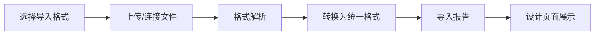

# UI转换器完整操作流程指南

## 🎯 **系统概述**

这是一个完整的UI设计转换平台，支持从多种设计工具导入，统一编辑，然后导出到不同的目标格式。系统的每个页面都通过菜单管理进行统一管理，支持设计自动生成页面时通过调用菜单管理的API接口自动创建。

---

## 📋 **完整操作流程**

### **阶段一：多格式资源导入** 📥

#### **1. 导入入口**
- 用户点击设计页面的 **"导入功能"** 按钮
- 系统展示多种格式的导入选项卡

#### **2. 支持的导入格式**

| 格式 | 状态 | 说明 |
|------|------|------|
| **Figma** | ✅ 已实现 | 通过Figma API导入设计文件 |
| **UMG** | ✅ 已实现 | Unreal Engine UI文件导入 |
| **墨刀** | 🔄 规划中 | 国产原型设计工具 |
| **Adobe XD** | 🔄 规划中 | Adobe设计工具 |
| **Sketch** | 🔄 规划中 | Mac平台设计工具 |
| **蓝湖** | 🔄 规划中 | 国产设计协作平台 |
| **预设模板** | ✅ 已实现 | 内置多种UI模板快速开始 |

#### **3. 导入处理流程**


---

### **阶段二：统一格式设计调整** ✏️

#### **1. 设计界面布局**
```
┌─────────────────────────────────────────────────┐
│  工具栏: 导入 | 保存 | 导出 | 预览            │
├──────────┬─────────────────────┬────────────────┤
│          │                     │                │
│ 组件树   │    可视化设计区     │   属性面板     │
│ 视图     │                     │                │
│          │  ┌─────────────┐    │  • 基础属性    │
│ • Root   │  │   预览区域  │    │  • 样式设置    │
│   - 组件A│  │             │    │  • 布局配置    │
│   - 组件B│  │    实时     │    │  • 事件绑定    │
│   - 组件C│  │    预览     │    │                │
│          │  └─────────────┘    │                │
└──────────┴─────────────────────┴────────────────┘
```

#### **2. 编辑功能**

**🎨 可视化编辑**
- 拖拽调整组件位置
- 鼠标调整组件尺寸
- 实时预览设计效果
- 组件层级管理

**⚙️ 属性编辑**
- 基础属性：名称、ID、可见性
- 样式属性：颜色、字体、边框、背景
- 布局属性：位置、对齐、间距、约束
- 交互属性：事件绑定、动画效果

**🌳 组件树操作**
- 组件层级结构展示
- 拖拽调整组件层级
- 组件重命名和删除
- 组件复制和粘贴

---

### **阶段三：预案确认与生成** 🔍

#### **1. 设计预览**
- **实时预览**：编辑过程中实时显示效果
- **多设备预览**：桌面、平板、手机视图
- **交互预览**：模拟用户交互行为
- **代码预览**：查看将要生成的代码结构

#### **2. 设计验证**
- **组件检查**：验证所有组件是否完整
- **布局检查**：检查响应式布局是否正确
- **兼容性检查**：验证目标平台兼容性
- **性能检查**：分析设计复杂度和性能影响

---

### **阶段四：多格式导出** 🚀

#### **1. Vue + Element Plus 生成**

**📦 生成内容**
- `.vue` 组件文件
- TypeScript类型定义
- SCSS样式文件
- 组件文档

**🔗 菜单集成**
- 自动生成菜单配置SQL
- 权限配置脚本
- 路由配置代码
- 一键部署到系统

**⚡ 生成选项**
```typescript
{
  target: 'vue-element',
  framework: 'typescript',
  theme: 'light',
  responsive: true,
  accessibility: true,
  optimization: {
    minify: true,
    treeshaking: true
  }
}
```

#### **2. 其他格式导出**

**🎮 UMG导出 (Unreal Engine)**
- `.umg` 中间格式文件
- `.uasset` 蓝图元数据
- 样式定义文件
- UE版本兼容性支持

**📱 React Native导出**
- JSX组件文件
- 样式表文件
- 导航配置
- 平台适配代码

**🌐 HTML/CSS导出**
- 静态HTML文件
- CSS样式文件
- JavaScript交互
- 响应式适配

**📋 设计规范导出**
- 设计标注文档
- 组件库文档
- 样式指南
- 开发交接文档

---

## 🧩 **核心组件说明及菜单配置**

### **1. 主界面组件 (ConverterView.vue)**
- **功能**：完整的工作流程界面，整合所有功能模块
- **特点**：三栏布局，工具栏操作，实时保存
- **快捷键**：
  - `Ctrl/Cmd + S`：保存设计
  - `Ctrl/Cmd + Z`：撤销操作
  - `Ctrl/Cmd + Shift + Z`：重做操作

**📋 菜单配置参数：**
```json
{
  "name": "UI转换器",
  "type": 1,
  "sort": 6000,
  "parentId": 0,
  "path": "ui-converter",
  "icon": "ep:magic-stick",
  "component": "",
  "componentName": "",
  "permission": "",
  "status": 0,
  "visible": true,
  "keepAlive": false,
  "alwaysShow": true
}
```

### **2. 导入对话框 (ImportDialog.vue)**
- **功能**：多格式文件导入，支持6种导入方式
- **支持格式**：
  - Figma API导入
  - UMG文件上传
  - JSON数据导入
  - 预设模板选择
  - 墨刀、XD（规划中）
- **特点**：拖拽上传，实时验证，格式转换

**📋 菜单配置参数：**
```json
{
  "name": "资源导入",
  "type": 2,
  "sort": 6010,
  "parentId": 6000,
  "path": "import",
  "icon": "ep:upload",
  "component": "ui-converter/import/index",
  "componentName": "UIConverterImport",
  "permission": "ui-converter:import:query",
  "status": 0,
  "visible": true,
  "keepAlive": true,
  "alwaysShow": false
}
```

### **3. 组件树视图 (ComponentTreeView.vue)**
- **功能**：层级结构展示，组件管理
- **操作**：
  - 展开/折叠节点
  - 右键菜单操作
  - 复制/粘贴组件
  - 拖拽调整层级
- **快捷操作**：双击编辑，删除确认

**📋 菜单配置参数：**
```json
{
  "name": "组件树管理",
  "type": 2,
  "sort": 6020,
  "parentId": 6000,
  "path": "component-tree",
  "icon": "ep:tree",
  "component": "ui-converter/component-tree/index",
  "componentName": "UIConverterComponentTree",
  "permission": "ui-converter:component-tree:query",
  "status": 0,
  "visible": true,
  "keepAlive": true,
  "alwaysShow": false
}
```

### **4. 设计画布 (DesignCanvas.vue)**
- **功能**：可视化设计区域，实时渲染
- **特点**：
  - 响应式预览
  - 组件选择高亮
  - 样式实时应用
  - 多设备适配
- **交互**：点击选择，拖拽调整

**📋 菜单配置参数：**
```json
{
  "name": "可视化设计器",
  "type": 2,
  "sort": 6030,
  "parentId": 6000,
  "path": "design-canvas",
  "icon": "ep:edit",
  "component": "ui-converter/design-canvas/index",
  "componentName": "UIConverterDesignCanvas",
  "permission": "ui-converter:design-canvas:query",
  "status": 0,
  "visible": true,
  "keepAlive": true,
  "alwaysShow": false
}
```

### **5. 属性面板 (PropertyPanel.vue)**
- **功能**：组件属性编辑，样式配置
- **面板**：
  - 基础属性：名称、类型、ID
  - 样式属性：颜色、字体、尺寸
  - 布局属性：对齐、间距、排列
  - 组件属性：文本、占位符、类型
  - 内边距：可视化编辑器
- **特点**：实时预览，智能提示

**📋 菜单配置参数：**
```json
{
  "name": "属性编辑器",
  "type": 2,
  "sort": 6040,
  "parentId": 6000,
  "path": "property-panel",
  "icon": "ep:setting",
  "component": "ui-converter/property-panel/index",
  "componentName": "UIConverterPropertyPanel",
  "permission": "ui-converter:property-panel:query",
  "status": 0,
  "visible": true,
  "keepAlive": true,
  "alwaysShow": false
}
```

### **6. 导出对话框 (ExportDialog.vue)**
- **功能**：多格式代码生成，配置选项
- **格式支持**：
  - Vue + Element Plus
  - Vue + UMG
  - UMG Asset
- **配置项**：
  - 语言类型：TypeScript/JavaScript
  - 主题模式：浅色/深色/自动
  - 功能选项：响应式、无障碍、国际化
  - 优化选项：压缩、Tree Shaking
- **额外功能**：菜单集成、UE版本选择

**📋 菜单配置参数：**
```json
{
  "name": "代码导出",
  "type": 2,
  "sort": 6050,
  "parentId": 6000,
  "path": "export",
  "icon": "ep:download",
  "component": "ui-converter/export/index",
  "componentName": "UIConverterExport",
  "permission": "ui-converter:export:query",
  "status": 0,
  "visible": true,
  "keepAlive": true,
  "alwaysShow": false
}
```

### **7. 预览对话框 (PreviewDialog.vue)**
- **功能**：设计和代码预览，多视图切换
- **视图模式**：
  - 设计视图：可视化预览
  - 代码视图：生成代码展示
  - 分割视图：设计+代码同时显示
- **设备模式**：桌面、平板、手机
- **统计信息**：组件数量、层级深度分析

**📋 菜单配置参数：**
```json
{
  "name": "预览中心",
  "type": 2,
  "sort": 6060,
  "parentId": 6000,
  "path": "preview",
  "icon": "ep:view",
  "component": "ui-converter/preview/index",
  "componentName": "UIConverterPreview",
  "permission": "ui-converter:preview:query",
  "status": 0,
  "visible": true,
  "keepAlive": true,
  "alwaysShow": false
}
```

---

## 🔧 **权限配置**

### **基础权限配置**
每个页面需要配置以下权限按钮：

**查询权限**
```json
{
  "name": "查询",
  "type": 3,
  "sort": 1,
  "parentId": "[页面菜单ID]",
  "path": "",
  "icon": "",
  "component": "",
  "componentName": "",
  "permission": "ui-converter:[功能]:query",
  "status": 0,
  "visible": true,
  "keepAlive": false,
  "alwaysShow": false
}
```

**新增权限**
```json
{
  "name": "新增",
  "type": 3,
  "sort": 2,
  "parentId": "[页面菜单ID]",
  "path": "",
  "icon": "",
  "component": "",
  "componentName": "",
  "permission": "ui-converter:[功能]:create",
  "status": 0,
  "visible": true,
  "keepAlive": false,
  "alwaysShow": false
}
```

**编辑权限**
```json
{
  "name": "编辑",
  "type": 3,
  "sort": 3,
  "parentId": "[页面菜单ID]",
  "path": "",
  "icon": "",
  "component": "",
  "componentName": "",
  "permission": "ui-converter:[功能]:update",
  "status": 0,
  "visible": true,
  "keepAlive": false,
  "alwaysShow": false
}
```

**删除权限**
```json
{
  "name": "删除",
  "type": 3,
  "sort": 4,
  "parentId": "[页面菜单ID]",
  "path": "",
  "icon": "",
  "component": "",
  "componentName": "",
  "permission": "ui-converter:[功能]:delete",
  "status": 0,
  "visible": true,
  "keepAlive": false,
  "alwaysShow": false
}
```

**导出权限**
```json
{
  "name": "导出",
  "type": 3,
  "sort": 5,
  "parentId": "[页面菜单ID]",
  "path": "",
  "icon": "",
  "component": "",
  "componentName": "",
  "permission": "ui-converter:[功能]:export",
  "status": 0,
  "visible": true,
  "keepAlive": false,
  "alwaysShow": false
}
```

---

## 🚀 **自动化菜单创建**

### **TypeScript 自动创建函数**
```typescript
import { MenuApi } from '@/api/system/menu'

/**
 * 自动创建UI转换器模块菜单
 */
export async function createUIConverterMenus() {
  try {
    // 1. 创建主菜单
    const mainMenuId = await MenuApi.createMenu({
      name: "UI转换器",
      type: 1,
      sort: 6000,
      parentId: 0,
      path: "ui-converter",
      icon: "ep:magic-stick",
      component: "",
      componentName: "",
      permission: "",
      status: 0,
      visible: true,
      keepAlive: false,
      alwaysShow: true
    })

    // 2. 创建子菜单
    const subMenus = [
      {
        name: "资源导入",
        path: "import",
        icon: "ep:upload",
        component: "ui-converter/import/index",
        componentName: "UIConverterImport",
        permission: "ui-converter:import:query"
      },
      {
        name: "组件树管理",
        path: "component-tree",
        icon: "ep:tree",
        component: "ui-converter/component-tree/index",
        componentName: "UIConverterComponentTree",
        permission: "ui-converter:component-tree:query"
      },
      {
        name: "可视化设计器",
        path: "design-canvas",
        icon: "ep:edit",
        component: "ui-converter/design-canvas/index",
        componentName: "UIConverterDesignCanvas",
        permission: "ui-converter:design-canvas:query"
      },
      {
        name: "属性编辑器",
        path: "property-panel",
        icon: "ep:setting",
        component: "ui-converter/property-panel/index",
        componentName: "UIConverterPropertyPanel",
        permission: "ui-converter:property-panel:query"
      },
      {
        name: "代码导出",
        path: "export",
        icon: "ep:download",
        component: "ui-converter/export/index",
        componentName: "UIConverterExport",
        permission: "ui-converter:export:query"
      },
      {
        name: "预览中心",
        path: "preview",
        icon: "ep:view",
        component: "ui-converter/preview/index",
        componentName: "UIConverterPreview",
        permission: "ui-converter:preview:query"
      }
    ]

    let sort = 6010
    for (const menu of subMenus) {
      await MenuApi.createMenu({
        ...menu,
        type: 2,
        sort: sort,
        parentId: mainMenuId,
        status: 0,
        visible: true,
        keepAlive: true,
        alwaysShow: false
      })
      sort += 10
    }

    console.log('UI转换器菜单创建成功')
    return mainMenuId
  } catch (error) {
    console.error('菜单创建失败:', error)
    throw error
  }
}
```

---

## 📊 **功能矩阵**

### **导入格式支持**
| 功能 | Figma | UMG | 墨刀 | XD | Sketch | 模板 |
|------|-------|-----|------|----|----|------|
| 基础组件 | ✅ | ✅ | 🔄 | 🔄 | 🔄 | ✅ |
| 布局信息 | ✅ | ✅ | 🔄 | 🔄 | 🔄 | ✅ |
| 样式属性 | ✅ | ✅ | 🔄 | 🔄 | 🔄 | ✅ |
| 图片资源 | ✅ | ✅ | 🔄 | 🔄 | 🔄 | ✅ |
| 交互事件 | 🔄 | ✅ | 🔄 | 🔄 | 🔄 | ✅ |

### **导出格式支持**
| 功能 | Vue | React | UMG | HTML | 小程序 |
|------|-----|-------|-----|------|--------|
| 组件生成 | ✅ | 🔄 | ✅ | 🔄 | 🔄 |
| 样式生成 | ✅ | 🔄 | ✅ | 🔄 | 🔄 |
| 路由生成 | ✅ | 🔄 | ❌ | 🔄 | 🔄 |
| 菜单集成 | ✅ | ❌ | ❌ | ❌ | 🔄 |

---

## 🛠️ **实现架构**

### **核心转换引擎**
```typescript
// 统一设计节点格式
interface DesignNode {
  id: string
  name: string
  type: ComponentType
  styles: StyleProperties
  layout: LayoutProperties
  properties: ComponentProperties
  children: DesignNode[]
  metadata: NodeMetadata
}

// 导入器插件
interface ImporterPlugin {
  name: string
  supportedFormats: string[]
  import(source: ImportSource): Promise<ImportResult>
}

// 转换器插件
interface ConverterPlugin {
  name: string
  targetFormat: string
  convert(designTree: DesignNode, options: ConversionOptions): Promise<ConvertResult>
}
```

### **数据流向**
```
导入格式 → 解析器 → 统一格式 → 编辑器 → 统一格式 → 转换器 → 目标格式
  ↓           ↓         ↓         ↓         ↓         ↓         ↓
Figma    →  Parser  →  DesignNode → Editor → DesignNode → Converter → Vue
UMG      →  Parser  →  DesignNode → Editor → DesignNode → Converter → React
XD       →  Parser  →  DesignNode → Editor → DesignNode → Converter → UMG
...
```

---

## 🚀 **使用场景**

### **场景一：设计师 → 开发者**
1. 设计师在Figma中完成UI设计
2. 通过转换器导入到系统
3. 开发者在系统中调整和完善
4. 生成Vue组件并集成到项目

### **场景二：跨平台开发**
1. 在统一平台设计UI
2. 同时导出Vue、React、UMG等多种格式
3. 不同团队使用对应格式开发
4. 保持UI的一致性

### **场景三：原型 → 产品**
1. 使用墨刀等工具制作原型
2. 导入转换器进行精细化调整
3. 直接生成可用的生产代码
4. 快速从原型到产品

### **场景四：快速原型**
1. 选择预设模板快速开始
2. 在设计器中调整布局和样式
3. 实时预览效果
4. 导出可用代码

---

## 💡 **最佳实践**

### **1. 导入优化**
- **Figma导入**：确保图层命名规范，使用组件化设计
- **UMG导入**：保持UMG文件结构清晰，避免过深嵌套
- **模板使用**：选择最接近需求的模板，减少后期调整

### **2. 设计编辑**
- **组件命名**：使用有意义的名称，便于后期维护
- **层级管理**：保持合理的嵌套深度，避免过度复杂
- **样式统一**：使用统一的色彩、字体、间距规范

### **3. 代码生成**
- **选择合适框架**：根据项目需求选择TypeScript或JavaScript
- **开启优化选项**：生产环境建议开启压缩和Tree Shaking
- **菜单集成**：合理配置菜单层级和权限

### **4. 性能优化**
- **减少组件数量**：合并相似组件，减少不必要的嵌套
- **优化样式**：避免重复样式，使用CSS变量
- **异步加载**：大型组件考虑异步加载

---

## 📈 **发展路线图**

### **近期目标 (1-2个月)**
- ✅ 完善Figma和UMG导入
- 🔄 实现墨刀、XD导入器
- 🔄 优化设计编辑界面
- 🔄 完善Vue组件生成

### **中期目标 (3-6个月)**
- 🔄 React Native导出
- 🔄 小程序导出
- 🔄 设计系统管理
- 🔄 协作功能

### **长期目标 (6-12个月)**
- 🔄 AI辅助设计
- 🔄 自动化测试生成
- 🔄 性能优化建议
- 🔄 云端协作平台

---

## 🛠️ **技术实现细节**

### **文件结构**
```
tunnel-management-ui/src/
├── core/converter/           # 转换器核心引擎
│   ├── index.ts             # 入口文件
│   ├── types.ts             # 类型定义
│   ├── UniversalConverter.ts # 通用转换器
│   ├── utils.ts             # 工具函数
│   ├── importers/           # 导入器
│   │   ├── FigmaImporter.ts
│   │   └── UMGImporter.ts
│   └── converters/          # 转换器
│       ├── VueConverter.ts
│       └── UMGConverter.ts
├── components/Converter/     # UI组件
│   ├── ConverterView.vue    # 主界面
│   ├── ImportDialog.vue     # 导入对话框
│   ├── ComponentTreeView.vue # 组件树
│   ├── DesignCanvas.vue     # 设计画布
│   ├── PropertyPanel.vue    # 属性面板
│   ├── ExportDialog.vue     # 导出对话框
│   └── PreviewDialog.vue    # 预览对话框
└── views/converter/          # 页面组件
    ├── demo.vue             # 演示页面
    └── ConverterView.vue    # 完整转换器页面
```

### **核心API**
```typescript
// 创建转换器实例
const converter = createConverter()

// 导入设计文件
const importResult = await converter.import(source, options)

// 转换为目标格式
const convertResult = await converter.convert(designTree, options)

// 生成文件
const files = convertResult.files
```

### **插件系统**
```typescript
// 注册导入器
converter.registerImporter(new FigmaImporter())

// 注册转换器
converter.registerConverter(new VueConverter())
```

---

这个完整的流程为用户提供了从设计到代码的一站式解决方案，大大提高了UI开发的效率和质量！通过模块化的组件设计和完善的菜单管理集成，系统具有良好的可扩展性和维护性。每个页面都可以通过提供的菜单配置参数快速集成到系统中，实现设计自动生成页面的目标。 