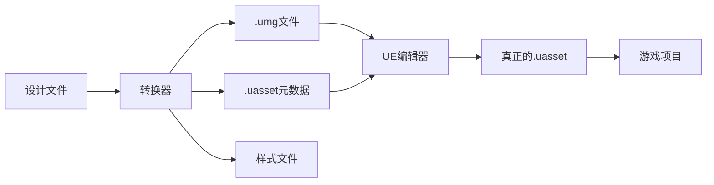

# UMG文件格式说明指南

## 📋 **文件格式概述**

### **1. `.umg` 文件格式**

**`.umg` 文件是我们转换器生成的中间格式**，不是Unreal Engine的原生格式。

#### **特点：**
- 📄 **格式**：可读的JSON格式
- 🎯 **用途**：调试、预览、跨平台交换
- 🔄 **转换**：需要进一步处理成UE原生格式
- 📝 **版本控制**：友好的文本格式，便于diff和合并

#### **结构示例：**
```json
{
  "Type": "Blueprint",
  "Class": "/Script/UMG.UserWidget", 
  "Name": "用户卡片",
  "WidgetTree": {
    "RootWidget": {
      "Class": "/Script/UMG.Border",
      "Name": "用户卡片",
      "Slot": { /* 布局信息 */ },
      "Slots": [ /* 子组件 */ ]
    }
  },
  "Variables": [ /* 组件变量 */ ],
  "Functions": [ /* 事件函数 */ ],
  "Bindings": [ /* 数据绑定 */ ]
}
```

---

### **2. `.uasset` 文件格式**

**UE的真实UI资产格式**

#### **特点：**
- 📄 **格式**：二进制格式
- 🎮 **引擎**：UE原生支持
- 📦 **组成**：通常配合`.uexp`文件
- 🔒 **版本敏感**：不同UE版本格式可能不兼容

#### **真实使用：**
- 需要通过UE编辑器或工具链生成
- 我们的转换器生成的`.uasset`是JSON格式的元数据描述
- 实际应用中需要通过UE工具转换

---

## 🎮 **UE版本兼容性**

### **支持的UE版本**

| UE版本 | 支持状态 | 支持组件 | 说明 |
|--------|----------|----------|------|
| 4.27   | ✅ 支持   | 基础组件 | Button, TextBlock, Image, EditableTextBox, CheckBox |
| 5.0    | ✅ 支持   | 扩展组件 | + Slider, ProgressBar |
| 5.1    | ✅ 支持   | 选择组件 | + ComboBoxString |
| 5.2    | ✅ 支持   | 列表组件 | + ListView |
| 5.3    | ✅ 推荐   | 完整组件 | + TreeView (默认版本) |

### **版本差异**

#### **类路径变化：**
```typescript
// UE 4.27
"/Script/UMG.Button"

// UE 5.0+
"/Script/UMG.Button" // 路径保持一致
```

#### **新增功能：**
- **UE 5.0+**: 增强的样式系统
- **UE 5.1+**: 改进的布局容器
- **UE 5.2+**: 虚拟化列表支持
- **UE 5.3+**: 树形控件和高级绑定

---

## 🛠️ **使用建议**

### **开发工作流**

1. **设计阶段**：使用转换器生成`.umg`文件进行预览
2. **开发阶段**：检查生成的组件结构和属性
3. **集成阶段**：通过UE工具链转换为真正的`.uasset`
4. **部署阶段**：在项目中使用生成的UI资产

### **文件转换流程**



### **最佳实践**

1. **版本选择**：
   - 新项目推荐使用UE 5.3
   - 现有项目根据当前版本选择
   
2. **组件使用**：
   - 优先使用对应版本支持的组件
   - 避免使用过于复杂的嵌套结构
   
3. **性能优化**：
   - 限制Canvas Panel的使用
   - 控制组件嵌套深度
   - 合理使用布局容器

---

## 🔧 **技术细节**

### **转换器配置**

```typescript
const options: ConversionOptions = {
  target: 'vue-umg',
  customConfig: {
    ueVersion: '5.3'  // 指定UE版本
  }
}
```

### **版本兼容性检查**

转换器会根据选择的UE版本：
- ✅ 检查组件支持性
- ⚠️ 生成兼容性警告
- 💡 提供优化建议

### **输出文件说明**

1. **主UMG文件** (`.umg`)：UI结构描述
2. **蓝图文件** (`.uasset`)：事件和逻辑元数据
3. **样式文件** (`.json`)：复杂样式定义

---

## 📞 **常见问题**

### **Q: .umg文件可以直接在UE中使用吗？**
A: 不可以。.umg是中间格式，需要通过UE工具转换为真正的.uasset文件。

### **Q: 如何选择合适的UE版本？**
A: 根据项目使用的UE版本选择。如果是新项目，推荐使用UE 5.3获得最完整的功能支持。

### **Q: 生成的文件包含什么内容？**
A: 包含完整的UI结构、组件属性、布局信息、事件绑定和样式定义。

### **Q: 转换后还需要手动调整吗？**
A: 可能需要。转换器生成基础结构，复杂的交互逻辑和高级样式可能需要在UE中进一步完善。 