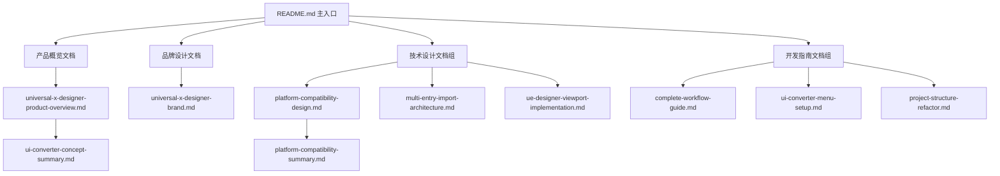

# Universal X Designer - 技术整合指南

> **Experience Everything, Export Everywhere**  
> 从设计概念到完整产品的技术整合方案

---

## 📖 文档概述

本文档详细说明如何将Universal X Designer的品牌理念、产品设计和技术实现进行完整整合，形成统一的产品体系。

---

## 🎯 整合目标

### 品牌与产品一致性
- 确保所有界面文案符合UX设计器的品牌定位
- 统一用户交互流程和体验标准
- 保持视觉设计语言的一致性
- 建立完整的权限和菜单体系

### 技术架构统一性
- 标准化组件命名和代码结构
- 统一错误处理和用户反馈机制
- 优化性能和用户体验
- 建立可扩展的插件化架构

### 文档体系完整性
- 整合所有设计和开发文档
- 建立清晰的文档导航关系
- 保持文档内容的同步更新
- 形成完整的知识体系

---

## 🏗️ 整合架构

### 产品层级结构
```
Universal X Designer (UXD)
├── 品牌体系
│   ├── 品牌定位和文案 → universal-x-designer-brand.md
│   ├── 用户画像和价值主张 → universal-x-designer-product-overview.md
│   └── 概念演进和竞争优势 → ui-converter-concept-summary.md
├── 技术架构  
│   ├── 平台兼容性设计 → platform-compatibility-design.md
│   ├── 多入口导入架构 → multi-entry-import-architecture.md
│   └── 可视化编辑器实现 → ue-designer-viewport-implementation.md
├── 开发实施
│   ├── 开发工作流程 → complete-workflow-guide.md
│   ├── 菜单权限配置 → ui-converter-menu-setup.md
│   └── 项目结构优化 → project-structure-refactor.md
└── 代码实现
    ├── 核心转换引擎 → UniversalConverter.ts
    ├── 插件化导入系统 → importers/
    ├── 多端输出系统 → converters/
    └── 用户界面组件 → UI Components
```

### 文档关联关系


---

## 🎨 界面文案整合

### 当前状态分析
基于品牌设计文档，需要将以下文案整合到界面中：

#### 页面标题体系
```typescript
// 当前界面文案
interface UITexts {
  // 主品牌标题
  mainTitle: "Universal X Designer - UX设计器",
  
  // 导航菜单
  navigation: {
    workspace: "UX工作台",
    demo: "体验演示", 
    templates: "设计模板"
  },
  
  // 功能按钮
  actions: {
    import: "🎨 开始UX设计",
    addContent: "📦 添加体验素材",
    preview: "👁️ 预览体验",
    export: "🚀 生成代码",
    save: "💾 保存体验",
    clear: "🗑️ 清空画板"
  },
  
  // 空状态文案
  emptyStates: {
    main: "开启您的用户体验设计之旅",
    guide: "从导入设计稿开始，或选择模板快速创建"
  }
}
```

#### 功能描述规范
```typescript
interface FeatureDescriptions {
  import: "支持 Figma、Sketch、Adobe XD 等主流设计工具",
  convert: "智能解析设计意图，生成符合UX最佳实践的代码",
  export: "一键输出 Vue、React、Flutter、小程序等多平台代码"
}
```

### 实施步骤

#### 1. 更新主要页面标题
```typescript
// ConverterView.vue
<template>
  <div class="converter-container">
    <ContentWrap title="Universal X Designer - UX设计器">
      <div class="converter-steps">
        <!-- 工作流程 -->
      </div>
    </ContentWrap>
  </div>
</template>
```

#### 2. 更新按钮文案
```typescript
// 导入按钮
<el-button type="primary" @click="showImportDialog">
  🎨 开始UX设计
</el-button>

// 内容导入按钮  
<el-dropdown-item @click="showContentImport">
  📦 添加体验素材
</el-dropdown-item>

// 预览按钮
<el-button @click="previewDesign">
  👁️ 预览体验
</el-button>

// 生成代码按钮
<el-button type="success" @click="generateCode">
  🚀 生成代码
</el-button>
```

#### 3. 更新空状态文案
```typescript
// 空状态组件
<div class="empty-state">
  <h3>开启您的用户体验设计之旅</h3>
  <p>从导入设计稿开始，或选择模板快速创建</p>
</div>
```

---

## 📋 数据库菜单整合

### 菜单配置方案

#### MySQL配置脚本整合
```sql
-- 基于品牌设计的完整菜单配置
-- 删除旧的转换器菜单
DELETE FROM system_menu WHERE name LIKE '%转换器%' OR name LIKE '%UI转换%';

-- 创建UX设计器主菜单
INSERT INTO system_menu (id, name, path, component, type, sort, visible, status, permission, icon) 
VALUES (2701, 'UX设计器', '/ux-designer', '', 1, 27, b'1', 0, '', 'ep:design');

-- 子菜单配置
INSERT INTO system_menu (id, name, path, component, type, sort, visible, status, permission, parent_id, icon)
VALUES 
(2702, 'UX工作台', 'workspace', 'converter/ConverterView', 2, 1, b'1', 0, 'ux:workspace:view', 2701, 'ep:monitor'),
(2703, '体验演示', 'demo', 'converter/demo', 2, 2, b'1', 0, 'ux:demo:view', 2701, 'ep:video-play'),
(2704, '设计模板', 'templates', 'converter/templates', 2, 3, b'1', 0, 'ux:templates:view', 2701, 'ep:files');

-- 功能权限配置
INSERT INTO system_menu (id, name, type, permission, parent_id)
VALUES
(2705, '体验导入', 3, 'ux:experience:import', 2702),
(2706, '多端导出', 3, 'ux:multiplatform:export', 2702),
(2707, '体验素材管理', 3, 'ux:assets:manage', 2702),
(2708, '组件体系', 3, 'ux:components:system', 2702);
```

#### PostgreSQL配置脚本整合
```sql
-- PostgreSQL版本的菜单配置
-- 删除旧配置
DELETE FROM system_menu WHERE name LIKE '%转换器%' OR name LIKE '%UI转换%';

-- 插入新的UX设计器菜单配置
-- (与MySQL配置相同，但使用PostgreSQL语法)
```

### 权限体系映射
```typescript
interface PermissionMapping {
  // 页面访问权限
  'ux:workspace:view': 'UX工作台页面访问',
  'ux:demo:view': '体验演示页面访问', 
  'ux:templates:view': '设计模板页面访问',
  
  // 功能操作权限
  'ux:experience:import': '体验设计导入功能',
  'ux:multiplatform:export': '多平台代码导出功能',
  'ux:assets:manage': '体验素材管理功能',
  'ux:components:system': '组件体系管理功能'
}
```

---

## 🚀 技术实现整合

### 组件命名统一化

#### 当前组件重命名方案
```typescript
// 文件重命名映射
interface ComponentRenaming {
  // 页面组件
  'ConverterView.vue': '保持不变 - 核心工作台',
  'demo.vue': '重命名为 UXDemo.vue',
  'templates.vue': '重命名为 UXTemplates.vue',
  
  // 对话框组件
  'ImportDialog.vue': '重命名为 DesignImportDialog.vue',
  'ContentImportDialog.vue': '重命名为 ExperienceAssetDialog.vue',
  'ExportDialog.vue': '重命名为 MultiplatformExportDialog.vue',
  
  // 工具组件
  'ComponentTreeView.vue': '重命名为 DesignTreeView.vue',
  'PropertyPanel.vue': '重命名为 ExperiencePropertyPanel.vue'
}
```

#### 核心引擎组件
```typescript
// 转换引擎重命名
interface EngineRenaming {
  'UniversalConverter.ts': '保持不变 - 核心引擎名称准确',
  'types.ts': '重命名为 UXDesignerTypes.ts',
  'utils.ts': '重命名为 UXDesignerUtils.ts',
  
  // 导入器
  'FigmaImporter.ts': '保持不变',
  'UMGImporter.ts': '保持不变', 
  'TemplateGenerator.ts': '重命名为 UXTemplateGenerator.ts',
  
  // 转换器
  'VueConverter.ts': '重命名为 VueUXConverter.ts',
  'UMGConverter.ts': '重命名为 UMGUXConverter.ts'
}
```

### API接口整合

#### 接口路径统一
```typescript
// API路径映射
interface APIMapping {
  // 当前路径
  '/api/tunnel/converter': '/api/ux-designer/workspace',
  
  // 新的API结构
  routes: {
    '/api/ux-designer/workspace': '工作台相关API',
    '/api/ux-designer/assets': '体验素材相关API', 
    '/api/ux-designer/templates': '设计模板相关API',
    '/api/ux-designer/export': '多端导出相关API'
  }
}
```

#### 接口响应格式
```typescript
interface UXDesignerAPIResponse<T> {
  code: number;
  message: string;
  data: T;
  timestamp: number;
  experience?: {
    qualityScore: number;
    suggestions: string[];
    platformCompatibility: string[];
  };
}
```

---

## 📊 性能优化整合

### 代码分割策略
```typescript
// 路由懒加载配置
const uxDesignerRoutes = [
  {
    path: '/ux-designer',
    component: () => import('@/layout/index.vue'),
    children: [
      {
        path: 'workspace',
        name: 'UXWorkspace',
        component: () => import('@/views/converter/ConverterView.vue'),
        meta: { title: 'UX工作台', permission: 'ux:workspace:view' }
      },
      {
        path: 'demo', 
        name: 'UXDemo',
        component: () => import('@/views/converter/UXDemo.vue'),
        meta: { title: '体验演示', permission: 'ux:demo:view' }
      },
      {
        path: 'templates',
        name: 'UXTemplates', 
        component: () => import('@/views/converter/UXTemplates.vue'),
        meta: { title: '设计模板', permission: 'ux:templates:view' }
      }
    ]
  }
];
```

### 组件懒加载
```typescript
// 大型组件异步加载
const asyncComponents = {
  DesignImportDialog: () => import('@/components/UXDesigner/DesignImportDialog.vue'),
  ExperienceAssetDialog: () => import('@/components/UXDesigner/ExperienceAssetDialog.vue'),
  MultiplatformExportDialog: () => import('@/components/UXDesigner/MultiplatformExportDialog.vue'),
  DesignTreeView: () => import('@/components/UXDesigner/DesignTreeView.vue')
};
```

### 缓存策略优化
```typescript
// 体验设计缓存
interface ExperienceCache {
  designs: Map<string, DesignNode[]>;
  templates: Map<string, TemplateData>;
  assets: Map<string, AssetData>;
  
  // 缓存策略
  maxSize: 50; // 最大缓存50个设计
  ttl: 30 * 60 * 1000; // 30分钟过期
}
```

---

## 🔄 持续集成整合

### 构建流程优化
```yaml
# .github/workflows/ux-designer-ci.yml
name: UX Designer CI/CD

on:
  push:
    paths:
      - 'tunnel-management-ui/src/components/Converter/**'
      - 'tunnel-management-ui/src/views/converter/**'
      - 'docs/design/**'
      - 'docs/development/**'

jobs:
  build-and-test:
    runs-on: ubuntu-latest
    steps:
      - name: Checkout code
        uses: actions/checkout@v3
        
      - name: Setup Node.js
        uses: actions/setup-node@v3
        with:
          node-version: '18'
          
      - name: Install dependencies
        run: |
          cd tunnel-management-ui
          npm ci
          
      - name: Run UX Designer tests
        run: |
          cd tunnel-management-ui
          npm run test:unit -- --testPathPattern=converter
          
      - name: Build UX Designer
        run: |
          cd tunnel-management-ui  
          npm run build:ux-designer
          
      - name: Deploy documentation
        run: |
          npm run docs:deploy
```

### 质量检查集成
```typescript
// eslint配置更新
module.exports = {
  extends: ['@vue/typescript/recommended'],
  rules: {
    // UX Designer特定规则
    'vue/component-name-in-template-casing': ['error', 'PascalCase'],
    'vue/component-definition-name-casing': ['error', 'PascalCase'],
    '@typescript-eslint/naming-convention': [
      'error',
      {
        selector: 'interface',
        format: ['PascalCase'],
        prefix: ['UX', 'Experience', 'Design']
      }
    ]
  }
};
```

---

## 📈 监控和分析整合

### 用户行为分析
```typescript
// 用户体验数据收集
interface UXAnalytics {
  // 设计工作流程分析
  designWorkflow: {
    importTime: number;
    editTime: number; 
    previewTime: number;
    exportTime: number;
  };
  
  // 功能使用统计
  featureUsage: {
    importFormats: Record<string, number>;
    exportPlatforms: Record<string, number>;
    templateUsage: Record<string, number>;
  };
  
  // 错误和性能监控
  performance: {
    loadTime: number;
    renderTime: number;
    memoryUsage: number;
    errorRate: number;
  };
}
```

### 质量指标监控
```typescript
// 代码质量监控
interface QualityMetrics {
  // 生成代码质量
  generatedCodeQuality: {
    syntaxErrors: number;
    bestPracticeScore: number;
    performanceScore: number;
    maintainabilityIndex: number;
  };
  
  // 用户满意度
  userSatisfaction: {
    nps: number; // Net Promoter Score
    usabilityScore: number;
    featureCompleteness: number;
  };
}
```

---

## 🎯 整合实施计划

### 第一阶段：界面文案整合 (1周)
- [ ] 更新所有页面标题和按钮文案
- [ ] 统一空状态和提示信息文案
- [ ] 更新错误信息和帮助文本
- [ ] 测试文案显示效果和用户体验

### 第二阶段：菜单权限整合 (1周) 
- [ ] 执行数据库菜单配置脚本
- [ ] 更新路由配置和权限检查
- [ ] 测试菜单导航和权限控制
- [ ] 确保与现有权限系统兼容

### 第三阶段：技术架构整合 (2周)
- [ ] 重命名核心组件和文件
- [ ] 更新导入导出路径和API接口
- [ ] 优化组件结构和依赖关系
- [ ] 完善错误处理和用户反馈

### 第四阶段：性能优化整合 (1周)
- [ ] 实施代码分割和懒加载
- [ ] 优化缓存策略和数据管理
- [ ] 添加性能监控和分析
- [ ] 进行性能测试和调优

### 第五阶段：文档整合完善 (1周)
- [ ] 更新所有技术文档
- [ ] 建立文档交叉引用关系
- [ ] 创建用户使用指南
- [ ] 完善开发者文档

---

## 📝 整合检查清单

### 品牌一致性检查
- [ ] 所有界面标题使用"Universal X Designer - UX设计器"
- [ ] 按钮文案符合UX导向表达习惯
- [ ] 功能描述突出体验设计价值
- [ ] 错误信息友好且专业

### 技术规范检查
- [ ] 组件命名遵循UX设计器前缀规范
- [ ] API接口路径统一使用/ux-designer前缀
- [ ] 类型定义包含Experience/UX相关命名
- [ ] 错误处理遵循统一标准

### 功能完整性检查
- [ ] 所有导入格式正常工作
- [ ] 多端输出功能完整
- [ ] 可视化编辑器功能完善
- [ ] 权限控制正确生效

### 性能质量检查
- [ ] 页面加载时间小于3秒
- [ ] 大型设计文件处理流畅
- [ ] 内存使用合理无泄漏
- [ ] 错误率低于1%

### 文档完整性检查
- [ ] 所有文档链接有效
- [ ] 代码示例可正常运行
- [ ] 配置步骤清晰准确
- [ ] 版本信息及时更新

---

## 📞 整合支持

### 技术支持团队
- **技术负责人** - 整体架构整合指导
- **前端开发工程师** - 界面和交互整合实施  
- **后端开发工程师** - API和权限整合配置
- **测试工程师** - 整合质量验证和测试

### 整合过程协调
- **每日同步** - 整合进度和问题沟通
- **阶段评审** - 每个阶段完成后的质量评审
- **用户测试** - 整合完成后的用户验收测试
- **文档同步** - 确保文档与实现保持同步

---

**Universal X Designer - 让用户体验设计师成为真正的产品创造者**

*本文档提供了完整的技术整合方案，确保品牌理念、产品设计和技术实现的统一。*

---

*最后更新时间：2024年12月*  
*文档版本：v1.0* 