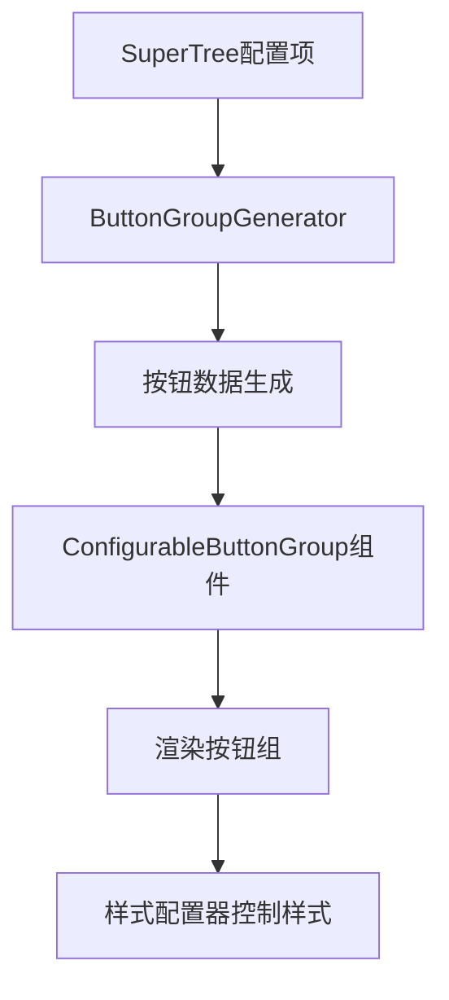

# 从配置项生成按钮组完整指南

## 🎯 **问题解决方案**

### 用户需求
用户希望能够**从SuperTree的配置项（如图中的新增按钮、编辑按钮、删除按钮等）自动生成按钮组**，而不需要手动创建每个按钮。

### 解决思路


## 🛠️ **实现的完整解决方案**

### 1. 按钮组生成器 (`ButtonGroupGenerator`)

**文件**: `tunnel-management-ui/src/components/SuperConfigurator/utils/ButtonGroupGenerator.ts`

**核心功能**:
```typescript
// 从配置项生成按钮组
const buttons = ButtonGroupGenerator.generateFromConfigItems(
  configItems,    // SuperTree的配置项
  'operation'     // 分组键
)

// 生成工具栏按钮
const toolbarButtons = ButtonGroupGenerator.generateToolbarButtons(configData)

// 生成Vue模板代码
const template = ButtonGroupGenerator.generateButtonGroupTemplate(buttons)
```

**自动映射规则**:
```typescript
// 从 'toolbar.buttons.add' 自动生成：
{
  key: 'add',
  label: '新增',
  icon: 'Plus',
  type: 'primary',
  tooltip: '添加新项目'
}
```

### 2. 可配置按钮组组件 (`ConfigurableButtonGroup`)

**文件**: `tunnel-management-ui/src/components/SuperConfigurator/ConfigurableButtonGroup.vue`

**使用方式**:
```vue
<template>
  <ConfigurableButtonGroup
    :config-items="configItems"          <!-- SuperTree配置项 -->
    :config-data="configData"            <!-- 配置数据 -->
    theme="modern"                       <!-- 主题样式 -->
    size="small"                         <!-- 按钮尺寸 -->
    direction="horizontal"               <!-- 布局方向 -->
    :show-labels="true"                  <!-- 显示标签 -->
    :show-config-info="true"             <!-- 显示配置信息 -->
    :show-code-preview="true"            <!-- 显示代码预览 -->
    @button-click="handleButtonClick"    <!-- 按钮点击事件 -->
  />
</template>
```

**支持的主题**:
- **默认主题** (`default`): 标准Element Plus样式
- **现代主题** (`modern`): 圆角、模糊背景效果
- **简约主题** (`minimal`): 透明背景、悬停效果
- **卡片主题** (`card`): 卡片容器、阴影效果

### 3. 演示页面 (`ButtonGroupGeneratorDemo`)

**访问路径**: `/demo/button-group-generator`

**功能特性**:
- 📋 **配置项选择**: 选择要生成的按钮配置项
- 🎨 **样式配置**: 主题、尺寸、方向、标签显示
- 🔘 **实时预览**: 即时查看生成的按钮组效果
- 💻 **代码生成**: 自动生成Vue模板、脚本、样式代码
- 📖 **使用指南**: 详细的集成说明

## 🚀 **具体使用步骤**

### 步骤1: 获取SuperTree配置项

```typescript
import { SuperTreeConfigInterface } from '@/components/SuperTree/SuperTreeConfigInterface'

// 创建配置接口实例
const configInterface = new SuperTreeConfigInterface()

// 获取操作相关的配置项
const operationConfigItems = configInterface.configItems.filter(item => 
  item.group === 'operation' && 
  item.key.includes('toolbar.buttons.')
)

console.log('操作配置项:', operationConfigItems)
// 输出: [
//   { key: 'toolbar.buttons.add', label: '新增按钮', ... },
//   { key: 'toolbar.buttons.edit', label: '编辑按钮', ... },
//   { key: 'toolbar.buttons.delete', label: '删除按钮', ... }
// ]
```

### 步骤2: 准备配置数据

```typescript
// 根据实际需求设置配置数据
const configData = {
  operationMode: 'toolbar',
  'toolbar.enabled': true,
  'toolbar.buttons.add': true,      // ✅ 启用新增按钮
  'toolbar.buttons.edit': true,     // ✅ 启用编辑按钮
  'toolbar.buttons.delete': true,   // ✅ 启用删除按钮
  'toolbar.buttons.copy': false,    // ❌ 禁用复制按钮
  'toolbar.buttons.refresh': true,  // ✅ 启用刷新按钮
  'toolbar.buttons.export': false   // ❌ 禁用导出按钮
}
```

### 步骤3: 使用按钮组生成器

```typescript
import { ButtonGroupGenerator } from '@/utils/ButtonGroupGenerator'

// 方法1: 从配置项生成
const buttons = ButtonGroupGenerator.generateFromConfigItems(
  operationConfigItems,
  'operation'
)

// 方法2: 从配置数据生成
const toolbarButtons = ButtonGroupGenerator.generateToolbarButtons(configData)

console.log('生成的按钮:', buttons)
// 输出: [
//   { key: 'add', label: '新增', icon: 'Plus', type: 'primary' },
//   { key: 'edit', label: '编辑', icon: 'Edit', type: 'warning' },
//   { key: 'delete', label: '删除', icon: 'Delete', type: 'danger' }
// ]
```

### 步骤4: 在Vue组件中使用

```vue
<template>
  <div class="toolbar-container">
    <!-- 方式1: 使用ConfigurableButtonGroup组件 -->
    <ConfigurableButtonGroup
      :config-items="operationConfigItems"
      :config-data="configData"
      theme="modern"
      size="small"
      @button-click="handleButtonClick"
    />
    
    <!-- 方式2: 手动渲染按钮组 -->
    <el-button-group class="custom-button-group">
      <el-button
        v-for="button in generatedButtons"
        :key="button.key"
        :type="button.type"
        :size="size"
        @click="handleAction(button.key)"
      >
        <el-icon><component :is="button.icon" /></el-icon>
        {{ button.label }}
      </el-button>
    </el-button-group>
  </div>
</template>

<script setup>
import { ref, computed } from 'vue'
import { ButtonGroupGenerator } from '@/utils/ButtonGroupGenerator'
import ConfigurableButtonGroup from '@/components/SuperConfigurator/ConfigurableButtonGroup.vue'

// 生成按钮数据
const generatedButtons = computed(() => {
  return ButtonGroupGenerator.generateFromConfigItems(
    operationConfigItems.value,
    'operation'
  ).filter(button => {
    // 根据配置数据过滤按钮
    return configData[`toolbar.buttons.${button.key}`] !== false
  })
})

// 处理按钮点击
const handleButtonClick = (button) => {
  console.log('按钮点击:', button.key)
  handleAction(button.key)
}

const handleAction = (action) => {
  switch (action) {
    case 'add':
      console.log('执行新增操作')
      break
    case 'edit':
      console.log('执行编辑操作')
      break
    case 'delete':
      console.log('执行删除操作')
      break
    default:
      console.log('执行操作:', action)
  }
}
</script>
```

## 🎨 **样式配置器集成**

### 使用ControlStyleConfigurator

```vue
<template>
  <div class="style-config-demo">
    <!-- 样式配置器 -->
    <ControlStyleConfigurator
      v-model="selectedStyles"
      :global-settings="globalSettings"
      @apply-styles="applyStylesToButtonGroup"
    />
    
    <!-- 应用样式的按钮组 -->
    <ConfigurableButtonGroup
      :config-items="configItems"
      :config-data="configData"
      :theme="buttonTheme"
      :size="buttonSize"
      :custom-class="customButtonClass"
    />
  </div>
</template>

<script setup>
// 样式配置
const selectedStyles = ref({
  button: 'button-group',  // 选择按钮组样式
  // 其他控件样式...
})

const globalSettings = ref({
  theme: 'modern',
  primaryColor: '#409eff',
  borderRadius: '6px'
})

// 应用样式到按钮组
const applyStylesToButtonGroup = (styles, settings) => {
  // 根据样式配置器的设置更新按钮组样式
  buttonTheme.value = settings.theme
  buttonSize.value = settings.size || 'small'
  
  // 应用自定义CSS类
  if (styles.button === 'button-group') {
    customButtonClass.value = 'styled-button-group'
  }
}
</script>

<style>
.styled-button-group .el-button {
  border-radius: v-bind('globalSettings.borderRadius');
  /* 其他动态样式 */
}
</style>
```

## 📊 **配置项到按钮的映射规则**

### 自动映射表

| 配置项键 | 按钮键 | 标签 | 图标 | 类型 | 说明 |
|---------|--------|------|------|------|------|
| `toolbar.buttons.add` | `add` | 新增 | `Plus` | `primary` | 添加新项目 |
| `toolbar.buttons.edit` | `edit` | 编辑 | `Edit` | `warning` | 编辑选中项 |
| `toolbar.buttons.delete` | `delete` | 删除 | `Delete` | `danger` | 删除选中项 |
| `toolbar.buttons.copy` | `copy` | 复制 | `DocumentCopy` | `info` | 复制选中项 |
| `toolbar.buttons.refresh` | `refresh` | 刷新 | `Refresh` | `info` | 刷新数据 |
| `toolbar.buttons.export` | `export` | 导出 | `Download` | `success` | 导出数据 |
| `toolbar.buttons.expandAll` | `expandAll` | 展开全部 | `ArrowDown` | `text` | 展开所有节点 |
| `toolbar.buttons.collapseAll` | `collapseAll` | 收起全部 | `ArrowUp` | `text` | 收起所有节点 |

### 自定义映射规则

```typescript
// 扩展ButtonGroupGenerator的映射规则
ButtonGroupGenerator.customMapping = {
  'toolbar.buttons.custom': {
    label: '自定义操作',
    icon: 'Setting',
    type: 'info',
    tooltip: '执行自定义操作'
  }
}
```

## 🔄 **实时配置更新**

### 响应式配置绑定

```vue
<script setup>
// 监听配置变化，实时更新按钮组
watch(() => configData, (newConfig) => {
  // 配置发生变化时，按钮组自动更新
  console.log('配置更新:', newConfig)
}, { deep: true })

// 动态切换操作模式
const switchOperationMode = (mode) => {
  configData.operationMode = mode
  
  if (mode === 'toolbar') {
    // 工具栏模式：显示按钮组
    configData['toolbar.enabled'] = true
  } else if (mode === 'nodeActions') {
    // 节点操作模式：隐藏工具栏，显示节点按钮
    configData['toolbar.enabled'] = false
  }
}
</script>
```

## 🎯 **最佳实践**

### 1. 性能优化
```typescript
// 使用computed缓存生成的按钮
const memoizedButtons = computed(() => {
  return ButtonGroupGenerator.generateFromConfigItems(configItems.value, 'operation')
})
```

### 2. 主题一致性
```vue
<!-- 确保按钮组主题与全局主题一致 -->
<ConfigurableButtonGroup :theme="$store.state.theme" />
```

### 3. 事件处理
```typescript
// 统一的事件处理器
const handleToolbarAction = (action, data) => {
  emit('toolbar-action', action, data)
  
  // 记录用户操作
  analytics.track('toolbar_action', { action, timestamp: Date.now() })
}
```

### 4. 权限控制
```typescript
// 根据用户权限过滤按钮
const authorizedButtons = computed(() => {
  return generatedButtons.value.filter(button => {
    return hasPermission(button.permission || `toolbar.${button.key}`)
  })
})
```

## 🧪 **测试和验证**

### 测试访问路径
- **演示页面**: `/demo/button-group-generator`
- **ComponentReflector测试**: `/demo/component-reflector-test`

### 验证清单
- ✅ 配置项正确读取（来自SuperTreeConfigInterface）
- ✅ 按钮组正确生成（根据配置数据）
- ✅ 样式主题正确应用
- ✅ 事件处理正常工作
- ✅ 代码生成功能完整
- ✅ 响应式更新正常

---

**实现版本**: v1.0.0  
**文档更新**: 2024-01-XX  
**相关组件**: SuperTreeConfigInterface, ButtonGroupGenerator, ConfigurableButtonGroup  
**演示地址**: `/demo/button-group-generator`