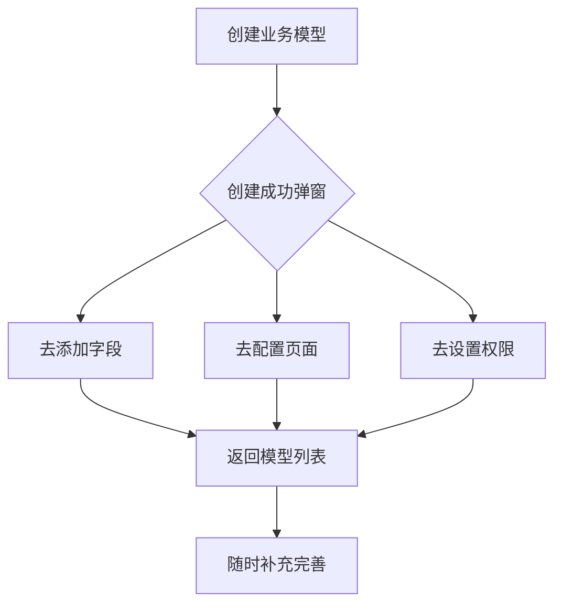

# 业务模型管理 - 架构设计

## 设计决策记录

### 类型选择讨论

在实现业务模型删除控制时，系统中存在两种类型实现：

#### 1. modelType（模型类型）
- **SYSTEM(0, "系统")** - 系统内置的模型
- **CUSTOM(1, "自定义")** - 用户自定义的模型

#### 2. readonly（只读字段）
- **false(0)** - 可编辑，可以删除
- **true(1)** - 只读，不能删除

### 方案对比分析

| 方案 | 优点 | 缺点 |
|------|------|------|
| **使用 modelType** | • 语义清晰，系统类型 vs 自定义类型<br>• 符合业务逻辑，系统模型不应该被删除<br>• 代码中已有相关逻辑 | • 不够灵活，系统类型就一定不能删除<br>• 无法处理"系统模型但允许删除"的特殊情况 |
| **使用 readonly** | • 更灵活，可以独立控制每个模型的删除权限<br>• 语义明确，专门用于控制删除权限<br>• 可以处理各种复杂场景 | • 需要额外的字段<br>• 增加了数据复杂度 |

### 最终决策：统一使用 readonly 字段

**决策理由：**

1. **语义更清晰**
   - `modelType` 表示模型的来源（系统 vs 自定义）
   - `readonly` 专门表示是否可删除
   - 两个概念独立，更符合单一职责原则

2. **更灵活**
   - 系统模型可以设置为可删除（特殊情况）
   - 自定义模型可以设置为只读（保护重要模型）
   - 支持更复杂的业务场景

3. **扩展性更好**
   - 未来可以基于 `readonly` 扩展更多权限控制
   - 比如：只读模型不能编辑、不能导出等

4. **数据迁移简单**
   - 系统模型自动设置为只读
   - 自定义模型默认可编辑
   - 保持向后兼容

### 关于 modelType 字段的保留决策

经过进一步讨论，决定保留 `modelType` 字段，原因如下：

1. **业务语义清晰**
   - 系统模型：内置的、预定义的模型
   - 自定义模型：用户创建的模型
   - 这个区分在业务上有重要意义

2. **功能扩展性**
   - 系统模型可能有特殊处理逻辑
   - 比如：系统模型可能有默认配置、特殊权限等
   - 未来可能需要基于模型类型做不同的业务处理

3. **数据统计和分析**
   - 可以统计系统模型 vs 自定义模型的数量
   - 分析用户使用习惯
   - 系统管理需要

4. **UI展示需求**
   - 前端需要区分显示系统模型和自定义模型
   - 不同的图标、颜色、分组等

**字段职责最终分工：**
- **modelType**：表示模型来源（0:系统，1:自定义）
- **status**：控制启用/禁用（0:禁用，1:启用）
- **readonly**：控制是否可删除（0:可编辑，1:只读）

## 系统架构

### 整体架构

```
┌─────────────────┐    ┌─────────────────┐    ┌─────────────────┐
│   前端界面       │    │   后端API       │    │   数据库        │
│                 │    │                 │    │                 │
│ • Vue 3         │◄──►│ • Spring Boot   │◄──►│ • MySQL         │
│ • Element Plus  │    │ • MyBatis Plus  │    │ • 动态表结构    │
│ • vuedraggable  │    │ • 权限控制      │    │                 │
└─────────────────┘    └─────────────────┘    └─────────────────┘
```

### 模块结构

```
cheers-module-dynamic-business/
├── controller/admin/model/          # 控制器层
│   ├── DynamicModelController.java  # 业务模型控制器
│   └── vo/                         # 视图对象
├── service/model/                   # 服务层
│   ├── BusinessModelService.java    # 业务模型服务接口
│   └── impl/                       # 服务实现
├── dal/                            # 数据访问层
│   ├── dataobject/model/           # 数据对象
│   └── mysql/model/                # MyBatis映射器
└── enums/                          # 枚举定义
```

### 前端结构

```
tunnel-management-ui/src/views/dynamic/model/
├── index.vue                       # 主页面
├── components/                     # 组件
└── api/                           # API调用
```

## 数据流

### 创建流程

1. 前端表单提交 → 后端API
2. 后端验证数据 → 生成默认值
3. 保存到数据库 → 创建动态表
4. 返回结果 → 前端刷新列表

### 删除流程

1. 前端确认删除 → 后端API
2. 后端检查权限 → 验证只读状态
3. 删除数据库表 → 删除模型记录
4. 返回结果 → 前端刷新列表

## 权限控制

### 权限矩阵

| 操作 | 系统模型 | 自定义模型 | 只读模型 |
|------|----------|------------|----------|
| 查看 | ✅ | ✅ | ✅ |
| 创建 | ❌ | ✅ | ❌ |
| 编辑 | ✅ | ✅ | ❌ |
| 删除 | ❌ | ✅ | ❌ |

### 权限检查逻辑

```java
// 删除权限检查
if (Boolean.TRUE.equals(model.getReadonly())) {
    throw new ServiceException(ErrorCodeConstants.BUSINESS_MODEL_READONLY_CANNOT_DELETE);
}

// 模型类型修改时的自动处理
if (model.getModelType() != null && !Objects.equals(oldModel.getModelType(), model.getModelType())) {
    // 如果从自定义改为系统类型，自动设置为只读
    if (model.getModelType() == 0 && oldModel.getModelType() == 1) {
        model.setReadonly(true);
    }
    // 如果从系统改为自定义类型，保持只读状态不变（由用户手动控制）
}
```

## 扩展性设计

### 未来扩展点

1. **权限级别扩展**
   - 基于 readonly 字段扩展更多权限控制
   - 如：编辑权限、导出权限等

2. **模型类型扩展**
   - 基于 modelType 扩展更多模型类型
   - 如：模板模型、共享模型等

3. **状态扩展**
   - 基于 status 扩展更多状态
   - 如：草稿、发布、归档等

### 配置化设计

- 模型类型可配置
- 权限规则可配置
- 状态流转可配置 

## 用户引导与步骤指引设计

### 设计背景

在实际业务系统中，用户往往无法一次性考虑周全所有业务配置。为提升易用性和减少配置遗漏，系统应在新建业务模型时就通过步骤指引，让用户提前了解完整的业务配置流程，并允许用户逐步完善。

### 步骤指引方案

1. **新建弹窗顶部增加步骤指引**
   - 在新建业务模型弹窗顶部，增加步骤进度条或步骤说明区域。
   - 让用户一眼看到：新建模型只是第一步，后续还需完善字段、页面、权限等配置。

   示例：
   ```vue
   <el-steps :active="1" finish-status="success" align-center>
     <el-step title="新建模型" description="填写基础信息" />
     <el-step title="添加字段" description="定义数据结构" />
     <el-step title="配置页面" description="生成管理界面" />
     <el-step title="设置权限" description="分配访问控制" />
   </el-steps>
   ```
   或更简洁的说明：
   ```html
   <div class="step-guide">
     <b>业务配置流程：</b>
     1. 新建模型 → 2. 添加字段 → 3. 配置页面 → 4. 设置权限
     <span class="tip">（每一步都可后续补充完善）</span>
   </div>
   ```

2. **每一步都可跳过，支持后续补充**
   - 步骤指引只做引导，不做强制校验，用户可只完成当前步骤，后续随时补充。
   - 可在每一步下方加提示：“此步骤可后续在模型管理中继续完善。”

3. **新建完成后再次提示下一步**
   - 新建成功后，弹窗或通知再次提示“建议立即添加字段、配置页面、设置权限”，并提供快捷入口。

4. **分步操作入口与进度提示**
   - 在模型卡片或弹窗中，直接提供“去添加字段”“去配置页面”“去设置权限”等快捷按钮。
   - 对未完成的步骤进行高亮或进度标识（如“未配置字段”“未生成页面”），提醒用户后续完善。

### 用户体验价值

- **全局认知**：让用户一开始就知道完整业务配置流程。
- **降低焦虑**：用户不用担心遗漏，知道后续可随时补充。
- **提升效率**：有明确指引，减少反复沟通和返工。

### 交互流程示意



### 总结

- 在新建业务模型弹窗顶部加入步骤指引，是提升业务系统易用性和专业度的最佳实践。
- 分步引导让用户清楚每一步该做什么，降低出错率。
- 允许逐步完善，提升灵活性和体验。
- 进度提示和快捷入口让用户随时掌握业务配置状态，方便后续维护和扩展。 

---

## 通用树系统与无代码动态建表设计（2024-07-03 更新）

### 1. 通用树系统设计
- 采用 `system_tree_data_rel` 表为核心的通用树系统，支持任意类型数据的树形关联。
- 通过 `system_tree_config` 和 `system_data_type_meta` 表实现完全动态的树形结构管理。
- 业务模型（model）通过通用树系统归属到任意树节点，支持多层级嵌套。

#### 表结构示例
```sql
-- 通用树数据关联表
CREATE TABLE system_tree_data_rel (
  id BIGINT PRIMARY KEY,
  tree_type VARCHAR(50),      -- 树类型：field_category/hierarchy_group等
  tree_node_id BIGINT,        -- 树节点ID
  data_type VARCHAR(50),      -- 数据类型：field_def/device/region等
  data_id BIGINT,             -- 数据ID
  data_name VARCHAR(255),     -- 数据名称
  metadata JSON               -- 扩展元数据
);

-- 树结构配置表
CREATE TABLE system_tree_config (
  id BIGINT PRIMARY KEY,
  tree_type VARCHAR(50),      -- 树类型编码
  tree_name VARCHAR(100),     -- 树类型名称
  allowed_data_types JSON,    -- 允许的数据类型列表
  max_level INT               -- 最大层级
);

-- 数据类型元数据表
CREATE TABLE system_data_type_meta (
  id BIGINT PRIMARY KEY,
  data_type VARCHAR(50),      -- 数据类型编码
  data_name VARCHAR(100),     -- 数据类型名称
  table_name VARCHAR(100),    -- 对应的数据表名
  id_field VARCHAR(50),       -- ID字段名
  name_field VARCHAR(50)      -- 名称字段名
);
```

### 2. 无代码动态建表方案
- 用户在前端配置业务模型和字段，后端根据配置动态生成/变更物理表（CREATE/ALTER TABLE）。
- 字段定义、分组、继承、权限等全部元数据驱动。
- 表名建议统一用 `dynamic_业务模型code` 或 `biz_业务模型id`，避免冲突。

### 3. 目录结构与命名规范
- 通用树管理页面放在 `views/system/universal-tree/` 下。
- 动态业务模型管理页面继续放在 `views/dynamic/model/` 下。
- 命名统一用 `universal_tree`（通用树系统）、`business_model`（业务模型/表单）。

### 4. 前端实现建议
- 使用 `UniversalTreeView.vue` 组件实现统一的树形管理界面。
- model 页面新增/编辑时可选择归属的树节点。
- 支持拖拽操作，实现数据在不同树节点间的移动。

### 5. 典型业务场景
- 字段分类树（tree_type: field_category）
  - 基础信息（tree_node）
    - 设备名称字段（field_def）
    - 设备编号字段（field_def）
  - 位置信息（tree_node）
    - 所在区域字段（field_def）

### 6. 设计原则总结
- 通用树系统完全动态化，支持任意类型数据的树形关联。
- 动态建表、字段变更、数据管理全部元数据驱动，适合无代码平台。
- 统一的API接口和前端组件，便于维护和扩展。

### 7. 迁移与演进建议
- 现有业务分组功能迁移到通用树系统。
- 使用 `system_tree_data_rel` 表替代原有的专用树表。
- 通过配置实现不同类型树的统一管理。

---

本节内容为 2024-07-03 业务模型管理通用树系统与无代码动态建表设计讨论记录，已更新为最新的通用树系统架构。 