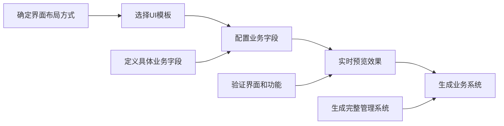
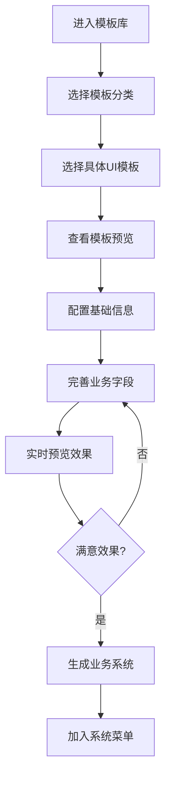

# 模板库架构重新设计：UI模板与业务配置分离

## 📋 概念重新梳理

### 问题背景

在模板库初期设计中，存在概念混淆的问题：
- ❌ **错误理解**：将"设备管理"、"文档管理"等称为"业务模板"
- ❌ **概念混淆**：模板与业务场景混合，导致通用性不足
- ❌ **局限性强**：每个"业务模板"只能用于特定业务场景

### 正确的概念定义

经过重新梳理，明确了以下概念：

#### 🎯 模板 = UI布局 + 数据结构（纯技术层面）
- **UI布局**：界面的展示方式和交互模式
- **数据结构**：支持该布局的基础字段结构
- **技术特性**：布局所支持的功能特性

#### 🎯 业务应用 = 选择模板 + 配置业务数据（业务层面）  
- **选择模板**：根据需要的界面效果选择UI模板
- **配置业务数据**：在模板基础上定义具体的业务字段
- **生成系统**：基于配置生成完整的业务管理系统

### 正确的开发流程



## 🏗️ 重新设计的模板体系

### 📊 驾驶舱模板类（2个模板）

#### 1. KPI驾驶舱
- **UI布局**：指标卡片 + 图表展示的经典驾驶舱布局
- **数据结构**：支持指标数据、图表数据
- **技术特性**：['指标卡片', '图表展示', '数据概览', '实时刷新']
- **业务示例**：['销售驾驶舱', '运营驾驶舱', '财务驾驶舱']

#### 2. 图表驾驶舱  
- **UI布局**：多图表组合展示的数据分析布局
- **数据结构**：支持多维度图表数据
- **技术特性**：['多图表', '数据分析', '趋势展示', '交互式']
- **业务示例**：['数据分析中心', '业务分析', '市场分析']

### 📋 数据管理模板类（6个模板）

#### 1. 标准数据视图（StandardDataView核心）
- **UI布局**：树分类 + 列表展示的经典数据管理布局，支持分级管理
- **数据结构**：基础字段 + 上级分类字段
- **技术特性**：['树形分类', '列表展示', '搜索过滤', 'CRUD操作']
- **业务示例**：['设备管理', '部门管理', '产品分类管理']
- **字段初始化**：
  ```typescript
  - name: 名称 (必填、列表显示、可搜索)
  - parentId: 上级分类 (选填、不显示、不可搜索)  
  - status: 状态 (必填、列表显示、可搜索)
  - createTime: 创建时间 (自动、列表显示、不可编辑)
  ```

#### 2. 分类列表视图
- **UI布局**：左侧分类选择 + 右侧列表内容的布局，适合扁平分类
- **数据结构**：基础字段 + 分类字段
- **技术特性**：['分类筛选', '列表展示', '快速切换', 'CRUD操作']
- **业务示例**：['文档管理', '商品管理', '知识库管理']
- **字段初始化**：
  ```typescript
  - name: 名称 (必填、列表显示、可搜索)
  - category: 分类 (必填、列表显示、可搜索、下拉选择)
  - status: 状态 (必填、列表显示、可搜索)
  - createTime: 创建时间 (自动、列表显示、不可编辑)
  ```

#### 3. 纯列表视图
- **UI布局**：单纯的列表展示布局，操作简洁高效
- **数据结构**：基础字段
- **技术特性**：['列表展示', '搜索过滤', '批量操作', 'CRUD操作']
- **业务示例**：['用户管理', '订单管理', '日志管理']
- **字段初始化**：
  ```typescript
  - name: 名称 (必填、列表显示、可搜索)
  - status: 状态 (必填、列表显示、可搜索)
  - createTime: 创建时间 (自动、列表显示、不可编辑)
  ```

#### 4. 卡片网格视图
- **UI布局**：卡片式展示布局，适合图文并茂的内容
- **数据结构**：基础字段 + 图片字段 + 描述字段
- **技术特性**：['卡片展示', '网格布局', '图片预览', 'CRUD操作']
- **业务示例**：['产品展示', '员工展示', '项目展示']
- **字段初始化**：
  ```typescript
  - name: 名称 (必填、列表显示、可搜索)
  - image: 图片 (选填、不显示、不可搜索、图片类型)
  - description: 描述 (选填、列表显示、可搜索、文本域)
  - status: 状态 (必填、列表显示、可搜索)
  - createTime: 创建时间 (自动、列表显示、不可编辑)
  ```

#### 5. 看板视图
- **UI布局**：拖拽式看板布局，适合状态流转管理
- **数据结构**：基础字段 + 状态流转字段
- **技术特性**：['看板列', '拖拽排序', '状态流转', '实时更新']
- **业务示例**：['任务管理', '项目进度', '工单处理']
- **字段初始化**：
  ```typescript
  - name: 名称 (必填、列表显示、可搜索)
  - status: 状态 (必填、列表显示、可搜索、下拉选择：待处理/进行中/已完成)
  - createTime: 创建时间 (自动、列表显示、不可编辑)
  ```

#### 6. 主从视图
- **UI布局**：上下或左右分割的主从关系布局
- **数据结构**：基础字段 + 关联字段
- **技术特性**：['主从关联', '详情面板', '同步联动', 'CRUD操作']
- **业务示例**：['订单-商品', '客户-联系人', '项目-任务']
- **字段初始化**：
  ```typescript
  - name: 名称 (必填、列表显示、可搜索)
  - masterId: 关联主记录 (必填、列表显示、可搜索、下拉选择)
  - status: 状态 (必填、列表显示、可搜索)
  - createTime: 创建时间 (自动、列表显示、不可编辑)
  ```

### 📺 监控中心模板类（2个模板）

#### 1. 实时监控视图
- **UI布局**：实时数据展示 + 状态监控的布局
- **数据结构**：支持实时数据、状态数据
- **技术特性**：['实时数据', '状态监控', '告警提示', '自动刷新']
- **业务示例**：['设备监控', '系统监控', '网络监控']

#### 2. 告警中心视图
- **UI布局**：告警列表 + 处理状态的监控布局
- **数据结构**：支持告警数据、处理流程数据
- **技术特性**：['告警列表', '处理流程', '状态跟踪', '优先级']
- **业务示例**：['告警处理', '事件管理', '故障处理']

## 🔧 技术实现架构

### 模板数据结构

```typescript
interface UITemplate {
  id: string                    // 模板唯一标识
  name: string                  // 模板名称  
  description: string           // 模板描述
  icon: string                  // 模板图标
  layoutType: string            // 布局类型
  features: string[]            // 技术特性
  sampleBusinessTypes: string[] // 业务示例
  component: Component          // Vue组件
}
```

### 智能字段初始化系统

```typescript
function initBusinessFieldsByLayoutType(layoutType: string) {
  const baseFields = [
    { key: 'name', label: '名称', type: FieldType.TEXT, required: true }
  ]
  
  switch (layoutType) {
    case 'tree-list':
      baseFields.push({
        key: 'parentId', 
        label: '上级分类', 
        type: FieldType.SELECT
      })
      break
    case 'category-list':
      baseFields.push({
        key: 'category',
        label: '分类',
        type: FieldType.SELECT,
        options: [
          { value: 'category1', label: '分类一' },
          { value: 'category2', label: '分类二' }
        ]
      })
      break
    // ... 其他布局类型
  }
  
  return baseFields
}
```

### 动态预览配置生成

```typescript
const previewConfig = computed(() => {
  if (!currentTemplate.value || !currentFields.value.length) return null

  const mockData = generateMockDataByLayoutType(
    currentTemplate.value.layoutType, 
    currentFields.value
  )
  
  return {
    viewMode: currentTemplate.value.layoutType,
    dataSource: { type: 'static', data: mockData },
    components: {
      toolbar: { /* 工具栏配置 */ },
      list: { /* 列表配置 */ }
    },
    layout: {
      type: currentTemplate.value.layoutType,
      split: calculateLayoutSplit(currentTemplate.value.layoutType)
    }
  }
})
```

## 🎯 用户操作流程

### 完整的使用流程



### 操作步骤详解

1. **选择模板分类**
   - 数据管理模板类（6个UI布局）
   - 驾驶舱模板类（2个UI布局）
   - 监控中心模板类（2个UI布局）

2. **选择具体UI模板**
   - 查看模板的UI布局说明
   - 了解模板的技术特性
   - 参考业务应用示例

3. **配置基础信息**
   - 系统名称：如"我的设备管理系统"
   - 数据表名：自动生成，可修改

4. **完善业务字段**
   - 基于模板自动初始化的字段
   - 添加业务特色的自定义字段
   - 配置字段属性和验证规则

5. **实时预览效果**
   - 查看完整的管理界面
   - 测试CRUD操作功能
   - 验证数据展示效果

6. **生成业务系统**
   - 一键生成完整管理系统
   - 自动加入系统菜单
   - 立即可用的业务功能

## 📊 效果对比分析

### 设计理念对比

| 对比维度 | 错误理解 | 正确理解 | 效果提升 |
|---------|----------|----------|----------|
| **概念清晰度** | 业务模板混淆 | **UI模板+业务配置** | **概念清晰** |
| **通用性** | 局限于预设业务 | **适用任何业务场景** | **通用性强** |
| **灵活性** | 固定业务字段 | **完全自定义业务字段** | **灵活性高** |
| **学习成本** | 需要理解业务概念 | **只需理解UI布局** | **学习简单** |
| **模板数量** | 3个业务模板 | **10个UI布局模板** | **覆盖全面** |

### 用户体验提升

| 功能模块 | 提升前 | 提升后 | 改进幅度 |
|---------|--------|--------|----------|
| **模板理解** | 需要匹配业务场景 | **直观的UI布局选择** | **简化50%** |
| **字段配置** | 手动定义所有字段 | **智能初始化+自定义** | **效率提升200%** |
| **适用范围** | 限定业务类型 | **任意业务场景** | **扩展300%** |
| **预览效果** | 静态配置展示 | **真实交互预览** | **直观度提升100%** |

## 🚀 技术优势

### 1. 架构优势
- **职责分离**：UI模板负责界面，业务配置负责数据
- **高度复用**：一个UI模板适用多种业务场景
- **易于扩展**：新增UI模板不影响现有业务

### 2. 开发优势
- **降低复杂度**：开发者只需关注UI布局实现
- **提高效率**：基于成熟组件快速构建新模板
- **统一标准**：所有模板基于StandardDataView组件

### 3. 用户优势
- **理解简单**：先选界面，再配数据
- **操作直观**：所见即所得的预览效果
- **配置灵活**：完全自定义业务字段

## 📋 实施计划

### 第一阶段：核心模板完善（已完成）
- ✅ 重新设计模板分类体系
- ✅ 实现智能字段初始化
- ✅ 完善动态预览功能
- ✅ 优化用户操作流程

### 第二阶段：功能增强
- 🔄 实现后端API生成
- 🔄 完善菜单自动创建
- 🔄 添加模板导入导出
- 🔄 支持自定义UI模板

### 第三阶段：生态完善
- 📋 建立模板市场
- 📋 支持模板分享
- 📋 提供模板开发工具
- 📋 建立模板评价体系

## 💡 最佳实践

### 模板选择建议

1. **数据有层级关系** → 选择"标准数据视图"
2. **数据有明确分类** → 选择"分类列表视图"  
3. **数据结构简单** → 选择"纯列表视图"
4. **需要图片展示** → 选择"卡片网格视图"
5. **有状态流转** → 选择"看板视图"
6. **有主从关系** → 选择"主从视图"

### 字段配置建议

1. **保留自动初始化字段**：充分利用模板的专业配置
2. **合理添加业务字段**：根据实际需求适度扩展
3. **注意字段属性设置**：必填、显示、搜索等属性影响用户体验
4. **善用字段类型**：选择合适的字段类型提升操作效率

### 命名规范建议

1. **系统名称**：体现业务特色，如"智能设备管理系统"
2. **字段名称**：使用业务术语，如"设备编号"、"设备状态"
3. **选项配置**：使用具体的业务值，如"在线/离线/维护中"

## 📖 总结

通过重新梳理模板库的概念，我们实现了：

1. **概念清晰化**：明确区分UI模板与业务配置
2. **架构合理化**：UI布局与业务数据完全分离
3. **功能通用化**：一套UI模板适用多种业务场景
4. **操作简单化**：先选界面，再配数据的直观流程

这次重新设计不仅解决了概念混淆问题，更重要的是建立了一套可扩展、可复用的模板体系，为零代码平台的持续发展奠定了坚实基础。

**核心价值**：让用户专注于"我要什么样的界面"和"我要管理什么数据"这两个核心问题，而不必关心复杂的技术实现细节。 