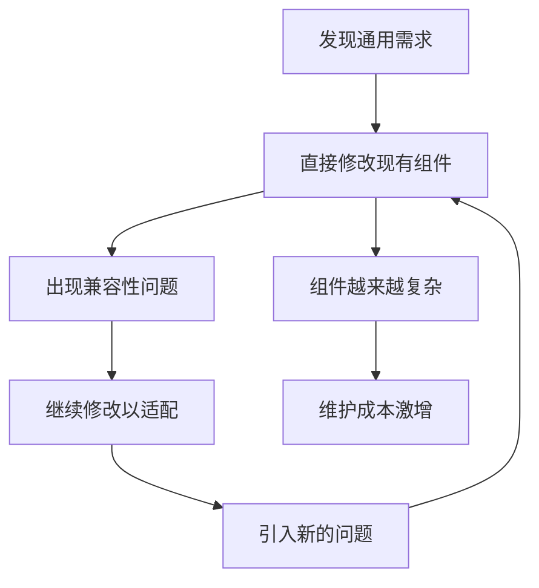
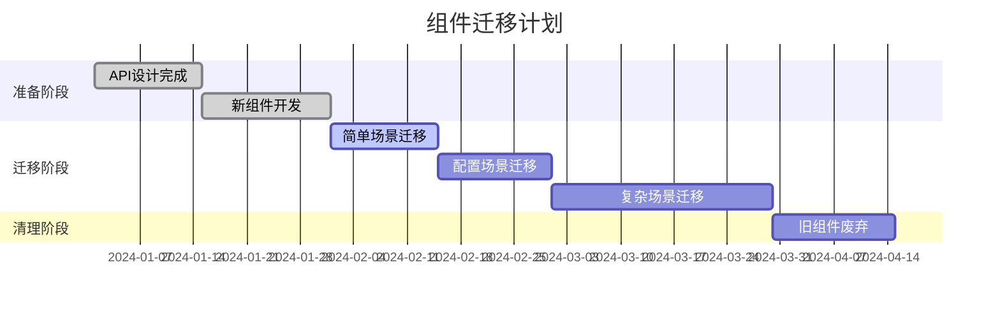

# 通用组件替换策略 - 避免"改了又改"的恶性循环

## 🎯 **问题分析**

### **当前困境**


### **根本原因**
1. **设计不充分**：缺乏全局视角的API设计
2. **接口不稳定**：频繁变更导致使用方疲于应对
3. **兼容性包袱**：为了兼容旧版本而妥协设计
4. **测试覆盖不足**：问题发现滞后

## 🚀 **解决方案：渐进式通用化策略**

### **阶段一：全面调研（Research Phase）**

#### **1. 使用场景分析**

基于代码搜索，发现以下树形组件使用模式：

| 使用场景 | 组件名称 | 数据特点 | 操作需求 | 复杂度 |
|---------|---------|----------|----------|--------|
| 字段管理 | ExtendTree | 层级数据 | CRUD + 拖拽 | 高 |
| 分类管理 | CategoryTree | 简单层级 | 基础选择 | 中 |
| 部门管理 | DeptTree | 组织架构 | 只读选择 | 低 |
| 菜单管理 | el-tree | 菜单结构 | 权限配置 | 中 |
| 页面设计 | ComponentTreeView | 组件层级 | 拖拽编辑 | 高 |

#### **2. API需求矩阵**

```typescript
// 需求频率分析
interface TreeRequirements {
  // 高频需求 (80%使用)
  basicDisplay: true      // 基础展示
  selection: true         // 选择功能
  search: true           // 搜索功能
  
  // 中频需求 (50%使用)
  crud: boolean          // 增删改查
  drag: boolean          // 拖拽排序
  expand: boolean        // 展开控制
  
  // 低频需求 (20%使用)
  checkbox: boolean      // 多选
  contextMenu: boolean   // 右键菜单
  virtualScroll: boolean // 虚拟滚动
}
```

### **阶段二：API设计（Design Phase）**

#### **1. 稳定API设计原则**

```typescript
// 🎯 核心设计原则
interface StableAPIDesign {
  // 1. 最小API原则
  required: string[]     // 只暴露必需的props
  
  // 2. 扩展性原则  
  extensible: object     // 通过config对象扩展
  
  // 3. 向后兼容原则
  deprecated: string[]   // 标记废弃，但保持兼容
  
  // 4. 渐进增强原则
  progressive: boolean   // 功能可选性加载
}
```

#### **2. 新ExtendTree设计**

```typescript
// 🔥 新版本API设计
interface ExtendTreeV2Props {
  // 核心API（稳定，不会变）
  data: TreeNode[] | Ref<TreeNode[]>  // 支持响应式
  
  // 配置API（通过对象扩展）
  config?: {
    // 显示配置
    display?: DisplayConfig
    // 交互配置  
    interaction?: InteractionConfig
    // 数据配置
    data?: DataConfig
    // 样式配置
    style?: StyleConfig
  }
  
  // 插件API（按需加载）
  plugins?: TreePlugin[]
}

// 配置对象设计
interface DisplayConfig {
  showSearch?: boolean
  showActions?: boolean
  showCheckbox?: boolean
  nodeTemplate?: ComponentOrFunction
}

interface InteractionConfig {
  selectable?: boolean
  draggable?: boolean
  editable?: boolean
  checkable?: boolean
}
```

### **阶段三：渐进式迁移（Migration Phase）**

#### **1. 三级迁移策略**

```typescript
// 🎭 兼容性适配器模式
class TreeCompatibilityAdapter {
  // Level 1: 直接替换（无业务逻辑）
  replaceSimpleUsage() {
    // DeptTree, CategoryTree等简单场景
    return new ExtendTreeV2({
      data: this.data,
      config: { display: { showSearch: true } }
    })
  }
  
  // Level 2: 配置迁移（有配置需求）
  migrateConfiguredUsage() {
    // 菜单管理等有配置的场景
    return new ExtendTreeV2({
      data: this.data,
      config: this.mapOldConfigToNew(this.oldConfig)
    })
  }
  
  // Level 3: 功能重构（复杂业务逻辑）
  refactorComplexUsage() {
    // ExtendTree等复杂场景
    // 需要重新设计业务逻辑
  }
}
```

#### **2. 迁移时间表**



### **阶段四：测试验证（Validation Phase）**

#### **1. 测试覆盖策略**

```typescript
// 🧪 测试金字塔
interface TestStrategy {
  // 单元测试（60%）
  unitTests: {
    apiStability: true      // API稳定性测试
    propsValidation: true   // 属性验证测试
    eventHandling: true     // 事件处理测试
  }
  
  // 集成测试（30%）
  integrationTests: {
    dataBinding: true       // 数据绑定测试
    componentInteraction: true // 组件交互测试
    performanceTest: true   // 性能测试
  }
  
  // E2E测试（10%）
  e2eTests: {
    userScenarios: true     // 用户场景测试
    browserCompatibility: true // 浏览器兼容性测试
  }
}
```

## 🛠 **具体实施方案**

### **第一步：创建兼容层**

```typescript
// 创建平滑过渡的兼容组件
// ExtendTreeLegacy.vue - 保持原有API
// ExtendTreeV2.vue - 新API设计
// ExtendTreeAdapter.vue - 自动适配器

<script setup lang="ts">
// 自动检测并选择合适的实现
const TreeComponent = computed(() => {
  if (isLegacyUsage(props)) {
    return ExtendTreeLegacy
  } else {
    return ExtendTreeV2
  }
})
</script>

<template>
  <component :is="TreeComponent" v-bind="adaptedProps" />
</template>
```

### **第二步：逐步替换**

```typescript
// 替换优先级策略
const migrationPriority = [
  // 1. 零风险替换（只读展示）
  { component: 'DeptTree', risk: 'low', effort: 'low' },
  
  // 2. 低风险替换（简单交互）
  { component: 'CategoryTree', risk: 'low', effort: 'medium' },
  
  // 3. 中风险替换（复杂配置）
  { component: 'MenuTree', risk: 'medium', effort: 'medium' },
  
  // 4. 高风险替换（复杂业务）
  { component: 'ExtendTree', risk: 'high', effort: 'high' }
]
```

### **第三步：监控和回滚**

```typescript
// 监控和回滚机制
interface MigrationMonitor {
  // 性能监控
  performance: {
    renderTime: number
    memoryUsage: number
    errorRate: number
  }
  
  // 用户体验监控
  userExperience: {
    crashRate: number
    feedbackScore: number
    usagePattern: object
  }
  
  // 自动回滚触发器
  rollbackTriggers: {
    errorRateThreshold: 5      // 错误率超过5%
    performanceDegradation: 50 // 性能下降超过50%
    userComplaints: 10         // 用户投诉超过10个
  }
}
```

## 📊 **成功指标**

### **技术指标**
- ✅ API稳定性：3个月内无破坏性变更
- ✅ 测试覆盖率：单元测试>80%，集成测试>60%
- ✅ 性能提升：渲染性能提升30%+
- ✅ 包大小：Tree包大小减少20%+

### **业务指标**
- ✅ 开发效率：新功能开发时间减少40%+
- ✅ Bug数量：Tree相关Bug减少60%+
- ✅ 维护成本：维护时间减少50%+
- ✅ 用户满意度：用户体验评分>8.5/10

## 🎯 **关键成功因素**

1. **充分调研**：深入理解所有使用场景
2. **稳定设计**：API设计考虑长期演进
3. **渐进迁移**：分阶段降低风险
4. **完整测试**：确保质量和稳定性
5. **持续监控**：及时发现和解决问题

## 📋 **行动清单**

### **近期（1-2周）**
- [ ] 完成使用场景调研
- [ ] 设计新版ExtendTree API
- [ ] 创建技术设计文档
- [ ] 搭建测试框架

### **中期（1-2月）**
- [ ] 开发ExtendTreeV2
- [ ] 创建兼容适配器
- [ ] 迁移简单使用场景
- [ ] 建立监控体系

### **长期（2-3月）**
- [ ] 迁移复杂使用场景
- [ ] 废弃旧版本组件
- [ ] 优化性能和体验
- [ ] 总结最佳实践

通过这种系统性的方法，我们可以避免"改了又改"的恶性循环，实现稳定、高效的组件通用化升级！ 🚀 