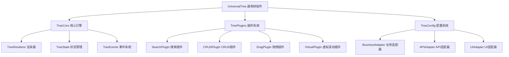

# 通用树组件完整设计方案

## 🎯 **需求分析**

### **核心功能需求**
1. **内置搜索功能**：搜索框 + 滚动条 + 图标 + 展开按钮 + 计数 + CRUD按钮 + 同级排序
2. **多场景适配**：部门树、设备树、分类树等，统一API区分业务类型
3. **交互联动**：点击节点触发其他控件动作（如右侧列表展开）

### **设计目标**
- **高复用性**：一套代码适配所有树形场景
- **高扩展性**：插件化架构，按需加载功能
- **高性能**：虚拟滚动，懒加载，智能缓存
- **易用性**：简单配置即可使用

## 🏗 **架构设计**

### **整体架构**


## 🧩 **组件结构设计**

### **1. 核心组件 - UniversalTree**
```typescript
// components/UniversalTree/index.vue
interface UniversalTreeProps {
  // 核心配置
  businessType: BusinessType          // 业务类型：'dept' | 'device' | 'category' | 'field'
  config?: TreeConfig                 // 树形配置
  
  // 数据配置
  dataSource?: TreeDataSource         // 数据源配置
  
  // 功能插件
  plugins?: TreePlugin[]              // 启用的插件列表
  
  // 交互配置
  interactive?: TreeInteractive       // 交互配置
  
  // 样式配置
  theme?: TreeTheme                   // 主题配置
}

// 业务类型枚举
enum BusinessType {
  DEPARTMENT = 'dept',      // 部门树
  DEVICE = 'device',        // 设备树
  CATEGORY = 'category',    // 分类树
  FIELD = 'field',         // 字段树
  MENU = 'menu',           // 菜单树
  AREA = 'area',           // 区域树
  ORGANIZATION = 'org'      // 组织树
}
```

### **2. 配置系统设计**
```typescript
// types/TreeConfig.ts
interface TreeConfig {
  // 显示配置
  display: {
    showSearch: boolean              // 显示搜索框
    showCounter: boolean             // 显示节点计数
    showIcons: boolean              // 显示图标
    showActions: boolean            // 显示操作按钮
    defaultExpanded: boolean        // 默认展开
    virtualScroll: boolean          // 虚拟滚动
  }
  
  // 交互配置  
  interaction: {
    selectable: boolean             // 可选择
    multiSelect: boolean           // 多选
    draggable: boolean             // 可拖拽
    editable: boolean              // 可编辑
    sortable: boolean              // 可排序
  }
  
  // 数据配置
  data: {
    idField: string                 // ID字段名
    nameField: string               // 名称字段名
    childrenField: string           // 子节点字段名
    parentIdField: string           // 父ID字段名
    iconField?: string              // 图标字段名
    sortField?: string              // 排序字段名
  }
  
  // API配置
  api: {
    baseUrl: string                 // 基础URL
    endpoints: TreeEndpoints        // 端点配置
    transformer?: DataTransformer   // 数据转换器
  }
}

// API端点配置
interface TreeEndpoints {
  list: string                      // 获取列表
  create: string                    // 创建节点
  update: string                    // 更新节点
  delete: string                    // 删除节点
  move: string                      // 移动节点
  search: string                    // 搜索节点
}
```

### **3. 插件系统设计**
```typescript
// plugins/TreePlugin.ts
abstract class TreePlugin {
  abstract name: string
  abstract version: string
  
  // 插件生命周期
  abstract install(tree: TreeInstance): void
  abstract uninstall(tree: TreeInstance): void
  
  // 插件配置
  abstract getDefaultConfig(): any
  abstract validateConfig(config: any): boolean
}

// 搜索插件
class SearchPlugin extends TreePlugin {
  name = 'search'
  version = '1.0.0'
  
  private searchState = reactive({
    keyword: '',
    results: [],
    highlightNodes: new Set()
  })
  
  install(tree: TreeInstance) {
    // 注册搜索功能
    tree.addMethod('search', this.search.bind(this))
    tree.addMethod('clearSearch', this.clearSearch.bind(this))
    
    // 注册UI组件
    tree.addComponent('SearchBox', SearchBox)
  }
  
  async search(keyword: string) {
    if (!keyword.trim()) {
      this.clearSearch()
      return
    }
    
    // 执行搜索
    const results = await this.performSearch(keyword)
    
    // 高亮结果
    this.highlightResults(results)
    
    // 展开路径
    this.expandSearchPath(results)
    
    return results
  }
}

// CRUD插件
class CRUDPlugin extends TreePlugin {
  name = 'crud'
  version = '1.0.0'
  
  install(tree: TreeInstance) {
    // 注册CRUD方法
    tree.addMethod('createNode', this.createNode.bind(this))
    tree.addMethod('updateNode', this.updateNode.bind(this))
    tree.addMethod('deleteNode', this.deleteNode.bind(this))
    
    // 注册UI组件
    tree.addComponent('ActionButtons', ActionButtons)
    tree.addComponent('NodeEditor', NodeEditor)
  }
  
  async createNode(parentId: string, nodeData: any) {
    // 调用API创建节点
    const result = await tree.api.create(nodeData)
    
    // 更新本地状态
    tree.state.addNode(result)
    
    // 触发事件
    tree.emit('node:created', result)
    
    return result
  }
}
```

## 🎨 **UI组件设计**

### **1. 主组件模板**
```vue
<!-- components/UniversalTree/index.vue -->
<template>
  <div class="universal-tree" :class="themeClass">
    <!-- 搜索栏 -->
    <TreeSearchBox 
      v-if="config.display.showSearch"
      v-model="searchKeyword"
      :loading="searchLoading"
      :results-count="searchResults.length"
      @search="handleSearch"
      @clear="handleClearSearch"
    />
    
    <!-- 工具栏 -->
    <TreeToolbar
      v-if="config.display.showActions"
      :selected-nodes="selectedNodes"
      :business-type="businessType"
      @create="handleCreate"
      @edit="handleEdit"
      @delete="handleDelete"
      @refresh="handleRefresh"
    />
    
    <!-- 树形内容 -->
    <div class="tree-content" ref="treeContentRef">
      <VirtualList
        v-if="config.display.virtualScroll"
        :items="flattenedNodes"
        :item-height="nodeHeight"
        @scroll="handleScroll"
      >
        <template #item="{ item }">
          <TreeNode
            :node="item"
            :config="nodeConfig"
            :selected="isSelected(item)"
            :highlighted="isHighlighted(item)"
            @select="handleNodeSelect"
            @expand="handleNodeExpand"
            @action="handleNodeAction"
          />
        </template>
      </VirtualList>
      
      <div v-else class="tree-nodes">
        <TreeNode
          v-for="node in visibleNodes"
          :key="node.id"
          :node="node"
          :config="nodeConfig"
          :selected="isSelected(node)"
          :highlighted="isHighlighted(node)"
          @select="handleNodeSelect"
          @expand="handleNodeExpand"
          @action="handleNodeAction"
        />
      </div>
    </div>
    
    <!-- 加载状态 -->
    <TreeLoading v-if="loading" />
    
    <!-- 空状态 -->
    <TreeEmpty v-if="!loading && isEmpty" :business-type="businessType" />
    
    <!-- 编辑对话框 -->
    <TreeNodeEditor
      v-model="editorVisible"
      :node="editingNode"
      :business-type="businessType"
      @save="handleSaveNode"
    />
  </div>
</template>
```

### **2. 树节点组件**
```vue
<!-- components/UniversalTree/TreeNode.vue -->
<template>
  <div 
    class="tree-node"
    :class="nodeClasses"
    :style="nodeStyles"
    @click="handleClick"
    @dblclick="handleDoubleClick"
  >
    <!-- 缩进 -->
    <div class="node-indent" :style="{ width: indentWidth + 'px' }"></div>
    
    <!-- 展开按钮 -->
    <button
      v-if="node.hasChildren"
      class="expand-button"
      :class="{ expanded: node.expanded }"
      @click.stop="handleExpand"
    >
      <el-icon><CaretRight /></el-icon>
    </button>
    <div v-else class="expand-placeholder"></div>
    
    <!-- 复选框 -->
    <el-checkbox
      v-if="config.checkable"
      :model-value="node.checked"
      :indeterminate="node.indeterminate"
      @change="handleCheck"
      @click.stop
    />
    
    <!-- 图标 -->
    <div class="node-icon" v-if="config.showIcon">
      <el-icon v-if="node.icon">
        <component :is="node.icon" />
      </el-icon>
      <el-icon v-else-if="node.hasChildren">
        <Folder />
      </el-icon>
      <el-icon v-else>
        <Document />
      </el-icon>
    </div>
    
    <!-- 节点内容 -->
    <div class="node-content" :title="node.name">
      <!-- 名称 -->
      <span class="node-name" v-html="highlightedName"></span>
      
      <!-- 计数 -->
      <el-tag 
        v-if="config.showCounter && node.count !== undefined" 
        size="small" 
        type="info"
      >
        {{ node.count }}
      </el-tag>
      
      <!-- 标签 -->
      <el-tag
        v-for="tag in node.tags"
        :key="tag.id"
        :type="tag.type"
        size="small"
      >
        {{ tag.label }}
      </el-tag>
    </div>
    
    <!-- 操作按钮 -->
    <div class="node-actions" v-if="showActions">
      <el-button-group size="small">
        <el-button 
          v-if="canCreate"
          :icon="Plus" 
          @click.stop="handleAction('create')"
          title="新增子节点"
        />
        <el-button 
          v-if="canEdit"
          :icon="Edit" 
          @click.stop="handleAction('edit')"
          title="编辑"
        />
        <el-button 
          v-if="canDelete"
          :icon="Delete" 
          type="danger"
          @click.stop="handleAction('delete')"
          title="删除"
        />
      </el-button-group>
    </div>
    
    <!-- 拖拽句柄 -->
    <div 
      v-if="config.draggable" 
      class="drag-handle"
      @mousedown="handleDragStart"
    >
      <el-icon><Grid /></el-icon>
    </div>
  </div>
</template>
```

## 🔧 **业务适配器设计**

### **1. 业务类型配置工厂**
```typescript
// adapters/BusinessConfigFactory.ts
class BusinessConfigFactory {
  static createConfig(businessType: BusinessType): TreeConfig {
    const baseConfig = this.getBaseConfig()
    
    switch (businessType) {
      case BusinessType.DEPARTMENT:
        return this.createDepartmentConfig(baseConfig)
      case BusinessType.DEVICE:
        return this.createDeviceConfig(baseConfig)
      case BusinessType.CATEGORY:
        return this.createCategoryConfig(baseConfig)
      case BusinessType.FIELD:
        return this.createFieldConfig(baseConfig)
      default:
        return baseConfig
    }
  }
  
  private static createDepartmentConfig(base: TreeConfig): TreeConfig {
    return {
      ...base,
      api: {
        baseUrl: '/api/system/dept',
        endpoints: {
          list: '/list',
          create: '/create',
          update: '/update',
          delete: '/delete',
          move: '/move',
          search: '/search'
        }
      },
      data: {
        idField: 'id',
        nameField: 'name',
        childrenField: 'children',
        parentIdField: 'parentId',
        iconField: 'icon',
        sortField: 'sort'
      },
      interaction: {
        selectable: true,
        multiSelect: false,
        draggable: true,
        editable: true,
        sortable: true
      }
    }
  }
  
  private static createDeviceConfig(base: TreeConfig): TreeConfig {
    return {
      ...base,
      api: {
        baseUrl: '/api/system/device',
        endpoints: {
          list: '/tree',
          create: '/create',
          update: '/update',
          delete: '/delete',
          move: '/move',
          search: '/search'
        }
      },
      data: {
        idField: 'deviceId',
        nameField: 'deviceName',
        childrenField: 'children',
        parentIdField: 'parentDeviceId',
        iconField: 'deviceIcon',
        sortField: 'sortOrder'
      },
      // 设备特殊配置
      plugins: ['search', 'crud', 'status-indicator'],
      customFields: {
        status: { type: 'badge', mapping: statusMapping },
        location: { type: 'text', prefix: '📍' },
        lastOnline: { type: 'time', format: 'relative' }
      }
    }
  }
}
```

### **2. API适配器**
```typescript
// adapters/APIAdapter.ts
class APIAdapter {
  private config: TreeConfig
  private httpClient: AxiosInstance
  
  constructor(config: TreeConfig) {
    this.config = config
    this.httpClient = axios.create({
      baseURL: config.api.baseUrl,
      timeout: 10000
    })
  }
  
  async getTreeData(params?: any): Promise<TreeNode[]> {
    try {
      const response = await this.httpClient.get(this.config.api.endpoints.list, { 
        params: {
          businessType: this.config.businessType,
          ...params
        }
      })
      
      // 应用数据转换器
      return this.transformData(response.data)
    } catch (error) {
      console.error('获取树形数据失败:', error)
      throw error
    }
  }
  
  async createNode(nodeData: any): Promise<TreeNode> {
    const response = await this.httpClient.post(this.config.api.endpoints.create, {
      businessType: this.config.businessType,
      ...nodeData
    })
    return this.transformNode(response.data)
  }
  
  async updateNode(id: string, nodeData: any): Promise<TreeNode> {
    const response = await this.httpClient.put(`${this.config.api.endpoints.update}/${id}`, {
      businessType: this.config.businessType,
      ...nodeData
    })
    return this.transformNode(response.data)
  }
  
  async deleteNode(id: string): Promise<void> {
    await this.httpClient.delete(`${this.config.api.endpoints.delete}/${id}`, {
      params: { businessType: this.config.businessType }
    })
  }
  
  async searchNodes(keyword: string): Promise<TreeNode[]> {
    const response = await this.httpClient.get(this.config.api.endpoints.search, {
      params: {
        businessType: this.config.businessType,
        keyword
      }
    })
    return this.transformData(response.data)
  }
  
  private transformData(rawData: any): TreeNode[] {
    if (this.config.api.transformer) {
      return this.config.api.transformer.transformList(rawData)
    }
    return this.defaultTransform(rawData)
  }
  
  private transformNode(rawNode: any): TreeNode {
    if (this.config.api.transformer) {
      return this.config.api.transformer.transformNode(rawNode)
    }
    return this.defaultTransformNode(rawNode)
  }
}
```

## 💡 **使用示例**

### **1. 部门树使用**
```vue
<!-- 部门管理页面 -->
<template>
  <div class="dept-management">
    <div class="left-panel">
      <UniversalTree
        business-type="dept"
        :plugins="['search', 'crud', 'drag']"
        @node-select="handleDeptSelect"
        @node-created="handleDeptCreated"
      />
    </div>
    
    <div class="right-panel">
      <DeptUserList 
        v-if="selectedDept"
        :dept-id="selectedDept.id"
      />
    </div>
  </div>
</template>

<script setup lang="ts">
import { UniversalTree } from '@/components/UniversalTree'

const selectedDept = ref(null)

const handleDeptSelect = (dept: TreeNode) => {
  selectedDept.value = dept
  console.log('选中部门:', dept)
}

const handleDeptCreated = (dept: TreeNode) => {
  ElMessage.success(`部门 "${dept.name}" 创建成功`)
}
</script>
```

### **2. 设备树使用**
```vue
<!-- 设备管理页面 -->
<template>
  <div class="device-management">
    <div class="left-panel">
      <UniversalTree
        business-type="device"
        :plugins="['search', 'crud', 'status-indicator', 'virtual-scroll']"
        :config="deviceTreeConfig"
        @node-select="handleDeviceSelect"
      />
    </div>
    
    <div class="right-panel">
      <DeviceDetail 
        v-if="selectedDevice"
        :device="selectedDevice"
      />
      <DeviceMonitor
        v-if="selectedDevice"
        :device-id="selectedDevice.id"
      />
    </div>
  </div>
</template>

<script setup lang="ts">
const deviceTreeConfig = {
  display: {
    showSearch: true,
    showCounter: true,
    showIcons: true,
    virtualScroll: true  // 设备数量多，启用虚拟滚动
  },
  customFields: {
    status: { 
      type: 'badge', 
      mapping: {
        online: { text: '在线', color: 'success' },
        offline: { text: '离线', color: 'danger' },
        maintenance: { text: '维护', color: 'warning' }
      }
    }
  }
}

const selectedDevice = ref(null)

const handleDeviceSelect = (device: TreeNode) => {
  selectedDevice.value = device
  // 触发设备详情和监控数据加载
}
</script>
```

### **3. 分类树使用**
```vue
<!-- 商品分类管理 -->
<template>
  <div class="category-management">
    <UniversalTree
      business-type="category"
      :plugins="['search', 'crud', 'sort']"
      :config="categoryConfig"
      @node-select="handleCategorySelect"
    />
  </div>
</template>

<script setup lang="ts">
const categoryConfig = {
  interaction: {
    sortable: true,    // 启用同级排序
    draggable: true    // 启用拖拽
  },
  display: {
    showCounter: true  // 显示商品数量
  }
}
</script>
```

## 🔌 **插件扩展示例**

### **状态指示器插件**
```typescript
// plugins/StatusIndicatorPlugin.ts
class StatusIndicatorPlugin extends TreePlugin {
  name = 'status-indicator'
  version = '1.0.0'
  
  install(tree: TreeInstance) {
    // 注册状态指示器组件
    tree.addComponent('StatusIndicator', {
      template: `
        <div class="status-indicator" :class="statusClass">
          <div class="status-dot"></div>
          <span class="status-text">{{ statusText }}</span>
        </div>
      `,
      props: ['status', 'mapping'],
      computed: {
        statusClass() {
          return `status-${this.status}`
        },
        statusText() {
          return this.mapping[this.status]?.text || this.status
        }
      }
    })
    
    // 扩展节点渲染
    tree.extendNodeRenderer((node, slots) => {
      if (node.status) {
        slots.push({
          name: 'status',
          component: 'StatusIndicator',
          props: { 
            status: node.status, 
            mapping: tree.config.customFields.status.mapping 
          }
        })
      }
    })
  }
}
```

### **虚拟滚动插件**
```typescript
// plugins/VirtualScrollPlugin.ts
class VirtualScrollPlugin extends TreePlugin {
  name = 'virtual-scroll'
  version = '1.0.0'
  
  install(tree: TreeInstance) {
    // 只有节点数量超过阈值才启用虚拟滚动
    const threshold = tree.config.virtualScroll?.threshold || 1000
    
    tree.addMethod('enableVirtualScroll', () => {
      if (tree.state.totalNodes > threshold) {
        tree.setVirtualScrollEnabled(true)
      }
    })
    
    // 监听数据变化
    watch(() => tree.state.totalNodes, (count) => {
      if (count > threshold) {
        tree.enableVirtualScroll()
      }
    })
  }
}
```

## 📊 **性能优化策略**

### **1. 数据管理优化**
```typescript
// composables/useTreePerformance.ts
export function useTreePerformance() {
  // 节点缓存
  const nodeCache = new Map<string, TreeNode>()
  
  // 可见节点计算（只计算可见的节点）
  const visibleNodes = computed(() => {
    return calculateVisibleNodes(allNodes.value, expandedKeys.value)
  })
  
  // 防抖搜索
  const debouncedSearch = debounce(async (keyword: string) => {
    searchResults.value = await api.searchNodes(keyword)
  }, 300)
  
  // 智能更新（只更新变化的节点）
  const smartUpdate = (updatedNode: TreeNode) => {
    const cached = nodeCache.get(updatedNode.id)
    if (cached && isEqual(cached, updatedNode)) {
      return // 没有变化，跳过更新
    }
    
    nodeCache.set(updatedNode.id, cloneDeep(updatedNode))
    triggerUpdate(updatedNode)
  }
  
  return {
    visibleNodes,
    debouncedSearch,
    smartUpdate
  }
}
```

### **2. 渲染优化**
```typescript
// 懒加载子节点
const lazyLoadChildren = async (node: TreeNode) => {
  if (node.childrenLoaded) return
  
  node.loading = true
  try {
    const children = await api.getChildren(node.id)
    node.children = children
    node.childrenLoaded = true
  } finally {
    node.loading = false
  }
}

// 虚拟滚动实现
const useVirtualScroll = (items: Ref<TreeNode[]>, itemHeight: number) => {
  const containerRef = ref<HTMLElement>()
  const scrollTop = ref(0)
  const containerHeight = ref(0)
  
  const visibleStart = computed(() => Math.floor(scrollTop.value / itemHeight))
  const visibleEnd = computed(() => visibleStart.value + Math.ceil(containerHeight.value / itemHeight) + 1)
  
  const visibleItems = computed(() => 
    items.value.slice(visibleStart.value, visibleEnd.value)
  )
  
  return {
    containerRef,
    visibleItems,
    scrollTop,
    totalHeight: computed(() => items.value.length * itemHeight)
  }
}
```

## 🎯 **总结**

这个通用树组件设计方案具有以下特点：

### **📈 优势**
1. **高度可配置**：通过业务类型和配置对象适配不同场景
2. **插件化架构**：功能模块化，按需加载
3. **性能优秀**：虚拟滚动、懒加载、智能缓存
4. **交互丰富**：搜索、CRUD、拖拽、排序等全功能
5. **易于扩展**：清晰的API和插件接口

### **🔄 实施计划**
1. **第一阶段**：实现核心树组件和基础插件
2. **第二阶段**：完善业务适配器和API层
3. **第三阶段**：添加高级功能和性能优化
4. **第四阶段**：完善文档和测试

这样设计的通用树组件可以满足您提到的所有需求，并且具备良好的扩展性和维护性！🚀 