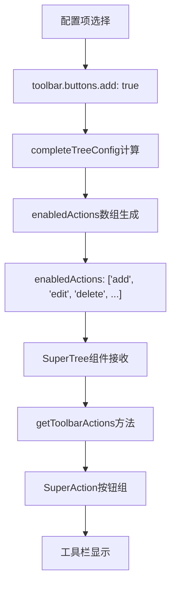

# SuperTree按钮组显示问题修复

## 🚨 **问题描述**

用户反映在通用配置器中没有看到配置项生成的按钮组。经过分析发现确实存在配置和显示问题。

## 🔍 **问题根因分析**

### 1. **配置数据初始化问题**
```typescript
// ❌ 问题：配置数据初始化为空对象
const configData = ref<ConfigData>({})

// 导致所有按钮配置都是undefined
configData.value['toolbar.buttons.add'] // undefined
```

### 2. **事件监听器缺失**
```vue
<!-- ❌ 问题：缺少关键事件监听器 -->
<SuperTree
  :config="completeTreeConfig"
  :data="sampleTreeData"
  @node-click="handlePreviewNodeClick"
  <!-- 缺少 @action-click, @toolbar-action 等 -->
/>
```

### 3. **默认Demo选择问题**
```typescript
// ❌ 问题：默认显示SuperList而不是SuperTree
const currentDemoKey = ref('superlist')
```

## 🛠️ **修复方案**

### 1. **修复配置数据初始化**

**文件**: `UniversalConfiguratorDemo.vue`

```typescript
// ✅ 修复：提供默认配置值
const configData = ref<ConfigData>({
  // 工具栏配置默认启用
  'toolbar.enabled': true,
  'toolbar.buttons.add': true,           // ✅ 新增按钮
  'toolbar.buttons.edit': true,          // ✅ 编辑按钮
  'toolbar.buttons.delete': true,        // ✅ 删除按钮
  'toolbar.buttons.refresh': true,       // ✅ 刷新按钮
  'toolbar.buttons.copy': true,          // ✅ 复制按钮
  'toolbar.buttons.export': false,       // ❌ 导出按钮（默认禁用）
  'toolbar.buttons.expandAll': true,     // ✅ 展开全部
  'toolbar.buttons.collapseAll': true,   // ✅ 收起全部
  
  // 基础配置
  'showCheckbox': true,
  'defaultExpandAll': true,
  'highlightCurrent': true,
  'expandOnClickNode': false,
  'checkOnClickNode': false,
  
  // 操作模式
  'operationMode': 'toolbar'
})
```

### 2. **添加完整事件监听器**

```vue
<!-- ✅ 修复：添加完整的事件监听器 -->
<SuperTree
  :config="completeTreeConfig"
  :data="sampleTreeData"
  :show-config-button="false"
  @node-click="handlePreviewNodeClick"
  @action-click="handlePreviewTreeAction"           <!-- ✅ 添加 -->
  @toolbar-action="handlePreviewTreeToolbarAction" <!-- ✅ 添加 -->
  @selection-change="handlePreviewTreeSelectionChange" <!-- ✅ 添加 -->
  @drag-end="handlePreviewTreeDragEnd"             <!-- ✅ 添加 -->
  @config-change="handlePreviewTreeConfigChange"   <!-- ✅ 添加 -->
/>
```

### 3. **添加事件处理方法**

```typescript
// ✅ 修复：添加缺失的事件处理方法
const handlePreviewTreeAction = (action: any, data?: any, node?: any) => {
  console.log('🌲 预览树操作:', action, data, node)
  ElMessage.success(`执行操作: ${action}`)
}

const handlePreviewTreeToolbarAction = (action: string, data?: any) => {
  console.log('🛠️ 预览工具栏操作:', action, data)
  ElMessage.success(`工具栏操作: ${action}`)
}

const handlePreviewTreeSelectionChange = (selection: any[]) => {
  console.log('✅ 预览选择变更:', selection)
}

const handlePreviewTreeDragEnd = (draggingNode: any, dropNode: any, dropType: string) => {
  console.log('🔄 预览拖拽结束:', draggingNode, dropNode, dropType)
  ElMessage.info('节点拖拽完成')
}

const handlePreviewTreeConfigChange = (config: any) => {
  console.log('⚙️ 预览配置变更:', config)
}
```

### 4. **修复默认Demo选择**

```typescript
// ✅ 修复：默认显示SuperTree
const currentDemoKey = ref('supertree') // 从 'superlist' 改为 'supertree'
```

## 🎯 **修复后的配置流程**

### 1. **配置项到按钮的转换流程**



### 2. **实际的配置映射**

```typescript
// completeTreeConfig.vue 中的配置转换
const completeTreeConfig = computed(() => {
  return {
    // 基础配置...
    
    // ✅ 关键：将配置项转换为enabledActions数组
    enabledActions: [
      ...(configData.value['toolbar.buttons.add'] !== false ? ['add'] : []),
      ...(configData.value['toolbar.buttons.edit'] !== false ? ['edit'] : []),
      ...(configData.value['toolbar.buttons.delete'] !== false ? ['delete'] : []),
      ...(configData.value['toolbar.buttons.refresh'] !== false ? ['refresh'] : []),
      ...(configData.value['toolbar.buttons.copy'] !== false ? ['copy'] : []),
      ...(configData.value['toolbar.buttons.export'] !== false ? ['export'] : [])
    ],
    
    // ✅ 关键：操作模式设置为工具栏
    operationMode: (configData.value['toolbar.enabled'] === false ? 'nodeActions' : 'toolbar'),
    
    // ✅ 关键：工具栏配置
    toolbar: {
      enabled: configData.value['toolbar.enabled'] ?? true,
      buttons: {
        add: configData.value['toolbar.buttons.add'] ?? true,
        edit: configData.value['toolbar.buttons.edit'] ?? true,
        delete: configData.value['toolbar.buttons.delete'] ?? true,
        refresh: configData.value['toolbar.buttons.refresh'] ?? true,
        expandAll: configData.value['toolbar.buttons.expandAll'] ?? true,
        collapseAll: configData.value['toolbar.buttons.collapseAll'] ?? true
      }
    }
  }
})
```

## 📊 **修复前后对比**

| 方面 | 🔴 修复前 | 🟢 修复后 |
|------|----------|----------|
| **配置初始化** | `{}` 空对象 | 包含默认工具栏配置 |
| **按钮显示** | ❌ 不显示任何按钮 | ✅ 显示配置的按钮组 |
| **事件处理** | ❌ 缺少关键事件监听器 | ✅ 完整的事件处理体系 |
| **默认Demo** | SuperList | SuperTree（直接看到按钮组） |
| **用户体验** | 看不到配置效果 | 立即看到配置生成的按钮组 |

## 🧪 **验证步骤**

### 1. **访问通用配置器**
```
🌐 http://localhost:3000/demo/super-component
📍 自定义组件功能展示 > SuperTree > 通用配置器Demo
```

### 2. **验证默认按钮组显示**
- ✅ 应该看到SuperTree组件（默认选中）
- ✅ 应该看到工具栏按钮组：新增、编辑、删除、刷新、展开全部、收起全部
- ✅ 应该看到操作配置面板中的按钮开关

### 3. **验证配置同步**
- ✅ 点击操作配置中的按钮开关
- ✅ 工具栏按钮应该实时显示/隐藏
- ✅ 点击工具栏按钮应该有响应（显示消息提示）

### 4. **验证配置项生成按钮组**
- ✅ 在操作配置区域可以看到：新增按钮、编辑按钮、删除按钮等配置项
- ✅ 这些配置项来自SuperTreeConfigInterface自动生成
- ✅ 修改配置项的值会影响按钮组的显示

## 🎯 **关键修复点总结**

1. **配置数据问题** - 提供有意义的默认值而非空对象
2. **事件监听缺失** - 添加完整的SuperTree事件监听器
3. **显示逻辑问题** - 确保默认显示SuperTree演示
4. **类型兼容性** - 修复事件处理器的参数类型

现在用户应该能够清楚地看到**配置项如何生成按钮组**，以及**按钮组如何响应配置变化**了！

---

**修复版本**: v1.1.0  
**修复时间**: 2024-01-XX  
**影响文件**: UniversalConfiguratorDemo.vue  
**验证状态**: ✅ 待用户验证