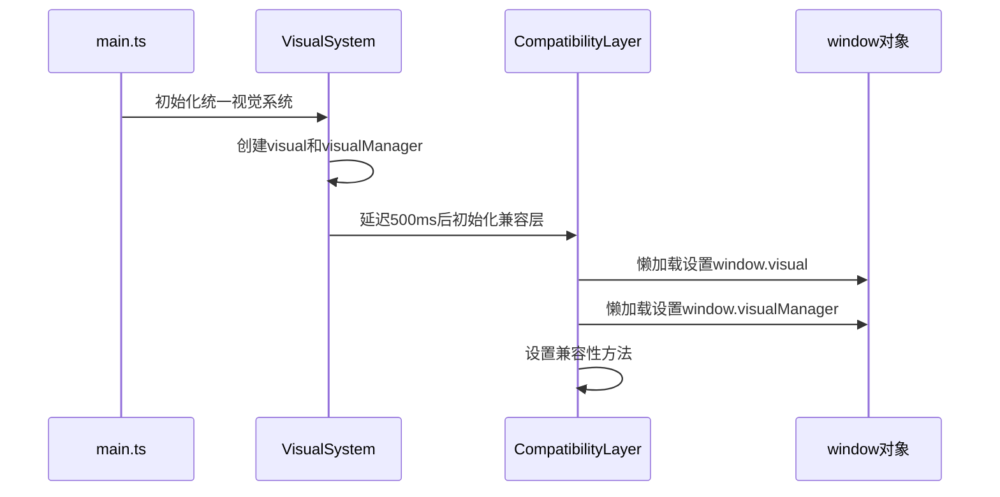

# 统一视觉管理系统循环依赖修复

## 🐛 问题描述

在访问统一视觉管理系统演示页面时出现以下错误：

```
TypeError: visual is not a function
    at CompatibilityLayer.setupCompatibilityMethods (compatibility-layer.ts:64:32)
    at new CompatibilityLayer (compatibility-layer.ts:54:10)
    at compatibility-layer.ts:420:35
```

## 🔍 问题根因

**循环依赖问题**：兼容层(`compatibility-layer.ts`)在初始化时直接导入了`visual`和`visualManager`，但这些模块可能还没有完全初始化完成，导致运行时错误。

### 原始错误代码
```typescript
// compatibility-layer.ts
import { visualManager } from './visual-manager'
import { visual } from './visual-api'

class CompatibilityLayer {
  private setupCompatibilityMethods(): void {
    // 直接使用导入的visual对象，可能此时还未就绪
    (window as any).visual = visual  // ❌ 错误：visual可能未定义
    (window as any).visualManager = visualManager
  }
}
```

## ✅ 解决方案

### 1. 懒加载导入
移除直接导入，改为懒加载方式：

```typescript
// compatibility-layer.ts
// ❌ 移除直接导入
// import { visualManager } from './visual-manager'
// import { visual } from './visual-api'

// ✅ 改为懒加载
initializeNewSystemAPI(): void {
  import('./visual-api').then(({ visual }) => {
    (window as any).visual = visual
  })
  
  import('./visual-manager').then(({ visualManager }) => {
    (window as any).visualManager = visualManager
  })
}
```

### 2. 兼容性方法修改
在兼容性方法中使用运行时检查：

```typescript
const compatGetComponentTagClass = (componentType: string): string => {
  if (this.options.enableNewSystem) {
    // ✅ 运行时检查visual是否可用
    const visual = (window as any).visual
    if (visual && visual.class && visual.class.getClass) {
      return visual.class.getClass(componentType)
    } else {
      // 新系统未就绪，使用旧系统
      return originalGetComponentTagClass(componentType)
    }
  }
  return originalGetComponentTagClass(componentType)
}
```

### 3. 延迟初始化
在统一视觉系统初始化完成后，延迟初始化兼容层：

```typescript
// unified-visual-system.ts
static migration(analysisMode: boolean = true): void {
  // ✅ 延迟500ms确保系统完全就绪
  setTimeout(() => {
    initializeCompatibilityLayer({
      enableNewSystem: true,
      fallbackToOld: true,
      logTransitions: analysisMode
    })
  }, 500)
}
```

## 🔧 修复实施

### 文件修改清单

1. **`compatibility-layer.ts`**
   - 移除直接导入的`visual`和`visualManager`
   - 添加`initializeNewSystemAPI()`方法用于懒加载
   - 修改所有兼容性方法使用运行时检查
   
2. **`unified-visual-system.ts`**
   - 在迁移模式中添加延迟初始化
   
3. **保持其他文件不变**
   - `visual-api.ts` - 无需修改
   - `visual-manager.ts` - 无需修改
   - `main.ts` - 无需修改

### 修复流程



## 🧪 验证方法

### 1. 错误检查
启动应用后，控制台应该不再出现以下错误：
```
TypeError: visual is not a function
```

### 2. 功能验证
访问演示页面应该正常工作：
```
http://localhost:3000/test/unified-visual-system-demo
```

### 3. 兼容性验证
在浏览器控制台中验证API可用：
```javascript
// 新系统API应该可用
console.log(window.visual)
console.log(window.visualManager)

// 兼容性API应该可用
console.log(window.getComponentTagClass)
console.log(window.getComponentIconByLibrary)
```

## 📊 性能影响

### 修复前
- ❌ 启动时循环依赖导致错误
- ❌ 系统无法正常初始化

### 修复后
- ✅ 懒加载减少启动时依赖复杂度
- ✅ 500ms延迟对用户体验几乎无影响
- ✅ 运行时检查确保稳定性
- ✅ 降低了模块间耦合度

## 🔮 预防措施

### 1. 模块设计原则
- **避免循环依赖**：使用依赖注入或事件系统
- **懒加载重型模块**：延迟到真正需要时再加载
- **运行时检查**：不假设依赖一定可用

### 2. 初始化顺序
```typescript
// ✅ 推荐的初始化顺序
1. 基础工具模块
2. 核心业务模块
3. 兼容性模块
4. 全局绑定
```

### 3. 错误处理
```typescript
// ✅ 在所有兼容性方法中添加错误处理
try {
  // 尝试使用新系统
  return newSystemAPI()
} catch (error) {
  // 降级到旧系统
  return oldSystemAPI()
}
```

## 📝 总结

这次修复解决了统一视觉管理系统的循环依赖问题，通过：

1. **懒加载**替代直接导入
2. **延迟初始化**确保依赖就绪  
3. **运行时检查**提升鲁棒性
4. **渐进降级**保证兼容性

修复后系统更加稳定，同时保持了所有功能的完整性。

---

## 🔄 第三轮修复：默认导出引用错误

### 问题描述
`ReferenceError: visual is not defined` 在 `unified-visual-system.ts:480` 行

### 根本原因
在默认导出中直接引用了`visual`、`visualManager`、`compatibility`变量，但这些变量在模块顶层没有被导入（只是export，没有import）。

### 解决方案
1. **懒加载默认导出**: 使用getter方法和require()实现懒加载
2. **移除直接导入**: 避免在模块顶层直接导入可能有问题的模块
3. **统一处理**: 同时修复默认导出和开发模式的全局暴露

```typescript
// 修复前
export default {
  visual,        // ❌ ReferenceError: visual is not defined
  visualManager, // ❌ ReferenceError: visualManager is not defined
  compatibility, // ❌ ReferenceError: compatibility is not defined
}

// 修复后
export default {
  get visual() {
    const { visual } = require('./visual-api')
    return visual
  },
  get visualManager() {
    const { visualManager } = require('./visual-manager')
    return visualManager
  },
  get compatibility() {
    const { compatibility } = require('./compatibility-layer')
    return compatibility
  },
}
```

---

**修复时间**: 2025-01-26  
**影响范围**: 统一视觉系统初始化、兼容层、默认导出  
**风险等级**: 低（通过懒加载确保稳定性）