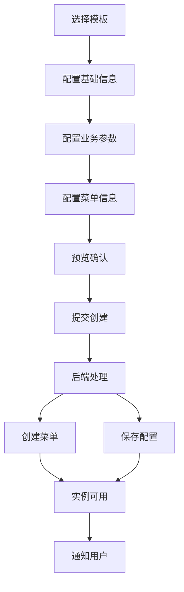
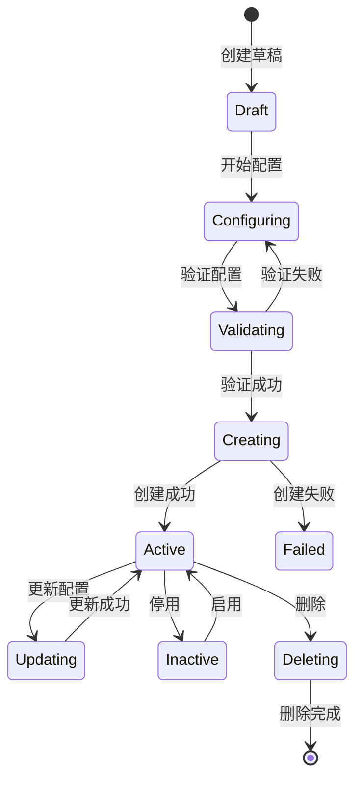

# 前端模板生成器 V2.0 架构设计

## 1. 整体架构

```
template-generator/
├── core/                           # 核心逻辑
│   ├── TemplateEngine.ts          # 模板引擎核心
│   ├── InstanceManager.ts         # 实例管理器
│   ├── ConfigValidator.ts         # 配置验证器
│   └── RouteGenerator.ts          # 路由生成器
├── templates/                      # 模板定义
│   ├── draggable-category/        # 拖拽分类模板
│   ├── data-table/               # 数据表格模板
│   └── form-builder/             # 表单构建模板
├── components/                     # UI组件
│   ├── TemplateSelector.vue      # 模板选择器
│   ├── ConfigurationForm.vue     # 配置表单
│   ├── PreviewPanel.vue          # 预览面板
│   └── InstanceManager.vue       # 实例管理
├── stores/                        # 状态管理
│   ├── templateStore.ts          # 模板状态
│   ├── instanceStore.ts          # 实例状态
│   └── configStore.ts            # 配置状态
└── services/                      # 服务层
    ├── TemplateAPI.ts            # 模板API
    ├── InstanceAPI.ts            # 实例API
    └── MenuAPI.ts                # 菜单API
```

## 2. 核心流程设计

### 2.1 模板引擎核心
```typescript
// core/TemplateEngine.ts
export class TemplateEngine {
  // 注册模板
  static registerTemplate(template: TemplateDefinition): void
  
  // 获取可用模板
  static getAvailableTemplates(): TemplateDefinition[]
  
  // 根据模板生成实例配置
  static generateInstanceConfig(
    templateId: string, 
    userConfig: any
  ): InstanceConfig
  
  // 验证配置有效性
  static validateConfig(
    templateId: string, 
    config: any
  ): ValidationResult
}
```

### 2.2 实例管理器
```typescript
// core/InstanceManager.ts
export class InstanceManager {
  // 创建实例
  static async createInstance(
    templateId: string,
    config: InstanceConfig
  ): Promise<InstanceResult>
  
  // 获取实例列表
  static async getInstances(
    templateId?: string
  ): Promise<TemplateInstance[]>
  
  // 更新实例配置
  static async updateInstance(
    instanceId: string,
    config: Partial<InstanceConfig>
  ): Promise<void>
  
  // 删除实例
  static async deleteInstance(instanceId: string): Promise<void>
  
  // 克隆实例
  static async cloneInstance(
    sourceInstanceId: string,
    newConfig: Partial<InstanceConfig>
  ): Promise<InstanceResult>
}
```

## 3. 模板定义标准

### 3.1 模板定义接口
```typescript
interface TemplateDefinition {
  id: string                          // 模板唯一标识
  name: string                        // 模板名称
  type: string                        // 模板类型
  version: string                     // 模板版本
  
  // 组件配置
  component: {
    path: string                      // 组件路径
    props: Record<string, any>        // 默认属性
  }
  
  // 路由配置
  route: {
    pattern: string                   // 路由模式
    supportsMultiInstance: boolean    // 是否支持多实例
    paramName?: string                // 动态参数名
  }
  
  // 配置结构
  config: {
    schema: JSONSchema                // 配置结构定义
    formSchema: FormSchema[]          // 表单结构
    defaultValues: Record<string, any> // 默认值
    validation: ValidationRules       // 验证规则
  }
  
  // 菜单配置
  menu: {
    defaultIcon: string               // 默认图标
    defaultParent: string             // 默认父菜单
    permissions: string[]             // 所需权限
  }
  
  // 元数据
  meta: {
    description: string               // 描述
    tags: string[]                   // 标签
    author: string                   // 作者
    documentation?: string           // 文档链接
    preview?: {                      // 预览配置
      component: string              // 预览组件
      props: Record<string, any>     // 预览属性
    }
  }
}
```

### 3.2 实例配置接口
```typescript
interface InstanceConfig {
  instanceId: string                  // 实例唯一标识
  templateId: string                  // 模板ID
  instanceName: string                // 实例名称
  businessType: string                // 业务类型
  
  // 页面配置
  page: {
    title: string                     // 页面标题
    description?: string              // 页面描述
    keywords?: string[]               // 关键词
  }
  
  // 菜单配置
  menu: {
    name: string                      // 菜单名称
    parentId: number                  // 父菜单ID
    icon: string                      // 图标
    sort: number                      // 排序
    permission: string                // 权限标识
  }
  
  // 业务配置
  business: Record<string, any>       // 业务相关配置
  
  // 数据配置
  data: {
    source: string                    // 数据源
    type: string                      // 数据类型
    config: Record<string, any>       // 数据配置
  }
  
  // 运行时配置
  runtime: {
    cacheStrategy: string             // 缓存策略
    refreshInterval?: number          // 刷新间隔
    permissions: string[]             // 运行时权限
  }
}
```

## 4. 状态管理设计

### 4.1 模板状态
```typescript
// stores/templateStore.ts
export const useTemplateStore = defineStore('template', {
  state: () => ({
    templates: [] as TemplateDefinition[],
    selectedTemplate: null as TemplateDefinition | null,
    loading: false,
    error: null as string | null
  }),
  
  actions: {
    async loadTemplates(): Promise<void>
    selectTemplate(templateId: string): void
    clearSelection(): void
  }
})
```

### 4.2 实例状态
```typescript
// stores/instanceStore.ts
export const useInstanceStore = defineStore('instance', {
  state: () => ({
    instances: [] as TemplateInstance[],
    currentInstance: null as TemplateInstance | null,
    creating: false,
    updating: false
  }),
  
  actions: {
    async loadInstances(templateId?: string): Promise<void>
    async createInstance(config: InstanceConfig): Promise<InstanceResult>
    async updateInstance(instanceId: string, config: Partial<InstanceConfig>): Promise<void>
    async deleteInstance(instanceId: string): Promise<void>
  }
})
```

## 5. 组件设计

### 5.1 模板选择器
```vue
<!-- components/TemplateSelector.vue -->
<template>
  <div class="template-selector">
    <div class="template-grid">
      <TemplateCard
        v-for="template in templates"
        :key="template.id"
        :template="template"
        :selected="selectedTemplate?.id === template.id"
        @select="onSelectTemplate"
      />
    </div>
  </div>
</template>
```

### 5.2 配置表单
```vue
<!-- components/ConfigurationForm.vue -->
<template>
  <div class="configuration-form">
    <el-steps :active="currentStep">
      <el-step title="基础配置" />
      <el-step title="业务配置" />
      <el-step title="菜单配置" />
      <el-step title="预览确认" />
    </el-steps>
    
    <component
      :is="currentStepComponent"
      v-model="formData"
      :template="selectedTemplate"
      @next="nextStep"
      @prev="prevStep"
    />
  </div>
</template>
```

### 5.3 实例管理
```vue
<!-- components/InstanceManager.vue -->
<template>
  <div class="instance-manager">
    <InstanceList
      :instances="instances"
      @edit="editInstance"
      @delete="deleteInstance"
      @clone="cloneInstance"
    />
    
    <InstanceDialog
      v-model:visible="dialogVisible"
      :instance="currentInstance"
      :mode="dialogMode"
      @save="saveInstance"
    />
  </div>
</template>
```

## 6. 工作流程

### 6.1 创建实例流程


### 6.2 实例生命周期


## 7. 扩展性设计

### 7.1 插件机制
```typescript
interface TemplatePlugin {
  name: string
  version: string
  install(engine: TemplateEngine): void
  uninstall(engine: TemplateEngine): void
}

// 插件注册
TemplateEngine.use(MyCustomPlugin)
```

### 7.2 自定义模板
```typescript
// 用户可以注册自定义模板
const customTemplate: TemplateDefinition = {
  id: 'my-custom-template',
  name: '我的自定义模板',
  // ... 其他配置
}

TemplateEngine.registerTemplate(customTemplate)
``` 