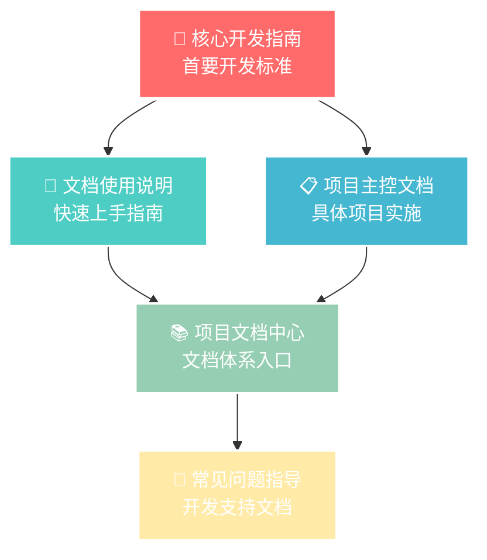

# 📋 规范性文档体系总结

> **Documentation Standards Summary**  
> 项目规范性文档的完整梳理和使用指南  
> 最后更新：2024-12-28

---

## 🎯 规范性文档体系概览

### 📊 文档体系结构
```
docs/
├── 📚 README.md                                    # 项目文档中心 (入口)
├── standards/
│   └── 📋 documentation-standards-summary.md       # 本文档 (规范总结)
├── development/
│   ├── 🚀 core-development-guide.md                # 核心开发指南 ⭐ 首要标准
│   ├── 📖 documentation-usage-guide.md             # 文档使用说明
│   └── 🔧 common-issues-guide.md                   # 常见问题指导
└── design/
    └── 📋 resource-import-master-plan.md           # 项目主控文档
```

### 🏗️ 规范层级关系


---

## 📋 规范性文档详细清单

### 🚀 Level 1: 首要开发标准

#### 1. [核心开发指南](../development/core-development-guide.md) ⭐ 必读
**文档性质**: 首要标准，所有开发工作必须遵循  
**更新频率**: 重大变更时更新  
**维护责任**: 架构师 + 项目负责人

**核心规范内容**:

##### 🎯 首要原则：文档持续更新机制
- **状态更新标准**: 每完成一个模块，必须立即更新对应状态和完成度
  - 实时同步: 开发状态与文档记录保持一致
  - 完成度跟踪: 精确到百分比的进度管理
  - 责任明确: 每个模块都有明确的负责人

- **问题跟踪记录**: 所有问题必须记录并持续跟踪直至解决
  - 实时记录: 遇到问题立即记录
  - 分级管理: 按严重程度分类处理
  - 解决跟踪: 从发现到解决的全过程记录

- **版本日志维护**: 每个版本发布必须详细记录更新内容
  - 详细记录: 每个版本的完整变更日志
  - 分类管理: 新增功能、技术改进、问题修复、文档更新
  - 可追溯性: 完整的版本演进历史

##### 📋 标准开发流程
1. **Phase 1: 项目启动**
   - **设计最优先**: 每个模块开发前需要梳理功能模块的需求整理出整体的功能分析、设计思路、实现步骤等完善的模块化开发指导意见，记录到docs的design目录下，文件以`模块名称-plan.md`命名
   - **文档创建优先**: 创建项目主文档、菜单配置记录、问题跟踪表、里程碑时间表
   - **技术架构设计**: 完成架构图设计、定义核心模块接口、规划文件结构、确定技术栈

   不要随意单独形成文档，创建文档时需要检查是否有该功能所属的上级文档，避免文档过于分散

2. **Phase 2: 开发实施**
3. **Phase 3: 测试验证**
4. **Phase 4: 发布部署**

##### 🎛️ 菜单管理集成规范
- **标准菜单配置模板**: 每个新增页面必须提供完整菜单配置参数
- **菜单创建状态跟踪表**: 实时跟踪菜单创建状态

##### 🛠️ 工具和辅助函数
- 进度更新函数: `updateModuleStatus()`
- 菜单配置生成器: `generateAndRecordMenuConfig()`
- 问题跟踪记录器: `recordIssue()`
- 版本日志生成器: `generateVersionLog()`

---

### 📖 Level 2: 操作指南

#### 2. [文档使用说明](../development/documentation-usage-guide.md) ⭐ 新手必读
**文档性质**: 操作指南，快速上手文档持续更新机制  
**更新频率**: 根据团队反馈持续优化  
**维护责任**: 技术文档负责人

**核心内容**:
- **日常使用流程**: 每天开始工作时、开发过程中、完成开发后的标准操作
- **实用模板和示例**: 模块状态更新模板、问题记录模板、版本发布模板
- **快速操作清单**: 每日必检清单、完成模块时必做清单、版本发布前必检清单
- **常见问题解答**: 完成度评估、问题处理、菜单配置、进度计算等

#### 3. [常见问题指导](../development/common-issues-guide.md)
**文档性质**: 开发支持文档，解决常见技术问题  
**更新频率**: 发现新问题时及时更新  
**维护责任**: 各模块开发者

**核心内容**:
- **TypeScript类型错误修复**: 接口定义规范、类型错误处理
- **菜单管理自动化配置**: 标准菜单创建参数、自动化菜单创建工具函数
- **功能完善最佳实践**: 数据持久化方案、撤销重做系统、性能优化

---

### 📚 Level 3: 项目文档中心

#### 4. [项目文档中心](../README.md)
**文档性质**: 文档体系入口，项目总览  
**更新频率**: 每周更新项目状态  
**维护责任**: 项目负责人

**核心内容**:
- **首要开发标准**: 文档持续更新机制核心原则
- **当前项目状态概览**: 实时进度、模块状态、问题跟踪
- **文档体系结构**: 完整的文档导航和分类
- **功能模块文档**: 各功能模块的详细文档链接
- **开发工作流程**: 标准开发流程和工具支持

---

### 📋 Level 4: 项目主控文档

#### 5. [资源导入功能 - 完整设计方案](../design/resource-import-master-plan.md)
**文档性质**: 项目主控文档，动态跟踪系统  
**更新频率**: 每完成一个模块立即更新  
**维护责任**: 项目负责人 + 各模块开发者

**核心内容**:
- **项目进度总览**: 总体进度可视化、各阶段完成度监控
- **技术架构**: 整体架构图、核心模块状态
- **文件结构**: 已创建和计划创建的文件清单
- **菜单管理配置**: 自动创建菜单参数列表、菜单创建状态跟踪
- **支持的资源格式**: 当前支持状态、文件扩展名支持
- **开发计划与里程碑**: 详细的开发计划和时间表
- **已知问题和解决方案**: 问题跟踪表、技术债务记录
- **版本更新日志**: 完整的版本演进历史

---

## 🔄 文档更新机制规范

### 📊 更新频率标准

| 文档类型 | 更新频率 | 触发条件 | 责任人 |
|----------|----------|----------|--------|
| **核心开发指南** | 重大变更时 | 开发流程调整、标准变更 | 架构师 |
| **文档使用说明** | 团队反馈时 | 操作流程优化、常见问题 | 技术文档 |
| **项目文档中心** | 每周 | 项目状态变更、新文档创建 | 项目负责人 |
| **项目主控文档** | 每日 | 模块完成、问题记录、进度更新 | 各模块开发者 |
| **常见问题指导** | 发现问题时 | 新问题出现、解决方案更新 | 开发者 |

### 🎯 质量控制标准

#### 文档质量指标
- **更新及时性**: 状态变更后24小时内必须更新文档
- **信息完整性**: 所有模块都必须有完整的状态和完成度记录
- **问题追踪率**: 所有问题都必须有对应的跟踪记录
- **版本记录覆盖率**: 每个版本都必须有详细的更新日志

#### 内容质量要求
- **准确性**: 文档内容与实际代码状态保持一致
- **完整性**: 包含所有必要的信息和参数
- **可读性**: 使用标准化的格式和图标
- **可追溯性**: 提供完整的链接和引用关系

---

## 📋 使用规范检查清单

### ✅ 开发者日常使用检查清单

#### 每日开始工作前
- [ ] 阅读[核心开发指南](../development/core-development-guide.md)了解首要标准
- [ ] 查看[项目主控文档](../design/resource-import-master-plan.md)确认当前模块状态
- [ ] 检查是否有分配给自己的问题需要处理
- [ ] 更新模块状态为"🔄 进行中"

#### 开发过程中
- [ ] 遇到问题立即记录到问题跟踪表
- [ ] 完成子功能时更新完成度百分比
- [ ] 重大决策和变更及时更新相关文档

#### 完成开发后
- [ ] 更新模块状态为"✅ 已完成"
- [ ] 提供菜单配置参数（如适用）
- [ ] 更新总体进度百分比
- [ ] 关闭或更新相关问题记录

### ✅ 项目负责人检查清单

#### 每周回顾
- [ ] 检查各模块完成度和进度
- [ ] 更新[项目文档中心](../README.md)的项目状态概览
- [ ] 分析问题跟踪表，识别需要关注的问题
- [ ] 检查文档更新的及时性和完整性

#### 版本发布前
- [ ] 所有模块状态为"✅ 已完成"
- [ ] 所有问题已解决或延期
- [ ] 完整的版本更新日志已编写
- [ ] 所有菜单配置参数已验证

---

## 🎯 规范执行监督机制

### 📊 执行监督指标

| 指标类型 | 衡量标准 | 目标值 | 监督频率 |
|----------|----------|--------|----------|
| **文档同步率** | 代码状态与文档记录一致性 | 100% | 每日检查 |
| **问题记录率** | 发现问题的记录完整性 | 100% | 实时监督 |
| **进度更新率** | 完成模块的状态更新及时性 | 24小时内 | 每日检查 |
| **菜单配置率** | 新页面菜单配置参数提供率 | 100% | 功能完成时 |

### 🔄 持续改进机制

#### 每月文档评审
1. **文档质量评估**: 检查文档内容的准确性和完整性
2. **流程优化**: 根据执行情况优化文档更新流程
3. **工具改进**: 完善自动化工具和辅助函数
4. **培训计划**: 针对问题较多的环节进行团队培训

#### 反馈收集渠道
- **问题跟踪表**: 记录文档改进建议
- **团队会议**: 收集使用体验反馈
- **定期调研**: 评估文档使用效果
- **持续优化**: 根据反馈持续改进文档体系

---

## 📚 相关文档快速导航

### 🚀 首要文档
- [🚀 核心开发指南](../development/core-development-guide.md) **⭐ 必读**
- [📖 文档使用说明](../development/documentation-usage-guide.md) **⭐ 新手必读**

### 📋 项目文档
- [📚 项目文档中心](../README.md) - 文档体系入口
- [📋 资源导入功能设计方案](../design/resource-import-master-plan.md) - 项目主控文档

### 🛠️ 支持文档
- [🔧 常见问题指导](../development/common-issues-guide.md) - 开发支持
- [🏗️ 完整工作流程指南](../development/complete-workflow-guide.md) - 工作流程

---

## 🎉 总结

### 📋 规范性文档体系的核心价值

1. **统一标准**: 建立了项目开发的统一标准和规范
2. **实时跟踪**: 通过文档持续更新机制实现项目进度的实时跟踪
3. **质量保障**: 通过标准化流程确保项目质量和交付效果
4. **知识管理**: 形成了完整的项目知识体系和文档资产
5. **团队协作**: 提供了高效的团队协作和沟通机制

### 🚀 使用建议

1. **新团队成员**: 从[文档使用说明](../development/documentation-usage-guide.md)开始，快速了解规范
2. **项目开发**: 严格按照[核心开发指南](../development/core-development-guide.md)执行开发流程
3. **日常工作**: 使用[项目主控文档](../design/resource-import-master-plan.md)跟踪项目进展
4. **问题解决**: 参考[常见问题指导](../development/common-issues-guide.md)解决技术问题

### 📊 成功指标

- **文档同步率**: 100% - 确保文档与代码状态完全同步
- **问题跟踪覆盖率**: 100% - 所有问题都有完整记录和跟踪
- **菜单配置完整率**: 100% - 所有新页面都有完整的菜单配置参数
- **团队执行率**: >95% - 团队成员严格按照规范执行开发流程

---

**📋 文档状态**: ✅ 已发布  
**🔄 维护责任**: 项目负责人 + 技术文档团队  
**📅 下次更新**: 2025-01-05 (月度评审) 