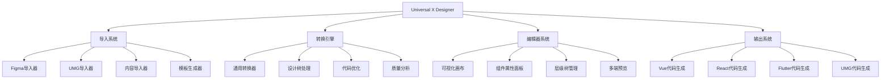
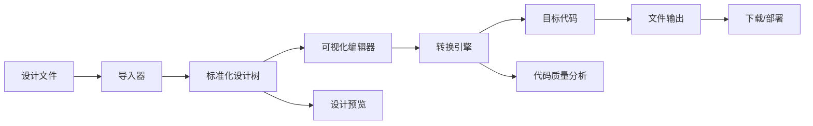

# Universal X Designer - UX设计器概念总结

> **Experience Everything, Export Everywhere**  
> 让用户体验设计师成为真正的产品创造者

---

## 📖 概述

Universal X Designer (UXD) 是一个专为UX设计师打造的端到端设计开发工具，通过智能的设计解析和代码生成技术，实现从用户体验设计到多平台产品的无缝转换。

本文档总结了项目的完整概念体系、技术实现和发展历程，是理解Universal X Designer产品理念的核心文档。本文档与 [品牌设计文档](../design/universal-x-designer-brand.md) 和 [产品概览文档](./universal-x-designer-product-overview.md) 共同构成完整的产品设计文档体系。

---

## 🎯 产品定位演进

### 最初概念：UI转换器
**时间**：项目启动期  
**定位**：通用前端设计器，解决设计稿到代码转换问题  
**用户群体**：前端开发者为主，设计师为辅  

### 品牌升级：Universal X Designer
**时间**：品牌重塑期  
**定位**：专业级UX设计开发工具，面向UX设计师的端到端解决方案  
**用户群体**：UX/UI设计师为主，产品经理和开发者为辅  

### 品牌内涵：X的多重含义
- **eXperience** - 用户体验设计器，专注于UX设计
- **eXtended** - 扩展设计能力边界，突破传统工具限制
- **Cross-platform** - 跨平台无缝输出，一次设计多端部署
- **eXport** - 导出多种格式代码，满足不同技术栈需求
- **eXpert** - 专家级设计工具，提供专业级功能
- **eXcellence** - 追求设计卓越，打造行业标杆

---

## 🌟 核心价值主张

### 设计师视角
**核心痛点**：
- 设计稿到产品的转化效率低
- 多端适配工作量大，一致性难保证
- 与开发团队沟通成本高
- 设计意图在实现过程中经常丢失

**价值解决**：
- **直接转换**：设计稿一键生成多平台代码
- **保持一致性**：统一的设计语言和组件体系
- **无缝协作**：设计师直接输出开发可用的代码
- **意图保留**：智能解析设计意图，确保实现效果

### 产品经理视角
**核心痛点**：
- 产品原型验证周期长
- 跨平台产品管理复杂
- 设计开发资源投入大
- 产品迭代效率低

**价值解决**：
- **快速验证**：快速生成可交互的产品原型
- **统一管理**：一套设计同步到多个平台
- **降低成本**：减少重复性设计开发工作
- **提升效率**：缩短从想法到产品的距离

### 开发者视角
**核心痛点**：
- 重复性UI编码工作多
- 设计还原度低，需要反复调整
- 跨平台代码维护成本高
- 代码质量和规范难统一

**价值解决**：
- **高质量代码**：生成符合最佳实践的组件代码
- **开箱即用**：直接可用的组件，无需从零开始
- **规范统一**：标准化的代码结构和命名规范
- **易于维护**：模块化的组件架构，便于扩展

---

## 🏗️ 技术架构体系

### 设计理念
1. **插件化架构** - 可扩展的导入器和转换器系统
2. **标准化数据模型** - 统一的设计树节点结构
3. **多端适配** - 支持多种输出格式和平台
4. **智能解析** - AI驱动的设计意图理解

### 核心模块



### 数据流架构



### 技术栈选择

#### 前端技术栈
```typescript
// 核心框架
Vue 3 + TypeScript + Element Plus

// 构建工具
Vite + ESBuild

// 状态管理
Pinia

// 样式处理
SCSS + PostCSS

// 工具库
Lodash + Day.js + JSZip
```

#### 代码生成技术
```typescript
// 模板引擎
Handlebars + 自定义模板

// AST操作
@babel/parser + @babel/traverse + @babel/generator

// 代码格式化
Prettier + ESLint
```

---

## 💡 功能模块详解

### 1. 导入系统

#### 支持格式
- **Figma** - 主流设计工具，API直连导入
- **UMG** - Unreal Engine UI系统，游戏界面导入
- **JSON** - 自定义数据格式，程序化导入
- **内容素材** - 图片、图标、样式等资源导入
- **设计模板** - 预制模板快速启动

#### 核心能力
- **格式识别** - 自动识别文件类型和版本
- **数据解析** - 提取设计元素和属性信息
- **标准化** - 转换为统一的设计树结构
- **错误处理** - 友好的错误提示和修复建议

### 2. 可视化编辑器

#### 编辑功能
- **设计画布** - WYSIWYG可视化编辑界面
- **组件树** - 层级结构管理和快速导航
- **属性面板** - 组件属性实时编辑和预览
- **样式编辑** - 精确的视觉样式调整

#### 交互特色
- **拖拽操作** - 直观的组件拖拽和排列
- **实时预览** - 即时查看编辑效果
- **多端预览** - 同时预览不同平台效果
- **快捷操作** - 键盘快捷键和右键菜单

### 3. 转换引擎

#### 核心算法
```typescript
interface ConversionPipeline {
  // 设计解析
  parseDesign(designTree: DesignNode[]): ParsedStructure;
  
  // 组件映射
  mapComponents(structure: ParsedStructure): ComponentMapping[];
  
  // 代码生成
  generateCode(mapping: ComponentMapping[], options: ConvertOptions): GeneratedFile[];
  
  // 质量分析
  analyzeQuality(files: GeneratedFile[]): QualityReport;
}
```

#### 智能优化
- **代码质量分析** - 自动检测代码质量问题
- **性能优化建议** - 提供性能优化建议
- **最佳实践应用** - 自动应用行业最佳实践
- **依赖管理** - 智能管理组件依赖关系

### 4. 输出系统

#### 支持平台
```typescript
enum TargetPlatform {
  Vue3 = 'vue3',
  React = 'react', 
  Flutter = 'flutter',
  UMG = 'umg',
  Weapp = 'weapp' // 小程序
}
```

#### 代码特色
- **高质量代码** - 符合各平台最佳实践
- **模块化结构** - 易于维护和扩展的组件结构
- **类型安全** - 完整的TypeScript类型定义
- **响应式支持** - 自动生成响应式布局代码

---

## 🎨 用户体验设计

### 界面设计原则

#### 设计理念
1. **UX First** - 以用户体验为第一优先级
2. **Designer Friendly** - 面向设计师的专业工具
3. **Workflow Optimization** - 优化设计师工作流程
4. **Visual Consistency** - 保持视觉一致性

#### 视觉语言
```scss
// 主色调
$primary-color: #409EFF;
$success-color: #67C23A; 
$warning-color: #E6A23C;
$danger-color: #F56C6C;

// 字体系统
$font-family-primary: "Helvetica Neue", Helvetica, "PingFang SC", "Hiragino Sans GB", "Microsoft YaHei", Arial, sans-serif;

// 间距系统
$spacing-unit: 8px;
$spacing-xs: $spacing-unit * 0.5;  // 4px
$spacing-sm: $spacing-unit * 1;    // 8px
$spacing-md: $spacing-unit * 2;    // 16px
$spacing-lg: $spacing-unit * 3;    // 24px
$spacing-xl: $spacing-unit * 4;    // 32px
```

### 工作流程设计

#### 四步骤工作流
1. **导入设计** - 简单直观的设计文件导入
2. **预览解析** - 清晰的设计树结构展示
3. **编辑优化** - 强大的可视化编辑功能
4. **生成输出** - 一键生成多平台代码

#### 交互模式
- **渐进式披露** - 按需显示复杂功能
- **即时反馈** - 实时显示操作结果
- **容错设计** - 友好的错误处理和恢复
- **快捷操作** - 提供多种操作方式

---

## 📊 商业模式设计

### 用户分层策略

#### 免费版 (Community)
**目标用户**：个人设计师、学习者  
**功能范围**：
- 基础导入导出功能
- 限量代码生成（每月50次）
- 基础模板库访问
- 社区技术支持

#### 专业版 (Professional)  
**目标用户**：专业设计师、小团队  
**功能范围**：
- 完整功能解锁
- 无限代码生成
- 高级模板和组件库
- 优先技术支持
- 云端项目存储

#### 企业版 (Enterprise)
**目标用户**：设计团队、大型企业  
**功能范围**：
- 团队协作功能
- 私有化部署
- API集成和自动化
- 定制开发服务
- 专属客户成功经理

### 收费模式
- **订阅制** - 月付/年付订阅模式
- **按量计费** - 按代码生成次数计费
- **一次性付费** - 买断制本地版本
- **企业定制** - 个性化定制和服务

---

## 🚀 发展历程回顾

### Phase 1: 概念验证 (已完成)
**时间**：项目启动 - 2024年10月  
**目标**：验证技术可行性和基础架构  
**成果**：
- ✅ 完成核心转换引擎架构设计
- ✅ 实现Figma导入器和Vue转换器
- ✅ 搭建基础UI界面和工作流程
- ✅ 验证插件化架构的可扩展性

### Phase 2: 功能扩展 (已完成)
**时间**：2024年11月 - 12月  
**目标**：完善功能模块和用户体验  
**成果**：
- ✅ 新增UMG导入器和转换器
- ✅ 实现内容导入和模板生成系统
- ✅ 开发可视化编辑器和预览功能
- ✅ 优化代码质量和错误处理

### Phase 3: 品牌升级 (已完成)
**时间**：2024年12月  
**目标**：明确产品定位和品牌形象  
**成果**：
- ✅ 确立Universal X Designer品牌
- ✅ 明确UX设计师目标用户群体
- ✅ 建立完整的文案和权限体系
- ✅ 制定商业模式和发展规划

### Phase 4: 生态建设 (进行中)
**时间**：2025年1月 - 6月  
**目标**：构建完整的产品生态系统  
**计划**：
- 🔄 多端输出支持（React、Flutter、小程序）
- 🔄 组件库和模板生态建设
- 🔄 AI功能集成和智能优化
- 🔄 云端服务和团队协作功能

---

## 🎯 核心竞争优势

### 技术优势
1. **插件化架构** - 业界领先的可扩展架构设计
2. **智能解析** - AI驱动的设计意图理解能力
3. **多端适配** - 一次设计，多平台部署能力
4. **代码质量** - 符合最佳实践的代码生成能力

### 产品优势
1. **专业定位** - 专门面向UX设计师的专业工具
2. **完整工作流** - 从设计到代码的端到端解决方案
3. **用户体验** - 为设计师量身定制的操作体验
4. **生态系统** - 完整的组件、模板和资源生态

### 市场优势
1. **蓝海市场** - 设计到代码转换的专业市场
2. **用户刚需** - 解决设计师的核心痛点需求
3. **商业模式** - 清晰的分层定价和商业模式
4. **成长潜力** - 随着设计工具市场发展的巨大潜力

---

## 📈 未来发展规划

### 短期目标 (3个月)
- [ ] **React转换器** - 完善React代码生成能力
- [ ] **Flutter转换器** - 支持Flutter移动应用开发
- [ ] **小程序转换器** - 支持微信、支付宝等小程序平台
- [ ] **组件库扩展** - 丰富标准组件类型和样式
- [ ] **性能优化** - 提升大型项目处理能力
- [ ] **用户反馈** - 建立完整的用户反馈和迭代机制

### 中期目标 (6个月)
- [ ] **AI功能集成** - 智能设计建议和自动优化
- [ ] **云端服务** - 项目云端存储和多设备同步
- [ ] **团队协作** - 多人协作编辑和版本管理
- [ ] **API开放** - 开放API供第三方集成
- [ ] **插件市场** - 建立第三方插件生态系统
- [ ] **国际化** - 多语言支持和海外市场拓展

### 长期愿景 (1年+)
- [ ] **行业标准** - 建立设计到代码转换的行业标准
- [ ] **生态建设** - 构建完整的设计师开发者生态
- [ ] **技术领先** - 保持下一代设计工具的技术领先地位
- [ ] **全球化** - 成为全球领先的UX设计开发工具
- [ ] **商业成功** - 实现可持续的商业模式和盈利

---

## 🔗 相关文档链接

### 产品设计文档
- [品牌设计文档](../design/universal-x-designer-brand.md) - 完整的品牌体系和文案规范
- [产品概览文档](./universal-x-designer-product-overview.md) - 全面的产品介绍和发展历程

### 技术设计文档
- [平台兼容性设计](../design/platform-compatibility-design.md) - 多端输出技术方案
- [多入口导入架构](../design/multi-entry-import-architecture.md) - 导入系统架构设计
- [UE设计器视口实现](../design/ue-designer-viewport-implementation.md) - 可视化编辑器实现

### 开发指南文档
- [完整工作流指南](../development/complete-workflow-guide.md) - 开发环境和工作流程
- [菜单配置指南](../development/ui-converter-menu-setup.md) - 系统菜单权限配置
- [项目结构重构](../development/project-structure-refactor.md) - 代码结构优化方案

---

## 📞 联系和支持

### 产品团队
- **产品负责人** - 负责产品规划和用户体验设计
- **技术负责人** - 负责技术架构和开发管理
- **设计负责人** - 负责界面设计和交互体验优化
- **运营负责人** - 负责市场推广和用户运营

### 社区渠道
- **官方网站** - universal-x-designer.com (规划中)
- **GitHub仓库** - 开源代码和问题反馈
- **设计师社区** - 用户交流和案例分享
- **技术博客** - 技术文章和最佳实践分享

### 商务合作
- **企业客户** - 企业级定制和服务
- **技术合作** - 技术集成和生态合作
- **投资洽谈** - 融资和战略投资机会

---

**Universal X Designer - Experience Everything, Export Everywhere**  
*让用户体验设计师成为真正的产品创造者*

---

*最后更新时间：2024年12月*  
*文档版本：v2.0* 